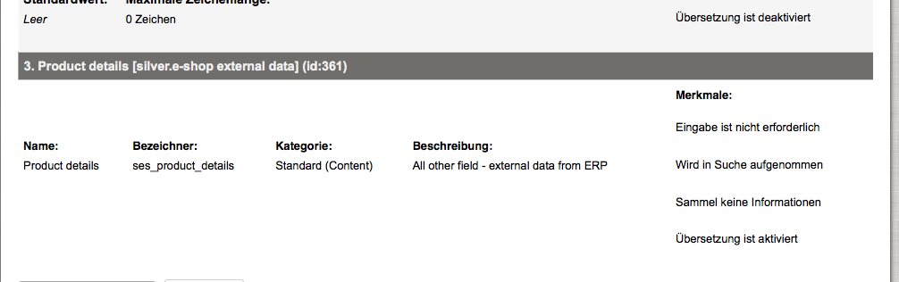
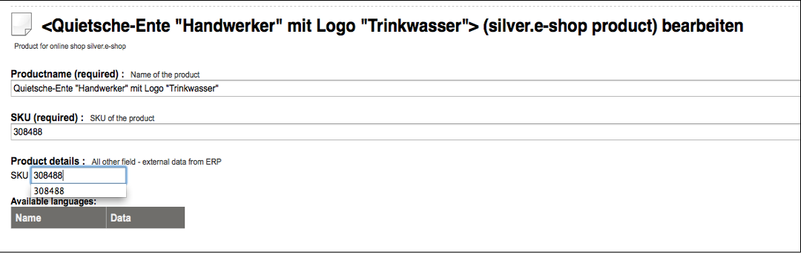
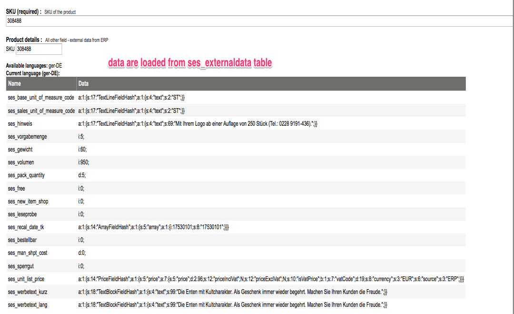
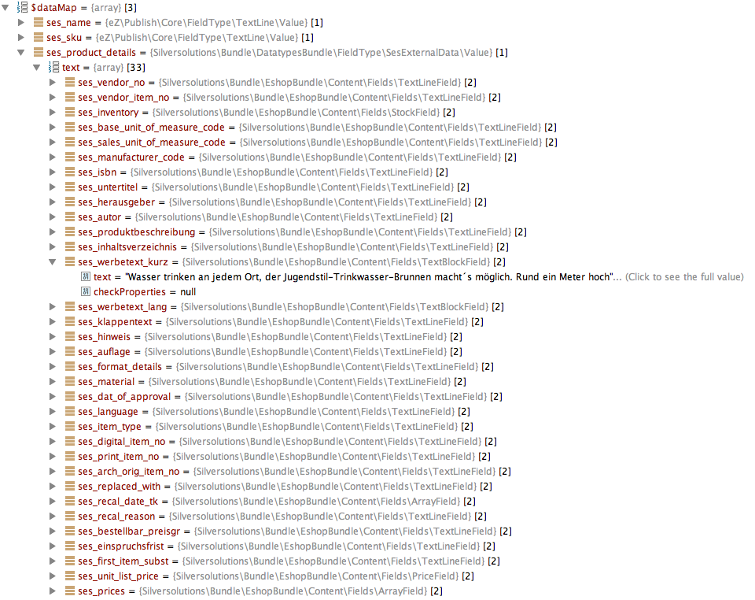

# SesExternalData

Advanced version only

This datatype `sesexternaldatatype` use external storage (not directly eZ) to store data. Data **MUST** be stored in following table.

### Table `ses_externaldata`:

|Field|Type|Description|
|--- |--- |--- |
|sku|char(40)|Unique ID of the Product category (CatalogElement)|
|identifier|char(40)|the ID of the field</br>Definition</br>constant prefix (ses) + lower case letters from NAV fields</br>Example:</br>VENDOR_NO  --> ses_vendor_no|
|language_code|char(8)|e.g. ger-DE|
|ses_field_type|char(20)|The datatype used for this data.</br>It is possible to use silver-e.shop FieldType:</br>ArrayField</br>FileField</br>ImageField</br>PriceField</br>StockField</br>TextBlockField</br>TextLineField</br>or just a simple datatype to store data</br>int</br>float</br>bool|
|content|longtext|serialized data in string format.|

### Create ses_externaldata table

**Create database table**

``` sql
CREATE TABLE `ses_externaldata` (
  `sku` char(40) NOT NULL,
  `identifier` char(40) NOT NULL,
  `language_code` char(8) NOT NULL,
  `ses_field_type` char(20) NOT NULL,
  `content` longtext,
  PRIMARY KEY (`sku`,`identifier`,`language_code`)
) ENGINE=InnoDB DEFAULT CHARSET=utf8
```

Important note:

It is required to create one attribute in the ses_externaldata per language and product which contains the sku itself:
Example (sku = 1122222)

|||||||
|---|---|---|---|---|---|
| id       | sku      | identifier  | language_code | ses_field_type | content                                                         |
| 11087155 | 1122222  | ses_sku_erp | ger-DE        | TextLineField  | a:1:{s:17:"TextLineFieldHash";a:1:{s:4:"text";s:7:"1122222";}}  |

## How to store data in `ses_externaldata` table

Data that is stored in the ses\_externaldata table must be either a simple datatype: *int, float, boolean* or a [FieldType](../fields_for_ecommerce_data/fields_for_ecommerce_data.md).

### Data format

#### silver-e.shop FieldTypes

The data content will be stored in the database in *serialized form* using the method **toHash()**.

``` php
//Product with sku: 308488, NAV-Field: WERBETEXT_KURZ, content: 'Die Enten mit Kultcharakter. Als Geschenk immer wieder begehrt. Machen Sie Ihren Kunden die Freude.', ses_field_type: TextBlockField
 
$blockField = new TextBlockField(
        array(
            'text' => 'Die Enten mit Kultcharakter. Als Geschenk immer wieder begehrt. Machen Sie Ihren Kunden die Freude.',
        )
    );
$content = serialize($blockField->toHash());
 
$dbStatement = "INSERT INTO ses_externaldata VALUES(308488, ses_werbetext_kurz, ger-DE, TextBlockField, $content)";
```

#### Simple datatypes

Simpe datatypes (int, float, bool) with be stored in *serialized form*.

``` php
//Product with sku: 308488, NAV-Field: GEWICHT, content: 60, ses_field_type: int
 
$content = serialize(60);
 
$dbStatement = "INSERT INTO ses_externaldata VALUES(308488, ses_gewicht, ger-DE, int, $content)";
```

## Symfony Datatype

Symfony Datatype is stored in:

```
Silversolutions/Bundle/DatatypesBundle/FieldType/SesExternalData/*
Silversolutions/Bundle/DatatypesBundle/Converter/SesExternalData.php
```

!!! note

    The member attribute $text of FieldType\\SesExternalData\\Value is actually an array. Do not assign strings to this (public) attribute as all implementations rely on the PHP type array. An example of how the structure of the array looks like, can be seen later in this document.

#### Configuration

**Silversolutions/Bundle/DatatypesBundle/Resources/config/services.xml**

``` xml
<parameters>
    <parameter key="ezpublish.fieldType.sesexternaldata.class">Silversolutions\Bundle\DatatypesBundle\FieldType\SesExternalData\Type</parameter>
    <parameter key="ezpublish.fieldType.indexable.sesexternaldata.class">Silversolutions\Bundle\DatatypesBundle\FieldType\SesExternalData\SearchField</parameter>
    <parameter key="ezpublish.fieldType.sesexternaldata.converter.class">Silversolutions\Bundle\DatatypesBundle\Converter\SesExternalData</parameter>  
</parameters>
 
<services>     
    <!-- sesexternaldata type service -->
    <service id="ezpublish.fieldType.sesexternaldata" class="%ezpublish.fieldType.sesexternaldata.class%" parent="ezpublish.fieldType">
        <tag name="ezpublish.fieldType" alias="sesexternaldata" />
    </service>
    <service id="ezpublish.fieldType.indexable.sesexternaldata" class="%ezpublish.fieldType.indexable.sesexternaldata.class%">
        <call method="setIndexDefinition">
            <argument>$ses_external_data_index_definition;siso_datatypes$</argument>
        </call>
        <tag name="ezpublish.fieldType.indexable" alias="sesexternaldata" />
    </service>
 
    <!-- sesexternaldata converter service -->
    <service id="ezpublish.fieldType.sesexternaldata.converter" class="%ezpublish.fieldType.sesexternaldata.converter.class%">
        <argument type="service" id="ezpublish.api.storage_engine.legacy.dbhandler" />
        <argument type="service" id="ezpublish.config.resolver" />
        <argument type="service" id="silver_common.logger" />
        <tag name="ezpublish.storageEngine.legacy.converter" alias="sesexternaldata"  />
    </service>
</services> 
```

## Handling of sesexternaldata in eZ DataProvider

#### Adding new field in the product class

It is possible to extend the product class by the sesexternaldata type.



#### Connecting to the external storage

If the table ses\_externaldata is filled properly with the data, it is possible to create the connection in eZ with appropriate product by typing the SKU.





#### Handling the fetched data

The data from sesexternaldata is converted in the shop and an array of [FieldTypes](../fields_for_ecommerce_data/fields_for_ecommerce_data.md) or simple types is returned

  
