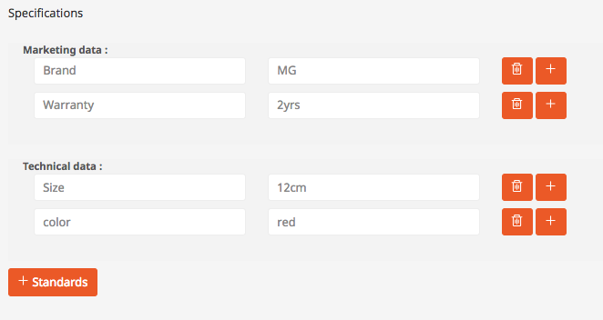

# SpecificationsType

The Field Type stores a structured list of attributes for products:



!!! caution "Field naming"

    A Field of the SpecificationsType must have `ses_specifications` as its Field identifier.

The data is stored in JSON format.

``` json
[
  {
    "name": "marketing",
    "data": [
      {
        "label": "Brand",
        "value": "MG"
      },
      {
        "label": "Warranty",
        "value": "2yrs"
      }
    ]
  },
  {
    "name": "technic",
    "data": [
      {
        "label": "Size",
        "value": "12cm"
      },
      {
        "label": "color",
        "value": "red"
      }
    ]
  }
]
```

## Adding a unit selection

The optional `option` attribute enables you to add a select field offering e.g. a selection of units:


``` yaml
-
    code: "technic"
    label: "Technical data"
    default_values:
        -
            label: "Width"
            value: ""
            options: ['mm','cm','m']
        -
            label: "Heigth"
            value: ""
            options: ['mm','cm','m']
        -
            label: "Length"
            value: ""
            options: ['mm','cm','m']
        -
            label: "Weight"
            value: ""
            options: ['g','kg']
```

## Adding default values

The Field Type uses a configuration that controls which groups are offered.
You can also provide default attributes:

``` yaml
siso_core.default.specification_groups:
    -
        code: "marketing"
        label: "Marketing data"
        default_values:
            -
                label: "Brand"
                value: ""
    -
        code: "technic"
        label: "Technical data"
        default_values: ~
    -
        code: "norms"
        label: "Standards"
        default_values: ~
```

## Template

`SilversolutionsDatatypesBundle::sesselectiontype_content_field.html.twig`
