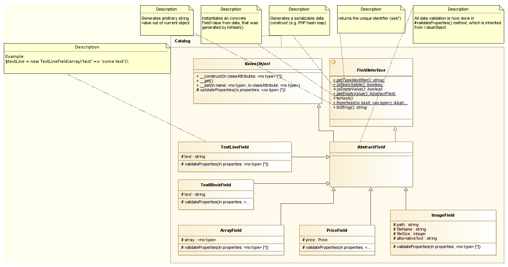

# Fields for ecommerce data

eZ Commerce uses own fields to store ecommerce related data, e.g for the catalog or basket.

The shop provides a flexible way to store data using concrete instances of classes implementing the `FieldInterface` and inheriting from the `AbstractField` class. Fields are used for fixed attributes of a product/catalog and flexible attributes (property `dataMap` in [`CatalogElement`](../../guide/catalog/catalog_api/product_category_catalogelement.md)).

Each instance of a concrete Field will provide the following methods:

| Method                | Description                                                         |
| --------------------- | ------------------------------------------------------------------- |
| `getTypeIdentifier()` | Returns the identifier of the Field (e.g. "sesimage")               |
| `isSearchable()`      | Returns true, if the Field is searchable                            |
| `isEmptyValue()`      | Returns true, if the value of the Field is empty                    |
| `getEmptyValue()`     | Returns an empty version of the Field                               |
| `toHash()`            | Returns a associative array (hash) from the Field                   |
| `fromHash($hash)`     | Returns a created instance of the Field by associative array (hash) |
| `toString()`          | Returns the value of the Field as string                            |

All AbstractField objects can be serialized, if you are using the methods toHash() and fromHash() before/after (un)serialize method.

**Example:**

``` php
//serialize
if($field instanceof AbstractField) {
    $fieldValue = serialize($field->toHash());
}
```

## Class diagram



## Implemented concrete Field classes

| Type             | Used for                                                     | identifier     |
| ---------------- | ------------------------------------------------------------ | -------------- |
| `TextLineField`  | A simple String without HTML-Code                            | `sestextline`  |
| `TextBlockField` | A rich text field containing HTML code                       | `sestextblock` |
| `ImageField`     | An image contains a path to an image and an alternative text | `sesimage`     |
| `ArrayField`     | A structured array                                           | `sesarray`     |
| `PriceField`     | An instance of the Price class                               | `sesprice`     |

## Used templates for rendering

For each concrete `Field` a templates has to be provided in order to render the `Field` in the template. 

The templates have to be provided in the folder `FieldTypes`. The name of the template has to start with the identifier of the `Field`, e.g.

- `ImageField.html.twig`
- `TextBlockField.html.twig`
- `TextLineField.html.twig`
- `PriceField.html.twig`

The renderer provides a parameter `$field` providing the object of the given field.

Call from a twig template, via `ses_render_field`:

``` html+twig
{{ ses_render_field(catalogElement, 'longDescription')|raw }}
```

## TextLineField

`TextLineField` is the representative implementation of `AbstractField` for a single line of text.

A new `TextLineField` can be created using the following data:

``` php
use Silversolutions\Bundle\EshopBundle\Content\Fields\TextLineField;
 
// Usage: 
$textLineField = new TextLineField(array('text' => 'This is the name of the product'));
```

## TextBlockField

`TextBlockField` is the representative implementation of `AbstractField` for a multi line text (or DOMDocument).

A new `TextBlockField` can be created using the following data:

``` php
use Silversolutions\Bundle\EshopBundle\Content\Fields\TextBlockField;

// Usage: 
$textBlockField = new TextBlockField(
    array(
        'text' => 'This is the <b>description</b> of the product'
    )
);
```

TextBlockField object can be <span lang="en">reliable serialized, such it implements the magic `__sleep()` and `__wakeup()` methods.

## ImageField

`ImageField` is the representative implementation of `AbstractField` for an image. An image is identified and initiated by a given path and an optional alternative text.

A new `ImageField` can be created using the following data:

``` php
use Silversolutions\Bundle\EshopBundle\Content\Fields\ImageField;

// Usage:
$imagePath = 'var/storage/images/product_image.jpg';
$imageField = new ImageField(
    array(
        'alternativeText' => 'a nice product',
        'fileName'        => basename($imagePath),
        'fileSize'        => filesize($imagePath),
        'path'            => $imagePath,
    )
);
```

## ArrayField

`ArrayField` is the representative implementation of `AbstractField` for a structured array.

A new `ArrayField` can be created using the following data:

``` php
use Silversolutions\Bundle\EshopBundle\Content\Fields\ImageField;

// Usage:
$myArray = array (
    'weight' => '10 kg',
    'color' => 'red'
);
$arrayField = new ArrayField(array('array' =>  $myArray));
```

## PriceField

`PriceField` is the representative implementation of `AbstractField` for a `Price`.

A new `PriceField` can be created using the following data:

``` php
use Silversolutions\Bundle\EshopBundle\Content\Fields\PriceField;
use Siso\Bundle\PriceBundle\Model\Price;
 
// Usage: 
$price = new Price(
    array(
        'price' => 99.99,
        'isVatPrice' => true,
        'vatCode' => 19.0,
        'currency' => 'EUR',
        'source' => 'ERP',
    )
);
$priceField = new PriceField(array('price' => $price));
```

#### Rendering

Please refer to [Rendering for prices](https://doc.silver-eshop.de/display/EZC14/Rendering+for+prices) to see the possibilities of outputting a PriceField using the `ses_render_field()` function.

It is also possible to render a priceField with a twig function **ses\_render\_price().** The difference see in the table below:

|Twig function|Paramaters|Usage|
|--- |--- |--- |
|ses_render_field()|$catalogElement</br>string $fieldIdentifier</br>array $params|more general -</br>renders also other FieldInterface $fields from $catalogElement</br>like TextBlockField, ImageField, PriceField|
|ses_render_price()|$catalogElement</br>PriceField $priceField</br>array $params|renders only PriceField $price|
