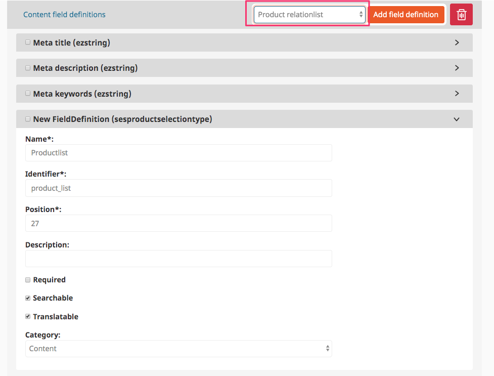
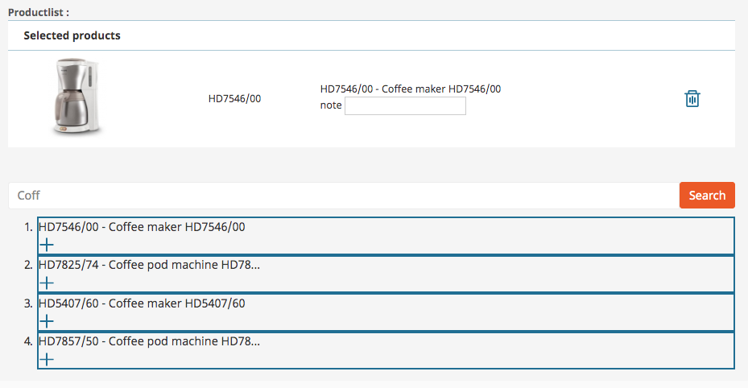

# ProductSelection

## General

This Fieldtype offers a relation feature for products. It can be used with product stored in eZ or in eContent.

## Usage

Add a new field (Product relationlist) to a contenttype:



In edit mode a editor can search for a product or sku and add product to the relation list:

- The optional attribute "note" can be used e.g. to display a hint on the frontend (e.g. Offer).



## For developers

You can access the relation list data in twig using a limited list of attributes:

- sku
- name
- note
- image

**Example**:

``` html+twig
<table class="table table-striped">
    
        <tr>
            <td>
                
                   
                
            </td>
            <td>{{ product.name }}</td>
        </tr>
    
</table>
```
