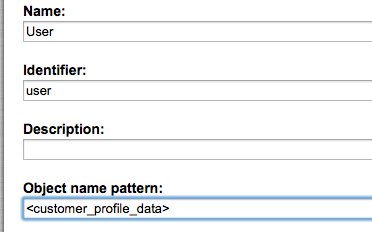

# SesProfileData

This datatype is used to store the [CustomerProfileData](../../developer_manual/customers/customers_api/customer_profile_data_components/customer_profile_data_model.md) in the User class in eZ Platform.

!!! note

    CustomerProfileData must be stored in eZ as a serialized string in **base64** format, since it is not possible to store any special HTML characters(`<`,`>`, `""`,`''`, `&`) in textfield or textarea field.

# Symfony Datatype

Symfony Datatype is stored in:

```
Silversolutions/Bundle/DatatypesBundle/FieldType/SesProfileData/*
Silversolutions/Bundle/DatatypesBundle/Converter/SesProfileData.php
```

#### Configuration

**Silversolutions/Bundle/DatatypesBundle/Resources/config/services.xml**

``` xml
<parameters>
    <parameter key="ezpublish.fieldType.sesprofiledata.class">Silversolutions\Bundle\DatatypesBundle\FieldType\SesProfileData\Type</parameter>
    <parameter key="ezpublish.fieldType.sesprofiledata.converter.class">Silversolutions\Bundle\DatatypesBundle\Converter\SesProfileData</parameter>
</parameters>

<services>      
    <!-- sesprofiledata type service -->
    <service id="ezpublish.fieldType.sesprofiledata" class="%ezpublish.fieldType.sesprofiledata.class%" parent="ezpublish.fieldType">
        <tag name="ezpublish.fieldType" alias="sesprofiledata" />
    </service>

    <!-- sesprofiledata converter service -->
    <service id="ezpublish.fieldType.sesprofiledata.converter" class="%ezpublish.fieldType.sesprofiledata.converter.class%">
        <tag name="ezpublish.storageEngine.legacy.converter" alias="sesprofiledata"  />
    </service>      
</services> 
```

The name of the customer (used from the contact section) can be used in the backend for lists. This can be achieved by using the name pattern in the class definition of the ezuser class:



"customer\_profile\_data" is the identifier of the attribute where the profile data is stored.
