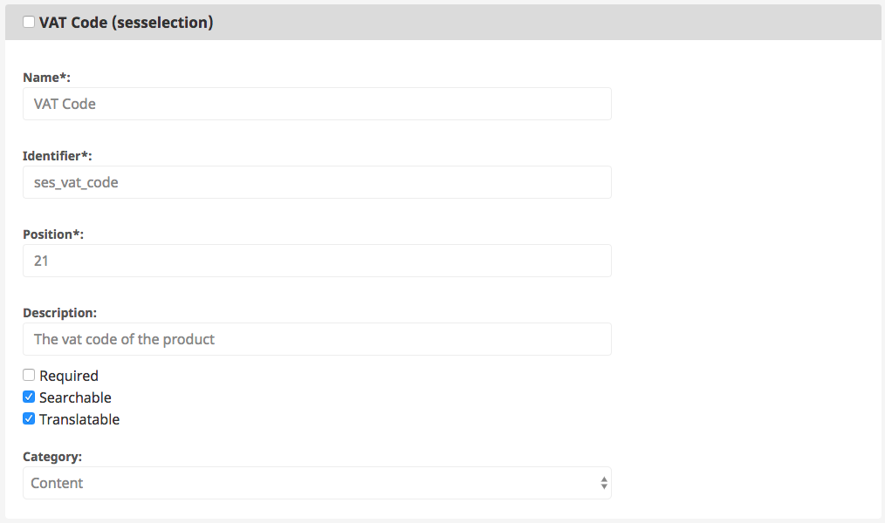
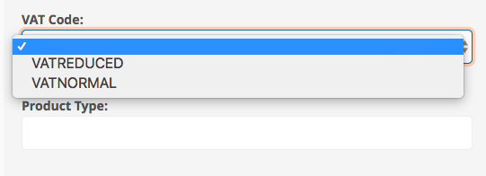

# SesSelection

## General

This datatype is used to render a selection in the backend, so the editor can choose a value. 

Unlike the standard selection field type provided by eZ Platform, the SesSelection field type configuration is a located in an own yml file (Take a look at the example below).

For that reason, it is possible to set up siteaccess specific selection field types. This is not possible with the standard selection field type.

## Usage

### Configuration

You have to define per attribute a configuration like below. This example is for an attribute ses\_vat\_code.

**Example YML configuration**

``` yaml
siso_core.default.sesselection.ses_vat_code:
    default: VATNORMAL
    translation_context: ses_vat_code
    options:
        VATREDUCED: 7
        VATNORMAL: 19
```

The translation context from the configuration is optional and will be used as context for translations. 

### Change content type

Add an attribute with field type sesselection to your content type.



The identifier of the field type (in this example. ses\_vat\_code) must be filled in a proper way as defined in the configuration above.

## Change the object

When your field type is set up in a proper way, you can assign a value in your object:


