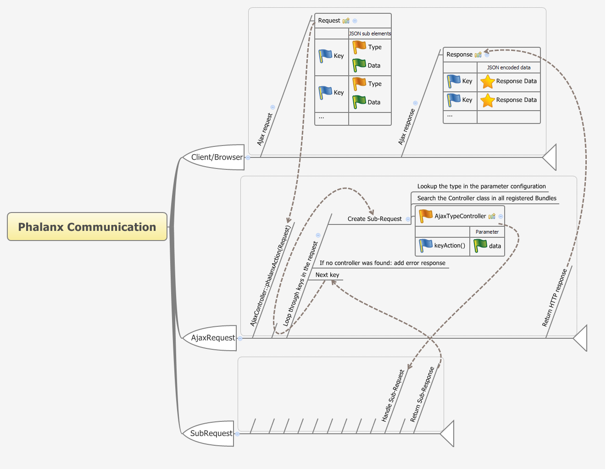

# Ajax (Phalanx)



## Workflow

Ajax requests use POST or GET methods (configured in hoplites):

- GET should be used for most requests except of sensitive data. GET requests can be cached.
- POST should be used to send sensitive information. POST requests are never cached.

All Ajax requests use the same URL:

``` yaml
silversolutions_phalanx:
    path: /_ajax_/phalanx
    defaults:
        _controller: SilversolutionsEshopBundle:Ajax:phalanx
```

`AjaxController` then decides to which `AjaxSubController` to forward the request.
This depends on the parameters that need to be send from the hoplite.  

- `type` defines which subcontroller is called
- key of the method defines which method in the subcontroller is called.
The key must always be in lowercase letters separated by underscore.

### Sending parameters from hoplite

``` php
var data = [];
// 'type' needs to be send in every call inside of data and determines the SubController
data[0] = {
  'form': $(this).parents('.js-product-line').find('input, select').serialize(),
  'type': 'basket'
};
// key of the method: 'add_basket' determines the method of the SubController
requestCollection['add_basket'].add(data);

// this will execute following controller: AjaxBasketController::addBasketAction(Request $request, array $data = array())
// see explanation below
```

### Determining the subcontroller and the method in backend

``` php
//Every SubController will follow this syntax
$type = 'basket';
$subController = 'Ajax' . ucfirst(strtolower($type)) . 'Controller'; 
//from the example above it means
$subController = 'AjaxBasketController';

//Every SubController method will follow this syntax
$keyOfTheMethod = 'add_basket';
$method = $this->underscoreToCamelcase($keyOfTheMethod) . 'Action';
//from the example above it means
$method = 'addBasketAction';
```

Every subcontroller method must follow these rules:

- Every subcontroller must extend `Silversolutions\Bundle\EshopBundle\Controller\BaseController``
- Every subcontroller method excepts following parameters: `Request $request`, `array $data = array()`
- Every subcontroller method must return `AjaxSubResponse()` to the AjaxController

``` php
use Silversolutions\Bundle\EshopBundle\Http\AjaxSubResponse;
use Silversolutions\Bundle\EshopBundle\Controller\BaseController;

class AjaxBasketController extends BaseController
{
    public function addBasketAction(Request $request, array $data = array())
    {
        $response = new AjaxSubResponse();   

        $responseContent = [
            'data' => 'some text data',        
        ];
        $response->setContentData($responseContent);

        return $response;
    }
}
```

AjaxController returns all data in JSON format.

### Overriding AjaxSubControllers

1. Create a new controller class which extends the controller that should be overridden.
For example: `Silversolutions\Bundle\ProjectBundle\Controller\AjaxProjectBasketController` extends `Silversolutions\Bundle\EshopBundle\Controller\AjaxBasketController`
2. Implement a new action method or reimplement a parent method.
3. You have two possibilities to override the default logic and influence which subcontroller is called:  
    - Either make sure that your bundle is loaded in kernel after the affected eZ Commerce bundle
    - Or create a parameter that defines the new controller (make sure to keep the correct syntax):

    ``` 
    # siso_eshop.ajax_controller.<type>
    siso_eshop.ajax_controller.basket: SilversolutionsProjectBundle:AjaxProjectBasket
    ```

### HTTP caching of Ajax requests

A response of GET requests can be cached.
To cache it, [use HttpCachingServiceStrategy](../guide/cache/content_cache_refresh/http_caching.md) in `Ajax<Type>Controller`.

!!! caution

    AjaxController copies all HTTP headers from `Ajax<Type>Controller` subresponse to the final response.
    It is done to pass caching headers to reverse proxy.
