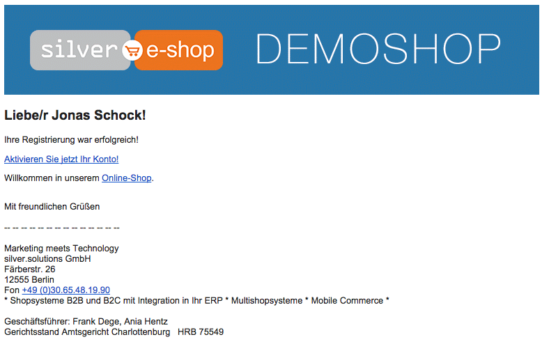
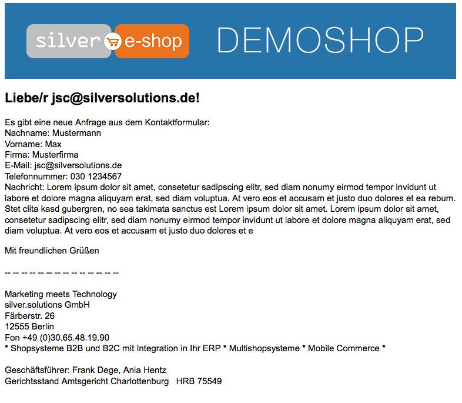
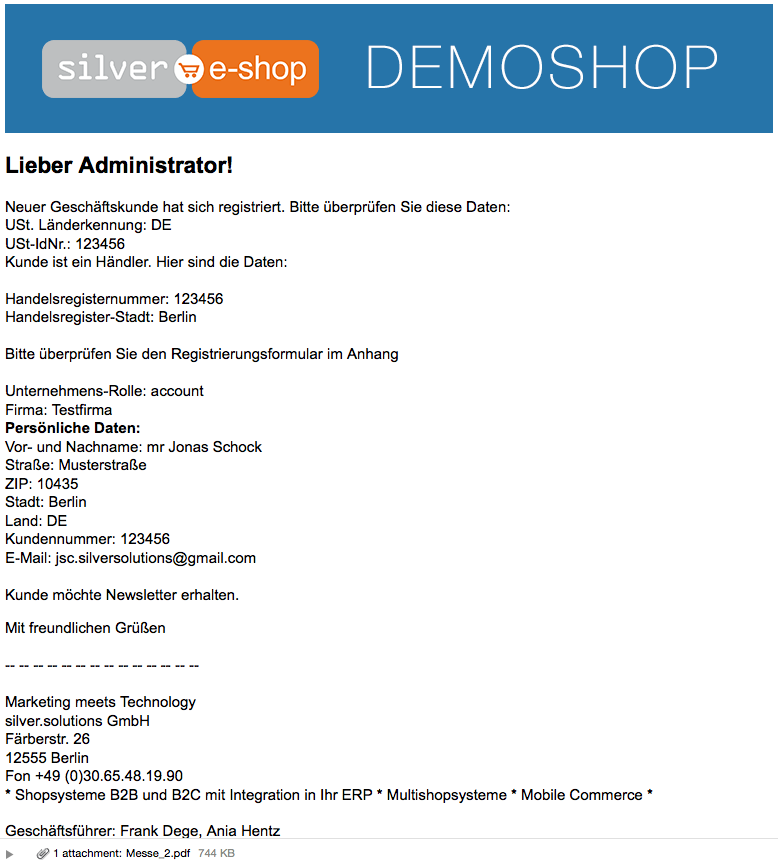

# Emails

Here you can find a list with emails that will be sent out from shop and processes behind them. Also the general configuration can be found here.

## Configuration

By default eZ Commerce is using [SwiftMailer](http://symfony.com/doc/master/reference/configuration/swiftmailer.html) in order to send the emails. This minimum configuration is necessary:

``` yaml
swiftmailer:
    transport:  smtp
    encryption: ssl
    auth_mode:  login
    host:       %ses_eshop.mail.smpt.host%
    username:   shopuser
    password:   shoptest
    #if you enable this parameter, the %ses_eshop.mail.master_address% will get every outgoing email from the shop!
    delivery_address: %ses_eshop.mail.master_address%
```

These parameters are used to configure the outgoing emails:

**General e-mail configuration - emails.yml**

``` yaml
parameters:
    siso_core.default.ses_swiftmailer:
        #general mail sender
        mailSender: noreply@silversolutions.de
        #administrator mail receiver
        mailReceiver: azh@silversolutions.de
        #mail receiver for contact form
        contactMailReceiver: azh@silversolutions.de
        #mail receiver for lost order
        lostOrderEmailReceiver: contact@silversolutions.de
        #mail receiver for cancellation form
        cancellationMailReceiver: contact@silversolutions.de
        #mail receiver for shop notifications
        shopOwnerMailReceiver: azh@silversolutions.de

    #possible mode: config or customer - if you want to send email to the sales person, set to config and add sales_email_address       
    siso_checkout.default.order_confirmation.sales_email_mode: customer
    siso_checkout.default.order_confirmation.sales_email_address:

    #configure email subject
    siso_checkout.default.order_confirmation_subject: "Order confirmation"    
    siso_eshop.default.order_failed_subject: "Order ERP submission failed"
    siso_core.default.cancellation_subject: common.cancellation_email_subject
```

**Customer center**

``` yaml
parameters:
    siso_customer_center.approve_basket.subject: 'Basket to approve'
    siso_customer_center.reject_basket.subject: 'Basket was rejected'
    siso_customer_center.password_mail.subject: 'Your new account'
```

## Email list and processes

### Emails sent to the user

#### Registration - private customer

Receiver: User who registered

How to reproduce:

- Fill the form data and send
- (register/private)

```
Dear Jonas Schock

salutation possible
```

Responsible service:

SendConfirmationMailDataProcessor

Template:

```
SilversolutionsEshopBundle:Emails:ConfirmationMail_RegisterPrivate.html.twig
SilversolutionsEshopBundle:Emails:ConfirmationMail_RegisterPrivate.txt.twig
```

Screnshot:

User:



#### DOI email for subscribe newsletter

Receiver: User who requested the newsletter

How to reproduce:

Input the email address and send

```
Dear {email}

salutation and name not possible, since we are using data from the form
```

Template:

```
Silversolutions/Bundle/EshopBundle/Resources/views/Emails/ConfirmationMail_SubscribeNewsletter.html.twig
Silversolutions/Bundle/EshopBundle/Resources/views/Emails/ConfirmationMail_SubscribeNewsletter.txt.twig
```

#### Forgot password

Receiver: User who executed 'forgot password' function

How to reproduce:

- Fill the form data and send
- (password/reminder)

```
Dear {email}

salutation and name not possible, since we only have the email address from the form
```

Responsible Service:

SendPasswordReminderEmailDataProcessor

Template:

```
SilversolutionsEshopBundle:Emails:password_reminder.html.twig
SilversolutionsEshopBundle:Emails:password_reminder.txt.twig
```

### Emails sent to the user and to the admins

#### Contact form

Receiver:

1. contactMailReceiver
2. User who send out the contact form (if checked send to my address)

How to reproduce:

- Fill the form data and send
- (service/contact)

```
Dear {email}

salutation not possible, since we are using the data from the form
name and last would be possible
```

Configuration:

``` yaml
parameters:
    siso_core.default.ses_swiftmailer:
        contactMailReceiver: azh@silversolutions.de
```

Responsible Service:

SendContactEmailDataProcessor

Template:

```
SilversolutionsEshopBundle:Emails:contact.html.twig
SilversolutionsEshopBundle:Emails:contact.txt.twig
```

Screenshot:

User:



#### Checkout - order confirmation

Receiver:

1. User who ordered
2. If customer center is active and approver triggered the order, approver and buyer will get the email
3. Sales person, if configured

How to reproduce:

If the order process was succesfull, user will get an confirmation email

- Ensure that there is connection to ERP
- order something

```
Dear {email}

salutation and user name not possible, since we are using the data from the form. In the checkout forms we only have
Name/CompanyName
```

Configuration:

``` yaml
parameters:
    #possible mode: config or customer, if you want to send 
    #email to the sales person, set to config and add 
    #sales_email_address
    siso_checkout.default.order_confirmation.sales_email_mode:  
    customer
    siso_checkout.default.order_confirmation.sales_email_address:
    
    #configure email subject
    siso_checkout.order_confirmation.subject: 
    "Order confirmation"
```

Responsible Service:

OrderConfirmationListener

Template:

```
SilversolutionsEshopBundle:Checkout/Email:order_confirmation.html.twig
SilversolutionsEshopBundle:Checkout/Email:order_confirmation.txt.twig
```

#### Lost orders

Receiver:

1. User who ordered
1. If customer center is active and approver triggered the order, approver and buyer will get the email
1. Sales person, if configured

How to reproduce:

Same behavior as in the checkout process:

- If the lost order process was successfull, user will get an confirmation email
- If it was not possible to send an order, admin will get a lost order email

Configuration:

``` yaml
parameters:
    #possible mode: config or customer, if you want to send 
    #email to the sales person, set to config and add 
    #sales_email_address
    siso_checkout.default.order_confirmation.sales_email_mode:  
    customer
    siso_checkout.default.order_confirmation.sales_email_address:
    
    #configure email subject
    siso_checkout.order_confirmation.subject: 
    "Order confirmation"
```

### Emails sent to shop admin

#### Registration - business customer

Receiver: Admin

How to reproduce:

- Fill the form data and send
- (register/business)

Service Responsible:

SendConfirmationMailDataProcessor

Template:

```
SilversolutionsEshopBundle:Emails:ConfirmationMail_RegisterBusiness.html.twig
SilversolutionsEshopBundle:Emails:ConfirmationMail_RegisterBusiness.txt.twig
```

Screenshots:

Administrator:



#### Cancellation form

Receiver: Administrator

How to reproduce:

- Fill the form data and send
- (service/cancellation)

Configuration:

``` yaml
parameters:
    siso_core.default.ses_swiftmailer:
        cancellationMailReceiver: azh@silversolutions.de
```

Service Responsible:

SendCancellationEmailDataProcessor

Template:

```
Silversolutions/Bundle/EshopBundle/Resources/views/Emails/cancellation.html.twig
Silversolutions/Bundle/EshopBundle/Resources/views/Emails/cancellation.txt.twig
```

#### Edit profile - buyer address

Receiver: Administrator

How to reproduce:

- Fill the form data and send
- Only for customers with customer number
- (profile/buyer)

Configuration:
```
parameters:    
    siso_core.default.ses_swiftmailer:      
        mailReceiver: azh@silversolutions.de
```

Service reponsible:

SendConfirmationMailDataProcessor

Template:

```SilversolutionsEshopBundle:Emails:ConfirmationMail_Buyer.html.twig
SilversolutionsEshopBundle:Emails:ConfirmationMail_Buyer.txt.twig
```

#### Edit profile - invoice address

Receiver: Administrator

How to reproduce:

- Fill the form data and send
- Only for customers with customer number
- (profile/invoice)

Configuration:

```
parameters:    
    siso_core.default.ses_swiftmailer:      
        mailReceiver: azh@silversolutions.de
```

Service Responsible:

SendConfirmationMailDataProcessor

Template:

```
Silversolutions/Bundle/EshopBundle/Resources/views/Emails/ConfirmationMail_Address.html.twig
Silversolutions/Bundle/EshopBundle/Resources/views/Emails/ConfirmationMail_Address.txt.twig
```

#### Checkout - order failed
Receiver: Administrator

How to reproduce:

If it was not possible to send an order, admin will get a lost order email

- Ensure that there is no connection to ERP
- Order something

Configuration:

``` yaml
parameters:
    siso_core.default.ses_swiftmailer:  
        mailReceiver: azh@silversolutions.de

    #configure email subject
    siso_eshop.default.order_failed_subject: 
        "Order ERP submission failed"
```

Service Reponsible:

OrderFailedNotifyListener

Template:

```
SilversolutionsEshopBundle:Emails:NotificationMail_FailedOrder.html.twig
SilversolutionsEshopBundle:Emails:NotificationMail_FailedOrder.txt.twig
```

### Fallback

#### Fallback email

How to reproduce:

Sometimes when the email template can not be found, fallback email template is used instead.
This is the case for all emails, where the SendConfirmationMailDataProcessor is used.

Service Reponsible:

SendConfirmationMailDataProcessor

Template:

```
SilversolutionsEshopBundle:Emails:ConfirmationMail_Fallback.html.twig
SilversolutionsEshopBundle:Emails:ConfirmationMail_Fallback.txt.twig
```

### Customer center

#### Approve basket

Receivers:

All approvers (or main contacts, if no approvers configured) from the company

How to reproduce:

- Try to order with a buyer who exceeded his budget.
- In the checkout summary page click on 'Send to approver' button
- All approvers from the company will get an email

Configuration:

```
parameters:
    siso_customer_center.approve_basket.subject: 
    'Basket to approve'
```

Service Responsible:

ApprovalController:sendToApproverAction

Template:

```
SisoCustomerCenterBundle:CustomerCenter/Emails:approve_basket.html.twig
SisoCustomerCenterBundle:CustomerCenter/Emails:approve_basket.txt.twig
```

#### Reject basket

Receiver:

Buyer whose basket was rejected

How to reproduce:

- Login as an approver
- Go the the page with a list of baskets waiting for approvement
reject one basket
- Buyer whose basket was rejected will get an email

Configuration:

``` yaml
parameters:
    siso_customer_center.reject_basket.subject: 
    'Basket was rejected'
```

Service Responsible:

ApprovalController:confirmRejectAction

Template:

```
SisoCustomerCenterBundle:CustomerCenter/Emails:reject_basket.html.twig
SisoCustomerCenterBundle:CustomerCenter/Emails:reject_basket.txt.twig
```

#### New account

Receiver: User whose account was created

How to reproduce:

- Login as main contact
- Request/add new user
- User whose account was created will get an email

Configuration:

```
parameters:
    siso_customer_center.password_mail.subject: 
    'Your new account'
```

Service Responsible:

AddUserInEzFormProcessor

Template:

```SisoCustomerCenterBundle:CustomerCenter/Emails:new_account_pw.html.twig
SisoCustomerCenterBundle:CustomerCenter/Emails:new_account_pw.txt.twig
```

!!! note

    If for some reason no email templates can be rendered (both html and twig), then this email will not be sent to the client.
