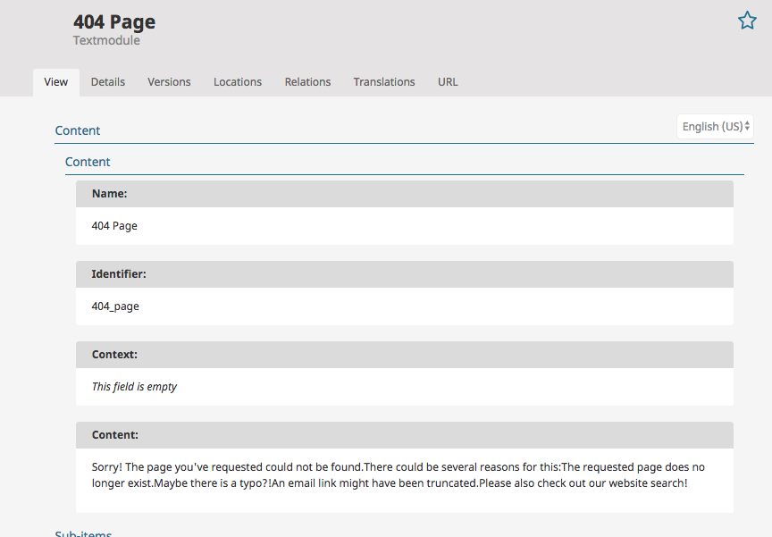

# Exception Handling

eZ Commerce provides default exception handling. Every uncaught exception is handled by
`Silversolutions\Bundle\EshopBundle\EventListener\ExceptionListener`.

Exceptions are logged in the page header as custom `X-Logged-Exception` header.

## Configuration

If an exception is thrown, the user sees a short information on the page.
To display the complete exception add the environment into configuration:

``` yaml
parameters:
    # add environments where you want to display the debug information
    siso_core.debug_environments: ['local', 'dev']
```

### Complete exception in 'dev' environment.


### Exception in 'prod' environment


## 404 page

The configurable 404 page uses a translatable text module.
Thanks to this you can use the Online Editor to place images, format text, etc.

The text module is located under **Components** / **Textmodules** / **Misc**.



The `EshopBundle/Resources/Exception/exception.html.twig` template displays the text from the `404_page` text module.
