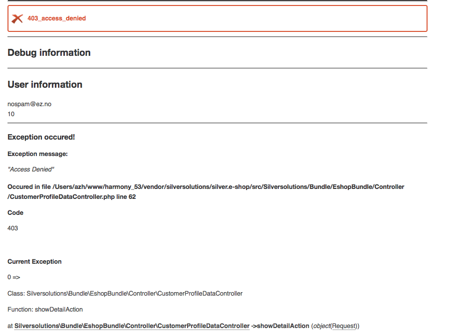
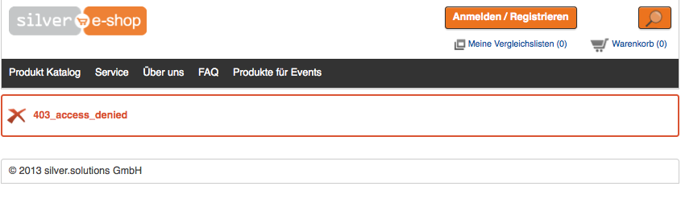

# Exception Handling

## Exception Listener

eZ Commerce provides default exception handling. Every not catched exception will be handled by

`Silversolutions\Bundle\EshopBundle\EventListener\ExceptionListener`

- Exceptions will be logged and displayed also in the page header as custom header: `'X-Logged-Exception'`

### Configuration

If exception is thrown, user will see just little information on the page. If you want to see the complete exception, please add your environment into configuration.

``` yaml
parameters:
    #add environments, where you want to display the debug information
    siso_core.debug_environments: ['local', 'dev']
```

#### Complete exception in 'dev' environment.



#### Exception in 'prod' environment


