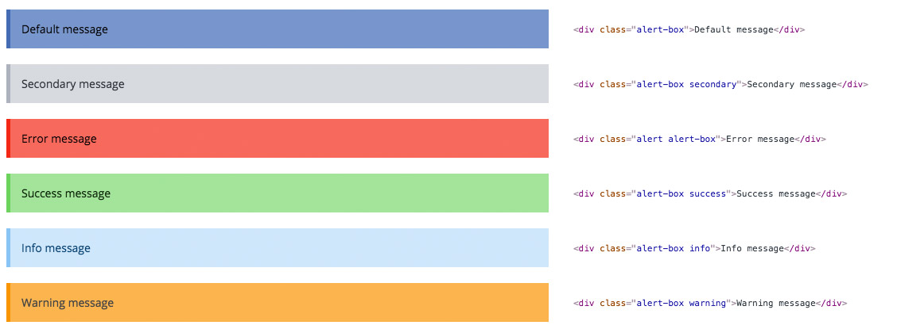

# Extend - Alert Boxes

Extends: <http://foundation.zurb.com/sites/docs/v/5.5.3/components/alert_boxes.html>

## What/why do we extend?

1. Some content that is displayed inside alert boxes comes from online editor (WYSIWYG). In that case every paragraph of text is wrapped with a \<p\> tag which creates margin bottom for every paragraph. With our extend this margin is removed.
1. Make them look different than the standard Foundation alerts.

Alert boxes are part of our messages ecosystem. We use alert boxes to display inline/in-content messages in multiple places like forms, confirmations, errors, etc. In order to generate messages in our shop we use one central template to make easy to maintain. We strongly recommend reading this part of our documentation to get more in depth knowledge about alert boxes usage in eZ Commerce: [Reusable message template](../../../../../developer_manual/templating/templates_for_the_shop/reusable_message_template.md)

## Sass

**File location**

``` 
scss/storm/_extend.components.alert-boxes.scss
```

### Default settings:

``` 
$alert-lighten: $global-alert-lighten;
$alert-left-border-width: 5px;
$alert-text-color-darken:  50%;
```

!!! note

    In order to change settings in project find `settings/_storm.scss` file in your project and find the Inline Alert Boxes section.

## HTML

### Basic examples:

``` 
<div class="alert-box">Default message
<div class="alert-box secondary">Secondary message
<div class="alert-box alert">Error message
<div class="alert-box success">Success message
<div class="alert-box info">Info message
<div class="alert-box warning">Warning message
```

#### Screenshot



### Example with close icon

!!! note

    If you want to enable inline close for messages please make sure to add **data-alert** attribute.

``` 
<div class="alert-box success" data-alert>
    <p>Success message</p>
    <a href="#" class="close">&times;</a>

```

You can use inline close functionality on every type of messages, not only success.
 
