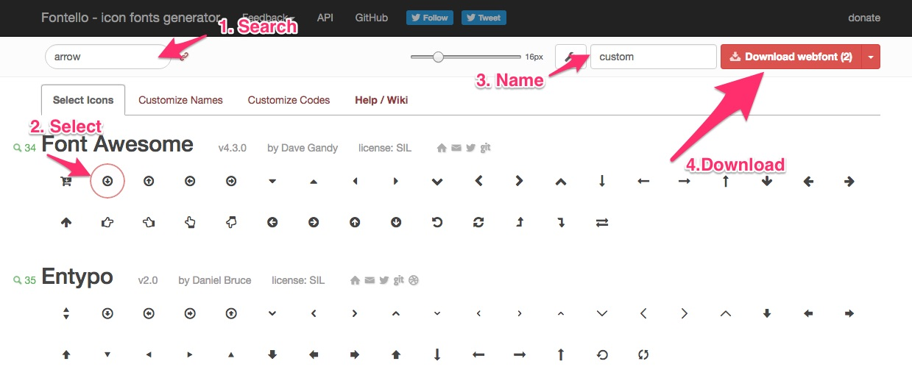

# 4.2.6 - Custom fonts

Introduced in version 3.3.3

Custom fonts are stored inside: and they may contain any custom font face including icon fonts.

# Custom icon fonts

Primarily we use [Font Awesome](http://fontawesome.io/), but sometimes there are situation that it's not possible to find the right icon in [Font Awesome set](http://fontawesome.io/icons/). 

In order to manage custom icon fonts we use this online tool: <http://fontello.com/>. It's pretty straight forward to use it:

1. Search for the icon you want to use
1. Click on it in order to select it (click on more time to deselect)
1. Download the set



!!! note

    Fontello also supports Font Awesome. Please don't include any of Font Awesome icons inside your custom build because they are already included. The image above is just an example.

## Updating custom icon fonts

In order to update custom icon font we already have follow these steps:

1. Go to <http://fontello.com/>
1. Upload custom.svg file onto the page (drag and drop) in order to check what icons are already included
1. Select new icon you want to include
1. Download webfont
1. Unzip the webfont that you downloaded
1. Copy all the files from font directory within that zip package and paste in: vendor/silversolutions/silver.e-shop/src/Silversolutions/Bundle/EshopBundle/Resources/public/font
1. Copy custom.css from css directory within that zip package and paste it in: vendor/silversolutions/silver.e-shop/src/Silversolutions/Bundle/EshopBundle/Resources/public/font

## Using custom icon fonts

### List of custom icons

| Icon                                                                                         | CSS class    |
| -------------------------------------------------------------------------------------------- | ------------ |
|  | .icon-wrench |

### Basic usage:

``` 
<i class="icon-wrench"></i>
```

In some cases e.g. line height of the icon is not correct you can mix it with base class for Font Awesome like this:

``` 
<i class="fa icon-wrench"></i>
```

*.fa is a base class for Font Awesome*
