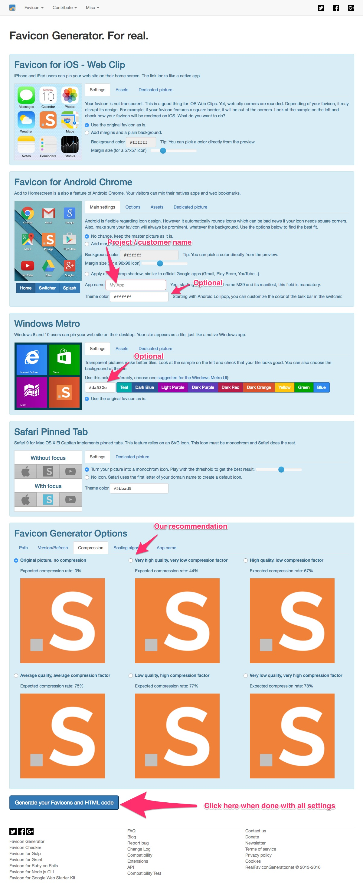
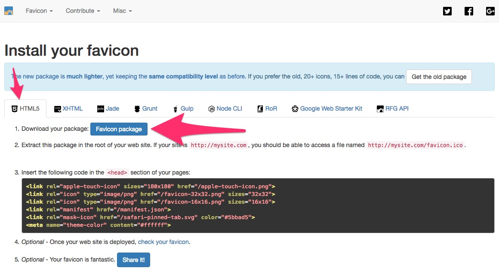

# 5. Standard workflow for a project

# 5.1 Setup

## 5.1.1 Prepare the structure

We have prepared a [boilerplate archive](project_boilerplate.zip) file with the basic structure and content. Download it and extract it into your project folder.

We advise to compare the content of scss/style.scss and scss/settings with respective files and folders inside our `vendor/silversolutions/silver.e-shop/src/Silversolutions/Bundle/EshopBundle/Resources/public/scss/*`

If you want to make it manually here's what we recommend as a base structure:

Inside your project bundle locate the Resources directory and create a "public" folder (if doesn't exist) and inside create a structure like this:

1.  directories:
    1.  css/ - for compiled CSS
    2.  img/ - for images
    3.  js/ - for JavaScript files
    4.  scss/ - for Sass files
    5.  vendor/ - for third party plugins/libraries/etc
2.  files: 
    1.  `.bowerrc`
    2.  `bower.json`
    3.  `gulpfile.js`
    4.  `package.json`
    5.  `scss/settings/_colors.flat.scss`
    6.  `scss/setgins/_foundation.scss`
    7.  `scss/settings/_storm.scss`
    8.  `scss/style.scss`

## 5.1.2 Install dependencies

In order to work with gulp make sure you followed steps described in the [Gulp and Assetic docs](4.5-Working-with-Gulp-and-Assetic_23560872.html). When this is done we need to install project dependencies which will run based on a separate gulp configuration (project specific).

1.  Go to your project public folder

    **Example for Demo Project**

    ``` 
    cd src/Silversolutions/Bundle/DemoBundle/Resources/public/
    ```

2.  Install npm packages by running

    ``` 
    npm install
    ```

    **Troubleshooting (in case of any issues during the installation):**

  -   - in case of permission issues try to run npm install with sudo: sudo npm install
    
      - make sure you have latest version of node installed
    
      - make sure you have latest version of gulp installed globally
    
      - make sure global and local gulp version match

## 5.1.3 Make sure your project bundle is installed in web/bundles

``` bash
php bin/console assets:install --symlink
```

Make sure in your project bundle contains already a Resources/public/ directory. Otherwise symilnk won't be placed in web/bundles/.

# 5.2 FAQ

## 5.2.1 Sass/CSS

### How to work with Sass and browser sync?

From terminal go to the public folder of your project, run gulp and assetic commands

``` 
// assuming that Demo is your project
cd src/Silversolutions/Bundle/DemoBundle/Resources/public/
gulp
 
// open another tab/window and from project root
php bin/console assetic:watch
```

After running gulp you should something similar to this:

``` 
15:14:35] Using gulpfile src/Silversolutions/Bundle/DemoBundle/Resources/public/gulpfile.js
[15:14:35] Starting 'css'...
[15:14:35] Starting 'sass'...
[15:14:35] Finished 'sass' after 6.59 ms
[15:14:35] Starting 'browser-sync'...
[15:14:35] Finished 'browser-sync' after 62 ms
[15:14:36] Finished 'css' after 86 ms
[15:14:36] Starting 'default'...
[15:14:36] Finished 'default' after 14 ms
[BS] Copy the following snippet into your website, just before the closing </body> tag
<script type='text/javascript' id="__bs_script__">//<![CDATA[
    document.write("<script async src='<\/script>".replace'>http://HOST:3002/browser-sync/browser-sync-client.2.11.0.js'><\/script>".replace("HOST", location.hostname));
//]]></script>
[BS] Access URLs:
 -------------------------------------
          UI: http://localhost:3003
 -------------------------------------
 UI External: http://192.168.0.14:3003
```

!!! caution

    Make sure to copy browser sync snippet into your template file, just before the closing \</body\> tag.

From now on you should be able to work with Sass and browser sync. Any changes in Sass will be injected into the browser window without reloading.

As an output you will get typically one file which will be located in publics/css/ directory. Please don't change this file directly because every change will be overridden when you will run gulp sass watcher.

#### Important

Make sure you have linked your project CSS file in the templates

**Demo Bundle example**

``` html+twig

  
  <link rel="stylesheet" href="{{ asset_url }}"/>
  

```

### How to change standard settings?

We suggest to use `public/scss/_project.settings.scss` file which is included in `public/scss/style.scss`.

``` css
// PROJECT_NAME by Silver Solutions
// www.silversolutions.de
// Copyright (C) 2014 silver.solutions GmbH. All rights reserved.
// license see vendor/silversolutions/silver.e-shop/license_txt_ger.pdf

//

// Table of Contents
// Project Settings

// a. Third party
// b. Typography
// c. Colors
// d. ...

// 01. Component
// 02. Component
// 03. ...

/* a. Third party

  Third party settings
  ========================================================================== */

// Slick slider override settings
$slick-arrow-color: $flat-peter-river;
$slick-loader-path: "../../silversolutionseshop/img/";
$slick-font-path: "../../silversolutionseshop/vendor/slick.js/slick/fonts/";

// Font Awesome settings
$fa-font-path: "../../silversolutionseshop/vendor/font-awesome/fonts";

/* b. Typography
  ========================================================================== */

$roboto-font-path: "../../silversolutionseshop/vendor/roboto-fontface/fonts";
$OpenSansPath: "../../silversolutionseshop/vendor/open-sans-fontface/fonts";

$storm-primary-font: Open Sans, Helvetica, Arial, sans-serif;
$storm-secondary-font: Roboto, Helvetica, Arial, sans-serif;

/* b. Colors
  ========================================================================== */

// $primary-color: #2574A9;
// $secondary-color: #34495E;
// $alert-color: $flat-alizarin;
// $success-color: $flat-nephritis;
// $warning-color: $flat-carrot;
// $info-color: $flat-peter-river;
/* 01. Component

  Component description if required
  ========================================================================== */
```

Please follow the convention of sectioning for better and easier navigation through the settings. Create your own sections if required.

- to override Foundation settings use `vendor/silversolutions/silver.e-shop/src/Silversolutions/Bundle/EshopBundle/Resources/public/scss/settings/_foundation.scss` as reference
- to override Storm settings use `vendor/silversolutions/silver.e-shop/src/Silversolutions/Bundle/EshopBundle/Resources/public/scss/settings/_storm.scss` as reference

### How to create new component?

1. Go to `public/scss/component/` directory and create your file. We suggest to use `_project.COMPONENT_NAME.scss` naming convention. This way it will be much easier to notice project files from standard files in `public/scss/style.scss`.
2. Make sure to include your component in `public/scss/style.scss` in the Components section.

### How to extend/override an existing component?

1. Go to `public/scss/component/` directory and create your file. We suggest to use `_project.extends.COMPONENT_NAME.scss` naming convention. This way it will be much easier to notice project files from standard files in `public/scss/style.scss`.
2. Make sure to include your component in `public/scss/style.scss` in the Components section.

### How to create a theme based on a component?

1. Go to `public/scss/component/` directory and create your file. We suggest to use `_project.theme.COMPONENT_NAME.scss` naming convention. This way it will be much easier to notice project files from standard files in `public/scss/style.scss`.
2. Make sure to include your component in `public/scss/style.scss` in the Themes section.

### How to enable/disable a Sass component?

1. Open `public/scss/style.scss` file
2. Find the component line and comment/uncomment
3. Run gulp command to generate new version of style.css file

## 5.2.2 Twig/templating

### How to override/extend templates?

1. Find the template you want to change (`vendor/silversolutions/silver.e-shop/src/Silversolutions/Bundle/EshopBundle/Resources/views`)
2. Copy / paste keeping the same structure into your project bundle views e.g: `src/Silversolutions/Bundle/DemoBundle/Resources/views/`

#### Troubleshooting

- if the template changes are not visible try to clear cache

``` bash
// from project root
php bin/console cache:clear
```

### How to create new templates?

1. Go to your project bundle views folder  e.g: src/Silversolutions/Bundle/DemoBundle/Resources/views/
2. Find the best place in the directory structure and create new file with desired content
3. Reference that file in the place you want to use it. Remember to use project bundle name when using the include tag

``` 
{% include 'YOUR_PROJECT_BUNDLE_NAME:path/to/the/file.html.twig'|st_resolve_template}
```

#### Troubleshooting

- if the template changes are not visible try to clear cache

``` bash
// from project root
php bin/console cache:clear
```

## 5.2.3 JavaScript

### How to create new JavaScript files?

Go to public/js/ and create the file you want. Please make sure to link it in the javascript block in your template(s)

``` 

<script type="text/javascript" src="{{ asset_url }}"></script>

```

### How to extend/override JavaScript files?

1. Go to vendor/silversolutions/silver.e-shop/src/Silversolutions/Bundle/EshopBundle/Resources/public/js and copy what you want to change.
2. Paste it in your project bundle public/js/ folder.
3. Make sure to link in the javascript block in your templates by replacing the one you are changing

``` 
// before

<script type="text/javascript" src="{{ asset_url }}"></script>

// after

<script type="text/javascript" src="{{ asset_url }}"></script>

```

## 5.2.4 Misc

### How to install third party vendors?

We use bower for our dependancy management. More about Bower here: [4. Front-end stack in details](4.-Front-end-stack-in-details_23560999.html) (Bower section at the bottom)

1. Go to public/ directory inside your project bundle Resources/
2. Run bower install \<package\_name\> in order to install it  
    **bower install \<package name\>** e.g. bower install jquery  
      - if you want to install specific version **bower install jquery\#2.1.3**
      - if you want to save it as dependency (for updates, etc) **bower install jquery --save**
3. For CSS/Sass files make sure to import them in public/scss/style.css in the Plugins section
4. For JavaScript files make sure to include them in the template javascripts block

### How to update a favicon?

Use this tool in order to create a package with all required icons: <http://realfavicongenerator.net/>. What you provide is a single image and the tool is generating a zip package for you which you can use in project. We recommend using public/img/favicon/ directory inside your project bundle.





After you download the package:

1. Compare what's in your page header to the code you will get in step 3
2. Copy the whole directory into your project public/img/favicon/
3. Update your vhost entry with the full path to the favicons directory. Remember to restart your webserver after changing your vhost configuration.  
    This path needs to be updated: 
    
    Define favicons_path vendor/silversolutions/silver.e-shop/src/Silversolutions/Bundle/EshopBundle/Resources/public/img/favicons/

    ``` 
    # Favicons
            # Using this approach we are able to store favicons and all related
            # files in one directory. This directory needs to be defined for each
            # project if the customer would like to use custom favicon
            Define favicons_path vendor/silversolutions/silver.e-shop/src/Silversolutions/Bundle/EshopBundle/Resources/public/img/favicons/
            <Directory ${favicons_path}>
                AllowOverride none
                Require all granted
            </Directory>
            RewriteRule ^/(apple-.*.png)$ ${favicons_path}$1 [L]
            RewriteRule ^/(android-.*.png)$ ${favicons_path}$1 [L]
            RewriteRule ^/(favicon-.*.png)$ ${favicons_path}$1 [L]
            RewriteRule ^/(mstile-.*.png)$ ${favicons_path}$1 [L]
            RewriteRule ^/(safari-pinned-.*.svg)$ ${favicons_path}$1 [L]
            RewriteRule ^/(favicon.ico)$ ${favicons_path}$1 [L]
            RewriteRule ^/(manifest.json)$ ${favicons_path}$1 [L]
            RewriteRule ^/(browserconfig.xml)$ ${favicons_path}$1 [L]
    ```

4.  Test if everything is fine using this tool: <http://realfavicongenerator.net/favicon_checker>
