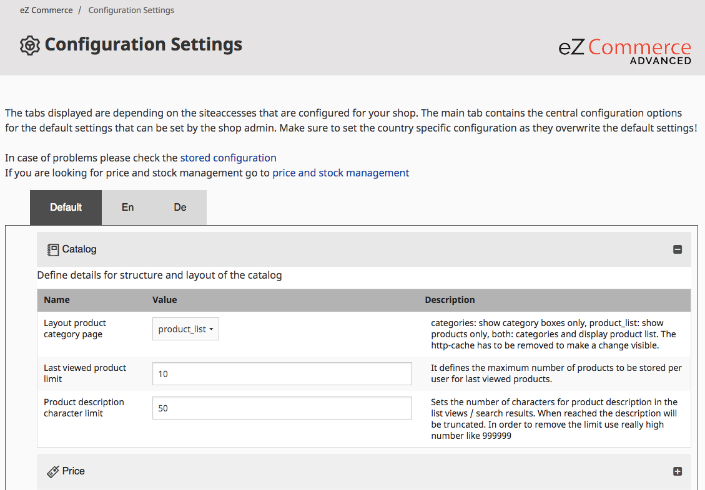
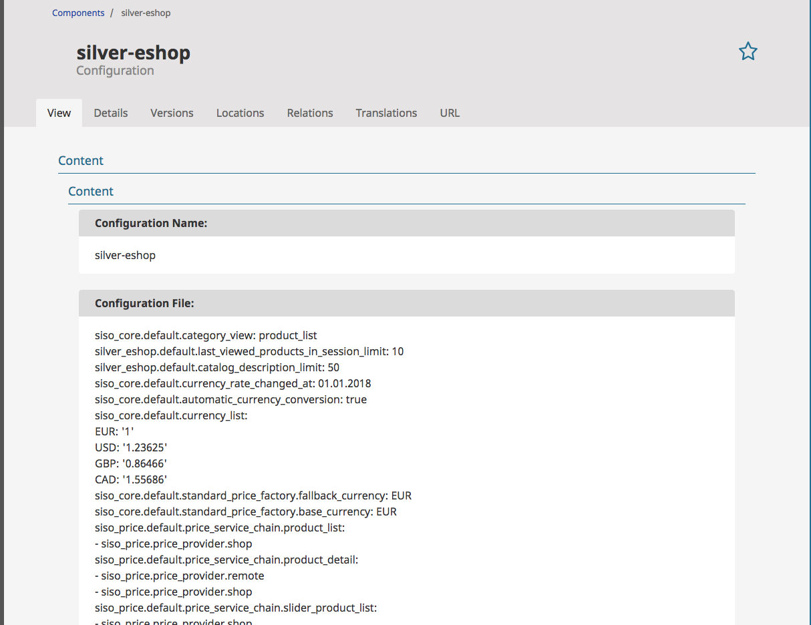

# How to adapt the UI for configuration

## Introduction

Shop administrator is able to configure some of the general parameters in order to customize eZ Commerce for his needs. 

This ability is available after logging to eZ Backend and going into eZ Commerce section.

The backend offers a selection of fields which can be configured. A developer can add new fields if required (see below).



## How customized parameters are stored

Administrator can update any of the exposed parameters. When button "Save" is clicked there are 2 actions that follow:

- 1. The configuration is stored in a database as **eZ Document**. There is a special type called "Configuration", which is storing the yml representation.  
  

- 2. The configuration is stored in the stash cache.

## How client configuration is acknowledged by eZ Commerce

In order to apply this additional configuration, which was set by administrator, a new configuration resolver with a high priority has been implemented. This is called before all other config resolvers are called and checks for additional configuration files in the file system.

``` xml
<service id="siso_core.config.resolver" class="%siso_core.config.resolver.class%" lazy="true">
    ...
    <tag name="ezpublish.config.resolver" priority="300" />
</service>
```

### How the siso\_core.config.resolver behaves

The siso\_core.config.resolver checks if additional configuration files exists in the file system. Therefore following folder is checked:

``` yaml
#Attention!!! This parameter is not ment to be changed! It should be only used as readonly parameters!!!
siso_core.default.silver_eshop_config_directory: '%kernel.root_dir%/Resources/silverEshopConfig/'
```

It reads all .yml files stored in this folder and merges them together - as a result one configuration list is created and stored in the stash cache.

!!! caution

    It is not the responsibility of this config resolver to check, if the .yml files are valid, or if the content is correct.

Afterwards when the actual configuration parameter is called by the application, it tries to read it from the stash first, otherwise it follows the default behaviour.

## Configuration of parameters exposed to administrators

All the siteaccess parameters can be stored in the backend configuration class. Therefore new parameters have to be added to the backend configuration files.  
These configuration files can be found here: `silver.e-shop/src/Silversolutions/Bundle/EshopBundle/Resources/config/backend`

The parameters are divided into sections by siteaccess and group. 

Example:

``` yaml
silver_eshop.default.catalog_product_list_limit:
    group: core
    type: integer
```

In the example above the "product limit" is in a default siteaccess (which is shown on the top in a tab) and in core group (which is visible as one of the accordion tables):

### List of parameters available for display

#### Simple values

##### boolean

``` yaml
siso_core.default.xxx:
    type: boolean
```
    
radio button

##### string

``` yaml
siso_core.default.xxx:
    type: email
```
    
text input field	

##### email

``` yaml
siso_core.default.xxx:
    type: email
```

text input field	

##### integer

``` yaml
siso_core.default.xxx:
    type: integer
```

number input

##### numeric

``` yaml
siso_core.default.xxx:
    type: number
```

number input	

##### selectbox

``` yaml
siso_core.default.xxx:
    type: selectbox
    choices: ['choice1', 'choice2']
```

select box with defined choices	

##### checkbox

``` yaml
siso_core.default.xxx:
    type: checkbox
    choices: ['choice1', 'choice2', 'choice3', 'choice4', 'choice5']
```

checkboxes with defined choices	

#### 1 dimensional arrays	

##### array

``` yaml
siso_core.default.xxx:
    type: array
    keys: true|false
    keys_choices: ['choice1', 'choice2', 'choice3']
    choices : ['choice1', 'choice2']
```

inputs or selectboxes with optional choices:

- if keys are allowed then user can specify array keys also
- if choice are defined only those values are allowed

User interface allows:

- adding new array items
- removing items

#### 2 dimensional arrays

##### subtype

```
siso_core.default.vat:
    group: core
    type: subtype
    internal_key: DE
    sub_type: array
    sub_keys: true
    sub_choices: [7, 19] 
```

subtype is used for 2 dimensional arrays

- internal_key - index of parameter in array
- sub_xxx - determines options same as array

## Translations

There is a possibility to add translations for configuration name and description that will appear in backend. For subtypes it is allowed to write description per internal key (example below):

``` 
'catalog_product_list_limit|config' => 'Products per page in a product list',
'catalog_product_list_limit|description' => 'This numeric value describes how many products should be visible on category listing page',
// subtype with internal key "active"
'catalog_factory.assets|config' => 'Shall assets (images, pdf) fetched automatically from filesystem',
'catalog_factory.assets.active|description' => 'Enable catalog factory for assets',
```

## Grouping of configuration

- general
  - activate/deactivate features (whishlist, comparison, ..)
  - b2b/btoc mode
- email
  - email addresses
- Catalog  
  - count of product per line in product lists 
  - show left navi yes/no
  - price engine chain config
- Checkout
  - Kind of basket footer (e.g. how totals shall be displayed)
  - Show top navi in checkout yes/no
  - columns for basket
  - offered payment options
- User  
  - supported countries
- Content
  - ez content IDs, etc

## Limitations

The complete parameter has to be added to the backend configuration class, it is not possible to configure only one part for the backend.

Example:

``` yaml
# Not possible to define this for the backend configuration:
silver_eshop.default.http_cache:
    product:
        max_age: 28800
        vary: ~

# Only the full configuration is possible:
silver_eshop.default.http_cache:
    product:
        max_age: 28800
        vary: ~
    product_list:
        max_age: 28800
        vary: ~
    product_type:
        max_age: 28800
        vary: ~
    product_type_children:
        max_age: 28800
        vary: user-hash
    price_block:
        max_age: 0
    header_login:
        max_age: 36000
        vary: cookie
    basket_preview:
        max_age: 36000
        vary: cookie
    stored_basket_preview:
        max_age: 36000
        vary: cookie
    last_viewed_products:
        max_age: 36000
        vary: cookie
    service_menu:
        max_age: 36000
        vary: ~
    navigation:
        max_age: 36000
        vary: user-hash
    newsletter:
        max_age: 36000
        vary: user-hash
``` 
