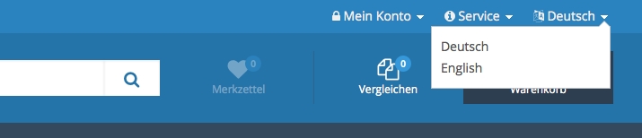

# Language switcher

eZ Commerce comes with a language switcher functionality, if your shop supports multiple siteaccesses because of the multilingualism. You can easily switch the language in the shop by clicking on the language in the language switcher list.

If user clicks on another language from the list, he will be redirected to the same page with the appropriate language.



## Technical background

### Configuration

The siteaccess and languages are configured in ezplatform.yml

``` yaml
ezpublish:
    siteaccess:
        default_siteaccess: ger
        list:            
            - engl
            - ger
            ...

    ...
    system:     
        engl:
            languages:
                - eng-US
       ger:
            languages:
                - ger-DE
```

### Template

The language switcher is integrated in the **pagelayout.html.twig**, so it can be displayed on every page.

!!! note

    The parameters for the language switcher controller are set here. Do not change them to ensure the full functionality\!

**Parameters for the controller - do not change!**

``` html+twig
{#parameters for the language switcher#}




    
    

    
    

    
    

    
    

{#end - parameters for the language switcher#}
```

The list of languages are configured in these blocks. You have to change them depending on your siteaccess configuration.

Per language you need to set the correct siteaccess name.

**List of languages - change\!**

``` html+twig


  <button href="#" data-dropdown="dropdown-languages-mobile" aria-controls="dropdown-languages-mobile"
          aria-expanded="false" class="label secondary right">
    DEEN
  </button>

  <ul id="dropdown-languages-mobile" data-dropdown-content class="f-dropdown tiny" aria-hidden="true">
    <li><a href="{{ url('silversolutions_language_switcher', {'siteaccess' : 'ger', 'source' : source, 'id' : id, 'query_string' : app.request.queryString }) }}">DE</a></li>
    <li><a href="{{ url('silversolutions_language_switcher', {'siteaccess' : 'engl', 'source' : source, 'id' : id, 'query_string' : app.request.queryString }) }}">EN</a></li>
  </ul>



...


      <li>
        <a href="#" class="c-nav-meta__dropdown with-arrow" data-dropdown="dropdown-languages" data-options="is_hover:true">
          <i class="fa fa-language"></i>
          DeutschEnglish
        </a>

        <ul id="dropdown-languages" class="f-dropdown tiny text-left content c-nav-meta__content"
            data-dropdown-content>
          <li class="current">
            <a href="{{ url('silversolutions_language_switcher', {'siteaccess' : 'ger', 'source' : source, 'id' : id, 'query_string' : app.request.queryString }) }}">
              Deutsch
            </a>
          </li>
          <li>
            <a href="{{ url('silversolutions_language_switcher', {'siteaccess' : 'engl', 'source' : source, 'id' : id, 'query_string' : app.request.queryString }) }}">
              English
            </a>
          </li>
        </ul>
      </li>

```

## Controller

The LanguageSwitcherController will generate the correct url depending on the given GET parameters in the template and redirect user to the correct page. If no url can be generated, user will be redirected to the homepage of the requested siteaccess.

**routing.yml**

``` yaml
silversolutions_language_switcher:
    path:     /language_switcher
    defaults: { _controller: SilversolutionsEshopBundle:LanguageSwitcher:redirect } 
```
