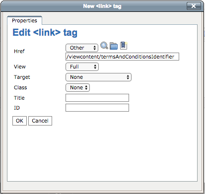

# Pop-up window with external content

## Popup window with content loaded via Ajax

It is possible to get external content and display it within a popup window using Storm messages plugin. 

**Required JavaScript and CSS is loaded automatically, so the only thing you have to do is to write proper HTML markup inside your template file.**

Advantages:

1. Content is displayed on one page and loaded via Ajax in other places (multiple) 
1. When the content is updated in the backed, changes are visible everywhere
1. It's better for user experience to show some kind of information in a popup window, especially in the basket or checkout process. We don't want that our users will leave the basket or checkout process.

#### Javascript

``` js
$(document).on('click', '.js-ajax-get-content a', function (e) {
  e.preventDefault();

  var url = $(this).attr('href');
  var selector = $(this).parents('.js-ajax-get-content').data('content-selector');

  storm.spinner.show();

  $.get(url, function (data) {
    var content = $('<div/>').html(data);
    storm.reveal.open('modal-ajax-response', content.find(selector).html(), 'with-text u-padding-1x-on-small', '')
    storm.spinner.hide();
  });
});
```

#### Design

We are using the Foundation Modal Component to show the content

<https://foundation.zurb.com/sites/docs/v/5.5.3/components/reveal.html>

#### Attributes

|Property Name|Description|
|--- |--- |
|class="js-ajax-get-content"|Trigger class that opens overlay window with content loaded via Ajax. Must be applied to the parent element. See the code example above. You are not limited to use this with span tag. You can whatever tag that suits your code. The only limitation here is that it will take the first link that is inside .ses_popup container.|
|data-content-selector=".js-ez-article"|Content selector to get data from. For example if we want to get content of an article from http://www.domain.com/terms-and-conditions.html and the text that we are interested in is inside .content container it should like like data-msg-content=".content". If you want to use id instead of class please use # like this: data-msg-content="#content".|

#### Code examples

Popup with CSS class selector"

``` html+twig
<div class="js-ajax-get-content" data-content-selector=".js-ez-article">
    <a href="/internalURL">

```

\*internalURL = is the URL of the page you want to include

## Popup window with content loaded by identifier

The article class in eZ was extended with an attribute 'identifier'. Now we can fetch the article by the given identifier and render the content. This textmodule can be exported.


