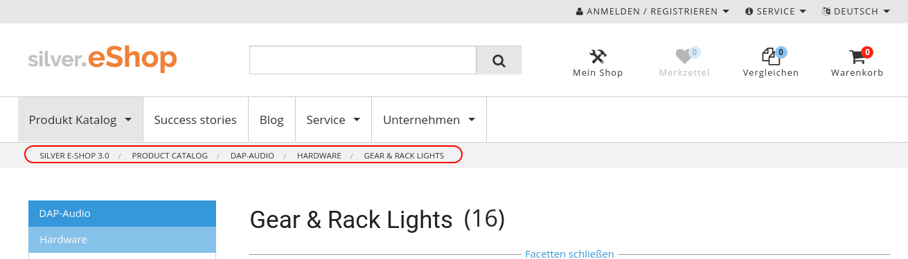

# Breadcrumbs

## Introduction

eZ Commerce supports generation of breadcrumbs throughout the shop. The customer can currently be in many different parts of the shop, but still there will be at least one generator responsible for creating breadcrumbs. 



The breadcrumb will be generated using a general template called from the pagelayout. There is no need to define html code in full templates:

**pagelayout.html.twig**

``` html+twig

        <div class="crumb-wrap hide-for-print">
          <div class="row">
            <div class="columns">
              

  
```

It uses schema.org markup (<http://schema.org/BreadcrumbList>) for generating the html tags. 

The breadcrumb system is using the [WhiteOctober breadcrumbs bundle](https://github.com/whiteoctober/BreadcrumbsBundle).

## Features

eZ Commerce breadcrumbs supports:

- creation of breadcrumbs for catalog elements (e.g. products, categories)
- creation of breadcrumbs for internal shop routes (e.g. my profile, search)
- creation of breadcrumbs for eZ Platform content
- creation of breadcrumbs for special eZ Commerce forms (e.g. contact form)
- different data providers as products may come from different sources
- generation of breadcrumbs for multiple product catalogs
- storage of additional data in translationParameters
- configuration for eZ content fields that should be used as breadcrumb labels

## Configuration

You can configure the eZ fields, that should be used as labels for the (eZ content) breadcrumb nodes.

The first match wins.

``` yaml
parameters:
    siso_core.default.breadcrumb_content_label_fields: ['name', 'title']
```

## Before you start 

Please keep in mind that Breadcrumbs is really connected with a lot of different modules in our shop. Be sure to check these out:

- [Catalog Element](23560458.html)
- [Dataprovider](http://confluence.extranet.silversolutions.de:8090/display/EX/Products+from+different+sources+-+Catalog+data+providers)
- [Navigation](Navigation_23560821.html)
