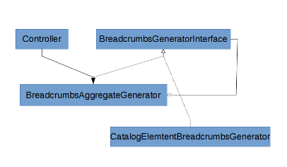

# Breadcrumbs API

### How do breadcrumbs work?

#### Page layout hook-in

The template *Silversolutions/Bundle/EshopBundle/Resources/views/pagelayout.html.twig* defines a block named `breadcrumb` in which the breadcrumbs are rendered as a sub-controller call.

The controller's short name is `SilversolutionsEshopBundle:Breadcrumbs:renderBreadcrumbs`.

FQN: `\Silversolutions\Bundle\EshopBundle\Controller\BreadcrumbsController::renderBreadcrumbsAction()`

#### Aggregation of generators

Breadcrumbs logic is using aggregate method for each generator interface.  The UML diagram is shown below.



The main gateway is a class "BreadcrumbsAggregateGenerator". It is collecting all generators, which can generate breadcrumbs. 

We use a compiler pass to get all services tagged with `siso_core.breadcrumbs_generator`.

``` 
<tag name="siso_core.breadcrumbs_generator" priority="20" />
```

#### Rendering of breadcrumbs

The controller method BreadcrumbsController::renderBreadcrumbsAction() uses the BreadcrumbsAggregateGenerator to render the breadcrumbs from the controller.

The AggregateGenerator loops through all collected generators to check if this particular generator can render breadcrumbs.

The first generator that returns true from canRenderBreadcrumbs() wins and will be used to render the breadcrumbs HTML code. That's why it is important to set the priority of the generators properly.

Every generator needs to implement the "Silversolutions\\Bundle\\EshopBundle\\Api\\BreadcrumbsGeneratorInterface".

|Method|Description|
|--- |--- |
|public function canRenderBreadcrumbs(Request $request);|This method verifies if the generator should render breadcrumbs for current request.|
|public function renderBreadcrumbs(Request $request);|This method is responsible for the breadcrumbs generation.
It renders the breadcrumbs for the current request.|

#### List of generators:

|Name|Description|
|--- |--- |
|RoutesBreadcrumbsGenerator|renders breadcrumbs, if the route for the action contains information (routing.yml):</br>`breadcrumb_path: silversolutions_stored_basket_show`</br>`breadcrumb_names: storedBasket`|
|PostSilverModuleBreadcrumbsGenerator|renders breadcrumbs for a silver module element|
|EzContentBreadcrumbsGenerator|renders breadcrumbs for an eZ Platform content element|
|CatalogBreadcrumbsGenerator|renders breadcrumbs for an e-shop catalog element|
