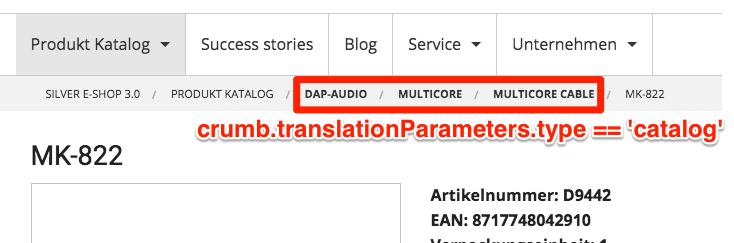

# Breadcrumbs FAQ

## Why do the breadcrumbs for my controller only display the root element?

Please check the routing.yml.

The RoutesBreadcrumbsGenerator need at least the parameter "**breadcrumb\_path**". This parameter usually contains the key of the current routing definition.

``` yaml
custom_blog_index:
    pattern:  /blog/index
    defaults:
        _controller: AppBundle:Blog:index
        breadcrumb_path: custom_blog_index
        breadcrumb_names: Blog List
```

## Some or all elements of the breadcrumbs display strange words like `some_route_name|breadcrumb`?

Please check the routing.yml.

Either no `breadcrumb_names` is defined, like:

``` yaml
custom_blog_index:
    pattern:  /blog/index
    defaults:
        _controller: AppBundle:Blog:index
        breadcrumb_path: custom_blog_index
```

Or the number of elements in `breadcrumb_names` and `breadcrumb_path` differ, like:

``` yaml
custom_blog_index:
    pattern:  /blog/index
    defaults:
        _controller: AppBundle:Blog:index
        breadcrumb_path: custom_blog_index/new
        breadcrumb_names: Blog List
```

In these cases, the fallback implementation tries to translate the respective breadcrumb\_path elements with context "breadcrumb", which most likely are not translated. The best solution is to have proper path and names configuration and existing translations for the breadcrumb\_names' elements:

``` yaml
custom_blog_index:
    pattern:  /blog/index
    defaults:
        _controller: AppBundle:Blog:index
        breadcrumb_path: custom_blog_index/new
        breadcrumb_names: Blog List/New blog post
```

## Why are no breadcrumbs displayed at all?

Possibilities:

- The 'breadcrumb' block of the pagelayout.html.twig template was overridden by the currently displayed, extending template with emtpy content.
- The matched generator encountered an error and didn't render the breadcrumbs
- Very unlikely but not impossible: No generator matched at all. But in the standard setup, the lowest prio RoutesBreadcrumbsGenerator checks the active Router service to match the active Request service. That's SHOULD be always the case.

## How can breadcrumbs be limited to their ez content in sub shops?

The parameter `content.tree_root.location_id` is used to limit the sub shops to their ez content (contains Node ID of the desired catalog).

If `content.tree_root.location_id` is set, a criterion is used in the CatalogHelper.php to fetch the correct product catalog instead of the default one.

``` php
if ($this->configResolver->hasParameter('content.tree_root.location_id')) {
                $ezLocationRootId = $this->configResolver->getParameter('content.tree_root.location_id');
                $ezLocationRoot = $this->locationService->loadLocation($ezLocationRootId);
                $ezLocationRootPath = $ezLocationRoot->pathString;
                $subtreeCriterion = new Criterion\Subtree($ezLocationRootPath);
                $criteria[] = $subtreeCriterion;
            }
```

## What is the purpose of the additional data stored in translationParameters?

This data can be used to define, for example if a breadcrumb of an eZNode should be clickable or hidden.

Example for not clickable breadcrumbs with bold text, if crumb.translationParameters.type == 'catalog':

**vendor/silversolutions/silver.e-shop/src/Silversolutions/Bundle/EshopBundle/Resources/views/Breadcrumbs/breadcrumb\_list.html.twig**

``` 

  <li itemprop="itemListElement" itemscope itemtype="http://schema.org/ListItem">
    
      <b>
        <span itemprop="name">{{ crumb.text }}
        <meta itemprop="position" content="{{ loop.index }}"/>
      </b>
    
      <a itemprop="item" href="{{ crumb.url }}">
        <span itemprop="name">{{ crumb.text }}
      </a>
      <meta itemprop="position" content="{{ loop.index }}" />
    
  </li>

  {# TODO make last element link configurable #}
  <li itemprop="itemListElement" itemscope itemtype="http://schema.org/ListItem">
    <span itemprop="name">{{ crumb.text }}
    <meta itemprop="position" content="{{ loop.index }}" />
  </li>

```

  
