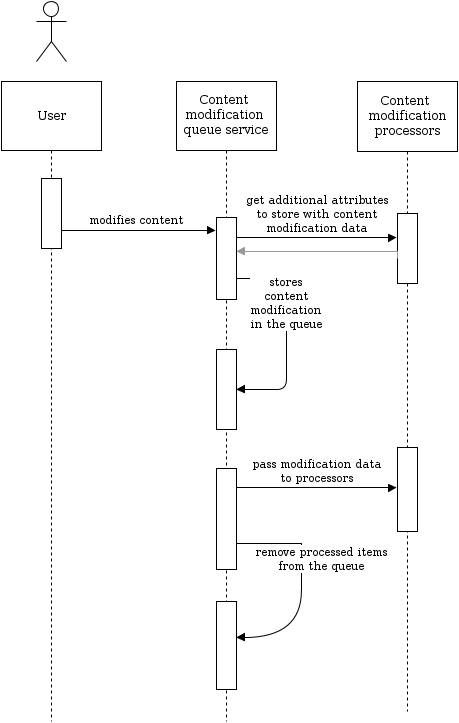

# Content cache refresh. Technical implementation

## General

### Slot implementation

!!! note

    Consult the [SignalSlots documentation](https://doc.ezplatform.com/en/2.5/guide/signalslots/#signals-reference) from eZ Platform for more information about the SignalSlot system.

The ContentModificationSlot pushes content modification data into the queue by using the ContentModificationQueueService.

### Definitions

**Content modification** - array with information about modified content.

|Attribute (key)|Value type|Description|
|--- |--- |--- |
|content_id|int|Content id of a modified content item.|
|action|string|Name of action which resulted in a content modification, e.g:</br>publish</br>delete|
|trigger|string|Legacy trigger name which caused a content modification, e.g:</br>post_publish</br>pre_delete</br>This attribute is creted only to provide additional information for content modification processor developers.|

!!! note

    You can find a list of actions and triggers. See [supported content modification actions and triggers](#Contentcacherefresh.Technicalimplementation-SupportedActions)

    Content modification processors can provide additional attributes. See getContentModificationAttributes.

**Content modification queue** - series of content modifications.

Implemented with Doctrine.

- ContentModificationQueue - Doctrine entity (queue item).
- ContentModificationQueueRepository - Doctrine entity repository for queue items.

**Content modification queue service** - service that stores content modifications in the queue and runs processors to handle content modifications.

**Content modification processor** - a service implemented to process information about content modification (e.g. refreshes related caches)

### Content modification queue service

ContentModificationQueueService has several responsibilities:

1. Gather all services that are tagged with `siso_tools.content_modification_processor` (content modification processors).
1. Fetch all current content modifications from the queue.
1. Get additional attributes from processors.
1. Push content modifications to the queue (table `ses_content_modification_queue`).
1. Pass every content modification object to every processor service.
1. Remove processed content modifications from the queue.



### Content modification processor

Every content modification processor must implement 2 actions:

1. Get content id and expose additional attributes that processor can process later.  
    E.g. navigation cache processor retrieves a content object language code form the given content id. This information is being added to content modification data along with initial data.
2. Process content modification data (e.g. clear cache).

#### Motivation. Why is it divided on 2 actions?

Content modifications are being stored in the content modification queue **immediately** after content is changed. However, processing of the queue doesn't happen immediately. Shop administrator can process the queue manually with a console script or configure a cronjob task.

It means that if user removes content item, there is no data which processor can use for clearing cache. For this reason, a content modification processor has to store information about removed content object before it is being processed.

Content modification processing is usually resource consuming operations. Therefore it should be done as a deferred task.

## How to implement new content modification processor

There are two steps to add your own Processor Service to the chain for content cache refresh.

### Step 1. Prepare service definition to add a service with the tag siso_tools.content_modification_processor

``` 
<!-- your own content modification processor service -->
<service id="domain.yourname_content_modification_processor" class="%domain.yourname_content_modification_processor.class%">
    ...
    <tag name="siso_tools.content_modification_processor" />
</service>
```

### Step 2. Create processor service class, which has to implement interface ContentModificationProcessorServiceInterface

``` 
interface ContentModificationProcessorServiceInterface
{
    /**
     * Processes modified eZ content.
     *
     * @param ContentModificationQueueItemInterface[] $queue
     * @return void
     */
    function process($queue);

    /**
     * Get an array of attributes to use them later on the process stage.
     *
     * @param $contentId
     * @return array|null
     */
    function getContentModificationAttributes($contentId);
}
```

### Example

To understand how **getContentModificationAttributes** and **process** methods cooperate, let's see an example of TransContentModificationProcessorService which is responsible for clearing of translation caches.

**Excerpt of the method getContentModificationAttributes**  

``` php
function getContentModificationAttributes($contentId)
{
    // 1. Get services
    $contentService = $this->repository->getContentService();
    $content = $contentService->loadContent($contentId);
    $contentTypeService = $this->repository->getContentTypeService();

    // 2. Get data to store in attributes
    $contentType = $contentTypeService->loadContentType($content->contentInfo->contentTypeId);
    $languageCode = $content->getVersionInfo()->initialLanguageCode;

    // 3. Define array of attributes
    return array(
        'content_type' => $contentType->identifier,
        'language_code' => $languageCode,
    );
}
```

**Excerpt of process method**

``` php
public function process($queue)
{
    ...

    foreach($queue as $queueItem) {

        $data = $queueItem->getData();

        // Content type attribute is requested
        if (!isset($data['content_type']) || $data['content_type'] !== self::TRANSLATION_IDENTIFIER) {
            continue;
        }

        if(in_array($data['action'], array('delete','removetranslation', 'hide'))) {
            $this->transService->removeTranslationCache(
                ...
                // Language code attribute is requested
                $data['language_code']
            );
        }
    }
}
```

!!! note

    Please pay attention that process method uses attributes language_code and content_type, which were added to content modification array using method getContentModificationAttributes.

### Supported content modification actions and triggers

|Action|Trigger|
|--- |--- |
|publish|post_publish|
|delete|pre_delete|
|hide|post_hide|
|move|post_move|
|swap|post_swap|
|updateobjectstate|post_updateobjectstate|
|updatepriority|post_updatepriority|
|addlocation|post_addlocation|
|removelocation|pre_removelocation|
|removetranslation|pre_removetranslation|

## Implemented content modification processor services

|Service|Purpose|
|--- |--- |
|NavigationContentModificationProcessorService|Clears navigation cache|
|TransContentModificationProcessorService|Clears translation cache|
