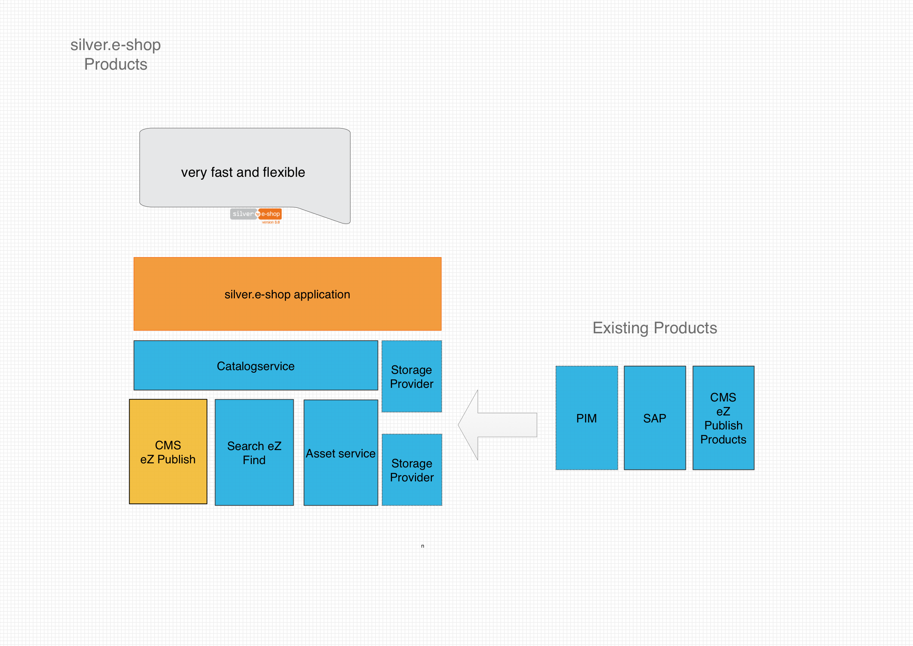

# Catalog

## Introduction

eZ Commerce provides a flexible way to handle products. It offers a standard way how to work with Product groups or products and it offers a

- flexible way how to store product data
- flexible data model

This allows to build ecommerce sites tailored to the needs of a project: from a limited number of products to a high scalable shop with 1 million products or more. 

Depending on the use case products can be stored in 

- the CMS eZ Platform (e.g. the customer doesn't have a CMS and PIM system)
- in an optimized storage econtent (in preparation), which is able to store up to 2 Mio of products  

A storage engine is responsible for handling products. It consist out of a 

- **catalog data provider** managing the access to the product data itself (e.g. access method using database queries)
- **catalog factory** which is responsible to build CatalogNodes and ProductNodes

The storage engine can be configured in the service container definition. 

## Product catalog objects

- A catalogElement represents a product group/category. It has a name, a code and a place in the catalog tree. It also can have additional fields 
- A productType represents a collection of very similar products, that differ only for some characteristics. It is used to show a list of products in a tabular way, every product can be added to basket directly from this overview page
- A productNode inherits from the catalogElement and it offers additional attributes such as a sku, images, price and other attributes  and thus an element of the catalog tree composite pattern. `ProductNode` itself defines (together with `ProductNodeContainer`) an element of another composite pattern, which is used to model more complex products (e.g. products with variants).

!!! note "Import note"

    Also it would be possible to access products which are stored as eZ Platform ContentObjects directly using the eZ Platform API we **highly recommend** to use the API provided by eZ Commerce.

    - The API will provide ecommerce related features such as access to stock and prices
    - It offers a abstract product model which is not depending on the data source used

## Products and content

eZ Commerce is able to mix product and content in a common sitemap and tree. There for the navigation service is used which build a common tree for the navigation. 

In addition a chain router is able to detect product URLs and will invoke the controllers for products and catalogElements in order to display products or product categories. 

## How to start in a project

eZ Commerce uses by default the storageprovider of the CMS. 

When you start a project there might be a need to make small adaptions since new product fields are used:

- Extend the Contenttype in the CMS in order to add new fields
- Extend the existing catalog factory in order to use the new fields 

You will find more info about how to override the catalog factory here: [How to extend a CatalogFactory](How-to-extend-a-CatalogFactory_23561020.html)
