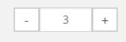

# Catalog - Configuration

## Configure templates to be used

```
silver_eshop.default.catalog_template.CatalogNode: Catalog:catalog.html.twig
silver_eshop.default.catalog_template.OrderableProductNode: Catalog:product.html.twig
silver_eshop.default.catalog_template.VariantProductNode: Catalog:product_variants.html.twig
silver_eshop.default.catalog_template.ProductType: Catalog:productType.html.twig
```

Defines which template should be used in case the CatalogController has to render a:
- CatalogNode (category)
- OrderableProductNode (a product)
- VariantProductNode (a variant)
- ProductType (special kind of "variant")

## Configuration for variants

See document [VariantType](../../cookbook/additional_ez_fieldtypes/varianttype.md)

## Configure the dataprovider 

The following example shows the configuration used for the dataprovider which uses the contentmodel of eZ Platform to store products. 

### see config_data_provider_ez.yml

``` yaml
services:
    siso_search.search_service.product:
        alias: 'siso_search.ezsolr_search_service'
    siso_search.search_service.catalog:
        alias: 'siso_search.ezsolr_search_service'
parameters:
    silver_eshop.default.catalog_data_provider: ez5
```

- Defines which searchservice has to be used
- Defines the identifier for the dataprovider (here ez5)

### see /ez_navigation.yml

``` yaml
siso_core.default.navigation.catalog:
    # the class id has to be specified here
    types: ['ses_category']
    sections: [1, 2]
    enable_priority_zero: true
    label_fields: ['ses_category_ses_name_value_s','name_s']
    additional_fields: ['ses_category_ses_code_value_s', 'ses_category_ses_name_value_s' ]
 
# enable if the depth of the node itself has to be added to the depth of the product catalog
siso_core.default.navigation.enable_add_product_catalog_node_depth: true
```

The navigation settings are used to build the navigation tree.

For more details see: Navigation

In addition the parameters for search have to be defined depending on the dataprovider (see econtent\_search.yml or [econtent configuration](../../features_advanced_version/econtent/econtent_configuration.md)).

## Configuration for the CatalogFactory

The following example shows the configuration used for the CatalogFactory to determine which method will create the CatalogElements depending of the ContentType

``` yaml
silver_eshop.default.catalog_factory.ses_category: createCatalogNode
silver_eshop.default.catalog_factory.ses_productcatalog: createProductCatalogNode
silver_eshop.default.catalog_factory.ses_product: createOrderableProductNode
silver_eshop.default.catalog_factory.ses_product_type: createProductTypeNode
```

- ses_category .. ses_product_type are the identifiers used in the corresponding ContentTypes
- createCatalogNode defines e.g. that in case a ContentType "ses_category" is provided the method "createCatalogNode" will be used to create the CatalogElement

Configuration for variants

Please see [VariantType](../../cookbook/additional_ez_fieldtypes/varianttype.md)

## Filter for creating product lists and more

The following configuration  is use to filter eZ ContentObjects. The dataprovider will use these filters to determine which ContentTypes in eZ Platform are used e.g. for 

- navigation (usually the `ses_category`)
- product list (display all products belonging to a category)

``` yaml
silver_eshop.default.ez5_catalog_data_provider.filter:
    navigation:
        contentTypes: [ "ses_category" ]
        sortClauses:
            -
                clause: "\\eZ\\Publish\\API\\Repository\\Values\\Content\\Query\\SortClause\\Location\\Priority"
                order: "\\eZ\\Publish\\API\\Repository\\Values\\Content\\Query::SORT_DESC"
            -
                clause: "\\eZ\\Publish\\API\\Repository\\Values\\Content\\Query\\SortClause\\DatePublished"
                order: "\\eZ\\Publish\\API\\Repository\\Values\\Content\\Query::SORT_ASC"
        limit: 20

    category_names:
        contentTypes: [ "ses_category", "ses_product_type" ]
        sortClauses:
            -
                clause: "\\eZ\\Publish\\API\\Repository\\Values\\Content\\Query\\SortClause\\Location\\Priority"
                order: "\\eZ\\Publish\\API\\Repository\\Values\\Content\\Query::SORT_DESC"
            -
                clause: "\\eZ\\Publish\\API\\Repository\\Values\\Content\\Query\\SortClause\\DatePublished"
                order: "\\eZ\\Publish\\API\\Repository\\Values\\Content\\Query::SORT_ASC"
        limit: 20
    navigation_incl_products:
        contentTypes: [ "ses_category", "ses_product" ]
        sortClauses:
            -
                clause: "\\eZ\\Publish\\API\\Repository\\Values\\Content\\Query\\SortClause\\Location\\Priority"
                order: "\\eZ\\Publish\\API\\Repository\\Values\\Content\\Query::SORT_DESC"
            -
                clause: "\\eZ\\Publish\\API\\Repository\\Values\\Content\\Query\\SortClause\\DatePublished"
                order: "\\eZ\\Publish\\API\\Repository\\Values\\Content\\Query::SORT_ASC"
        limit: 20
    catalogList:
        contentTypes: ["ses_category"]
        sortClauses:
            -
                clause: "\\eZ\\Publish\\API\\Repository\\Values\\Content\\Query\\SortClause\\Location\\Priority"
                order: "\\eZ\\Publish\\API\\Repository\\Values\\Content\\Query::SORT_DESC"
    productList:
        contentTypes: ["ses_product"]
        sortClauses:
            -
                clause: "\\eZ\\Publish\\API\\Repository\\Values\\Content\\Query\\SortClause\\Location\\Priority"
                order: "\\eZ\\Publish\\API\\Repository\\Values\\Content\\Query::SORT_DESC"
```

## Misc

``` yaml
silver_eshop.default.catalog_product_list_limit: 6
silver_eshop.default.catalog_category_limit: 100
silver_eshop.default.catalog_product_list_limit_ajax: 3
```

- number of elements do be displayed and paging is used
- number of elements on category overview pages
- number of elements for ajax calls

``` yaml
silver_eshop.default.last_viewed_products_in_session_limit: 10
silver_eshop.default.catalog_description_limit: 50
```

- Max. number of products stored in the last viewed cache
- Number of chars used for product descriptions on overview page

``` yaml
siso_core.default.quantity_change_button: false
```

Enable +/- (plus/minus) button for quantity instead of singe input field.


