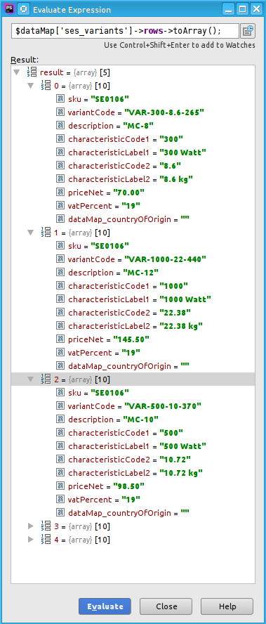
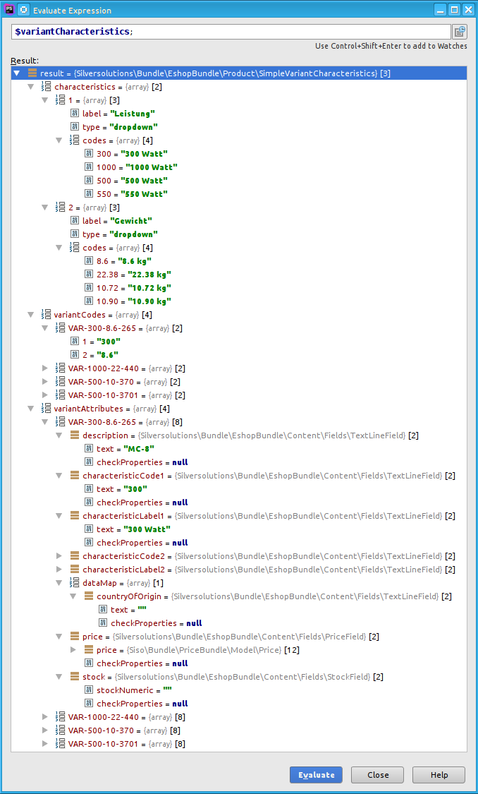
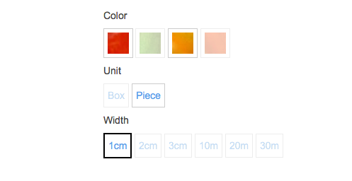

# How to set up variants from external source

## Goal

The default DataProvider and CatalogFactory for eZ Platform ([CMS dataprovider](CMS-dataprovider_23560465.html)) already support variants up to 2 levels which can be setup  [using a special variant FieldType](23560612.html) in the backend. 

The purpose of this document is to provide a 'recipe', how to setup variants if you are not using the default eZ content types of  eZ Commerce and don't want to setup variants manually in the eZ Platform backend. 

The main goal is to map your variant structure to the [VariantProdutNode](23560374.html) structure.

## How to start

!!! tip

    Main work that every CatalogFactory has to do, is to fill the [VariantProductNode](23560374.html) attribute [$variantCharacteristics](SimpleVariantCharacteristics_23560236.html). The basic concept is to take information from provided dataMap (e.g. dataMap is coming from DataProvider: source can be eZ, or external) and create an attribute $variantCharacteristic for the VariantProductNode.

Example for Ez5CatalogFactory: dataMap from DataProvider



Example for Ez5CatalogFactory: the information was already mapped into `$variantCharacteristics` attribute in catalog element: 



## Steps to map variant information

### 1. Create DataProvider and CatalogFactory

The first thing you need to do in order to create variants is to create your own DataProvider and Factory for catalog elements. 

!!! tip

    It would be a good practice to define a configuration for templates. Depending on which type of catalog element the provider/factory will create, different template should be used. Here is the default configuration:

    parameters:

    ```
    silver_eshop.default.catalog_template.CatalogNode: Catalog:catalog.html.twig
    silver_eshop.default.catalog_template.OrderableProductNode: Catalog:product.html.twig
    silver_eshop.default.catalog_template.VariantProductNode: Catalog:product_variants.html.twig
    ```

    You can find more information about this here: [Catalog - UI](Catalog---UI_23560463.html)

If you are writing your own provider and factory from scratch, you have to implement all necessary methods. In this recipe we will concentrate only on variant connected methods.

### 2.Implement specific method for creating of VariantProductNode

#### Determine which method to call and when

The starting point would be the **createCatalogElement()** method. This is the place where the factory decides, which function it will internally use to create the catalog element.

!!! tip

    It would be a good practice to define a configuration which method should be used depending on e.g. the class identifier (eZ content type). This is the default configuration for eZ Commerce:

    parameters:

    ```
    silver_eshop.default.catalog_factory.ses_category: createCatalogNode
    silver_eshop.default.catalog_factory.ses_product: createOrderableProductNode
    ```

    You can see an implementation of how these parameters can be used in the Example.

Because in our case (standard implementation), the variants are stored as content objects of the same content type like 'normal' products (ses_product), the **createCatalogElement()** must do additional differentiation when to call the method *createOrderableProductNode()* and when *createVariantProductNode()* (see below).  
In the default implementation the factory will call the method *createVariantProductNode()*  always when the [EzMatrix with variants](23560612.html) is filled.

In your case, you may adapt this behavior. Maybe you will get some special flag from ERP, that will tell you, if product is a variant.

??? note "Example"

    ``` 
    public function createCatalogElement(array $nodeInfo = array())
    {
        //get the class identifier
        $contentTypeIdentifier = $this->ezpublishApiRepository
            ->getContentTypeService()
            ->loadContentType($nodeInfo['contentInfo']->contentTypeId)
            ->identifier;

        //determine the factory method depending on the $contentTypeIdentifier
        $configParameter = sprintf('catalog_factory.%s', $contentTypeIdentifier);
        $factoryMethod = $this->configResolver->getParameter($configParameter, 'silver_eshop');

        // ******* if the product has variants, call createVariantProductNode ******* //
        if (isset($nodeInfo['dataMap']['ses_variants'])
            && $nodeInfo['dataMap']['ses_variants'] instanceof \EzSystems\MatrixBundle\FieldType\Matrix\Value
        ){
            /** @var \EzSystems\MatrixBundle\FieldType\Matrix\Value $matrix */
            $matrix = $nodeInfo['dataMap']['ses_variants'];
            $rows = $matrix->rows->toArray();
            if (!$this->hasEmptyRowsOnly($rows)) {
                $factoryMethod = 'createVariantProductNode';
            }
        }
        // check, if factory method is callable, otherwise throw exception
        if (!is_callable(array($this, $factoryMethod))) {
            throw new \BadMethodCallException('Method "'.$factoryMethod.'" is not callable by factory instance of "'
                .__CLASS__.'".');
        }

         return $this->$factoryMethod($nodeInfo);
    } 
    ```

#### Implement the necessary method createVariantProductNode()

Then you need to implement the method createVariantProductNode() from the abstract class CatalogFactory.

**CatalogFactory**

``` 
abstract public function createVariantProductNode($rawData = null);
```

Example from **Ez5CatalogFactory** (we use information stored in ez matrix (`ses_variants`) which is located in dataMap (provided by the DataProvider).

``` 
public function createVariantProductNode($rawData = null)
{
    if ($this->isValidRawData($rawData)) {

        $attributes = $this->getNodeAttributes($rawData);
        $dataMap    = $rawData['dataMap'];
 
        // this method extracts variant characteristics
        $variantAttributes = $this->extractVariants('ses_variants', $dataMap);

        // set variant characteristics into catalog element attributes
        foreach($variantAttributes as $index => $variantAttribute){
            $attributes[$index] = $variantAttribute;
        }

        $productNode = new VariantProductNode($attributes, $this->urlService);
        return $this->fillCatalogElementDataMap($productNode, $dataMap);
    }

    return null;
}
```

!!! tip

    `$this->extractVariants()` will extract the variant information from the dataMap and returns an array with a single element, that is an [SimpleVariantCharacteristics object](SimpleVariantCharacteristics_23560236.html) as shown in the [example above](#Howtosetupvariantsfromexternalsource-varChar).

### 3\. Fill VariantProductNode attribute $variantCharacteristics

In your factory you need to map your dataMap information into VariantProductNode attribute [$variantCharacteristics](SimpleVariantCharacteristics_23560236.html). The structure is described below.

All information about variants is stored in this attribute (including prices and pictures). It contains 3 different information:

- characteristics - This contains all information about characteristics (choosable options) like images or labels for displaying options in templates
- variantCodes -This is a set of all possible combinations of variant characteristics (i.e. variants). It contains a list of the respective variant codes, which store a particular combination of the characteristics. The record structure is the following:

    - variantCode =>
        - characteristicIdentifier => characteristicCode
        - ...
    - ...

In this example, the characteristicIdentifier is the index number of the variant level, which is provided by the structure of the eZ Matrix.

- variantAttributes - contains all additional information for each variant (country, price, labels etc). Attributes that will be displayed in b2b need to follow special rules:
    - characteristicCode#
    - characteristicLabel#


##### Example for 1 level variant (only Color)

``` php
$variantAttributes = array(
    'variantCharacteristics' => new SimpleVariantCharacteristics(
        array(
            'characteristics' =>
                array(
                    '1' => array(
                        'label' => 'Color',
                        'type'  => 'dropdown',
                        'codes'  => array(
                            'grn' => 'Green',
                            'red' => 'Red',
                        ),
                        // optional images for variant display
                        'images' => array(
                            'grn' => new ImageField('image_for green'),
                            'red' => new ImageField('image_for red'),
                        ),
                    ),
                ),
            'variantCodes' => array(
                'VAR-GRN' => array(
                    '1' => 'grn',
                ),
                'VAR-RED' => array(
                    '1' => 'red',
                ),
            ),
            'variantAttributes' => array(
                'VAR-GRN' => array(
                    'characteristicCode1' => FieldInterface,
                    'characteristicLabel1' => FieldInterface,
                    'description' => FieldInterface,
                    'price' => FieldInterface,
                    'dataMap' => array(
                        'countryOfOrigin' => FieldInterface
                    )
                ),
                'VAR-RED' => array(
                    'characteristicCode1' => FieldInterface,
                    'characteristicLabel1' => FieldInterface,
                    'description' => FieldInterface,
                    'price' => FieldInterface,
                    'dataMap' => array(
                        'countryOfOrigin' => FieldInterface
                    )
                ),
            ),
        )
    ),
);
```

##### Example for 3 level variant (Color, Unit, Witdh)

``` php
$variantAttributes = array(
    'variantCharacteristics' => new SimpleVariantCharacteristics(
        array(
            'characteristics' =>
                array(
                    '1' => array(
                        'label' => 'Color',
                        'type'  => 'dropdown',
                        'codes'  => array(
                            'grn' => 'Green',
                            'red' => 'Red',
                        ),
                        'images' => array(
                            'grn' => new ImageField('image_for green'),
                            'red' => new ImageField('image_for red'),
                        ),
                    ),
                    '2' => array(
                        'label' => 'Unit',
                        'type'  => 'dropdown',
                        'codes'  => array(
                            'box' => 'Box',
                            'pcs' => 'Piece',
                        ),
                    ),
                    '3' => array(
                        'label' => 'Width',
                        'type'  => 'dropdown',
                        'codes'  => array(
                            '1' => '1cm',
                            '2' => '2cm',
                            '3' => '3cm',
                            '10' => '10cm',
                            '20' => '20cm',
                            '30' => '20cm',
                        ),
                    ),
                ),
            'variantCodes' => array(
                'VAR-GRN-BOX-20' => array(
                    '1' => 'grn',
                    '2' => 'box',
                    '3' => '20',
                ),
                'VAR-RED-PCS-1' => array(
                    '1' => 'red',
                    '2' => 'pcs',
                    '3' => '1',
                ),
            ),
            'variantAttributes' => array(
                'VAR-GRN-BOX-20' => array(
                    'characteristicCode1' => FieldInterface,
                    'characteristicCode2' => FieldInterface,
                    'characteristicCode3' => FieldInterface,
                    'characteristicLabel1' => FieldInterface,
                    'characteristicLabel2' => FieldInterface,
                    'characteristicLabel3' => FieldInterface,
                    'description' => FieldInterface,
                    'price' => FieldInterface,
                    'dataMap' => array(
                        'countryOfOrigin' => FieldInterface
                    )
                ),
                'VAR-RED-PCS-1' => array(
                    'characteristicCode1' => FieldInterface,
                    'characteristicCode2' => FieldInterface,
                    'characteristicCode3' => FieldInterface,
                    'characteristicLabel1' => FieldInterface,
                    'characteristicLabel2' => FieldInterface,
                    'characteristicLabel3' => FieldInterface,
                    'description' => FieldInterface,
                    'price' => FieldInterface,
                    'dataMap' => array(
                        'countryOfOrigin' => FieldInterface
                    )
                ),
            ),
        )
    ),
);
```

## Result

When your factory setup the variants, you should see the characteristics on the product detail page. This examples builds 3 level variants and display variants for B2C shop (depending on the [configuration](Product-Variants_23560366.html)). 


