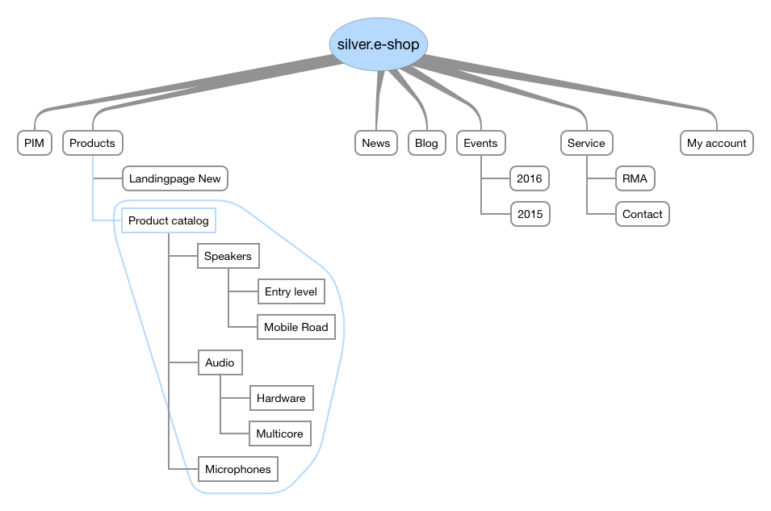

# Catalog data providers - Products from different sources

eZ Commerce provides a flexible way to handle products and catalogs. The shop uses central data providers to fetch data for the shop (concrete implementations of `CatalogDataProvider`).

The blue colored section e.g. represents the products which  are located beneath the menu item "Products".

The products are dynamically injected into the content tree regardless of which source is used to provide the products.

## Catalog Data CMS eZ

(Ez5CatalogDataProvider)

- products can be edited in the CMS
- good for up to 20.000 products
- import of products costs time

Use case: The customer has no PIM system and the amount of products is limited

## Catalog Data eContent

(EcontentCatalogDataProvider)

- allows more than 1 million products
- fast imports
- currently no edit interface in the backend of the CMS

Use case: The customer is using a PIM system or the ERP provides all the product information

It is possible to implement own dataproviders. 

Currently the following catalog data providers are available:

- Data provider for eZ Platform (`Ez5CatalogDataProvider`)
- Data provider for econtent (`EcontentDataProvider`)
