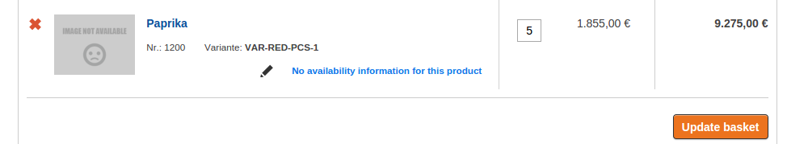
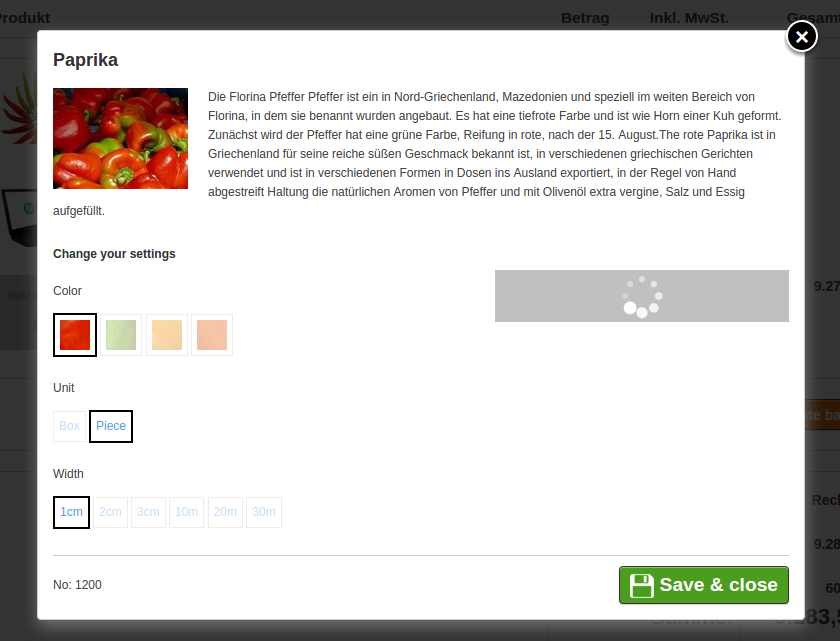
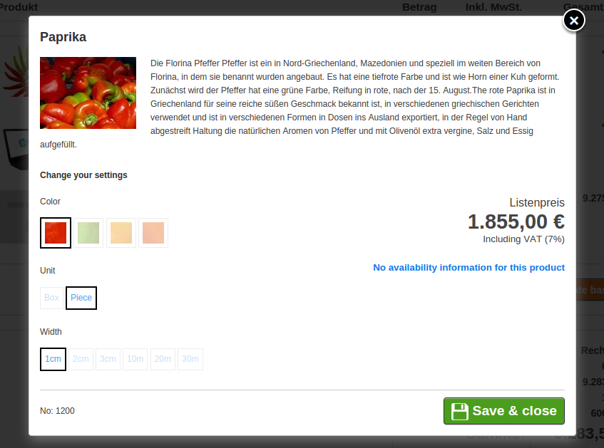

# Product variants

## General Information

[Variants](../../catalog_api/variantproductsnode_and_orderablevariantnode/variantproductnode_and_orderablevariantnode.md) are used if a product is available in different options. eZ Commerce offers a flexible variant model allowing 1..3 levels of variant characteristics such as color or size. 

## Features

eZ Commerce comes with an out-of-the-box support for variants for B2C and B2B shops. It displays variants in a different way, respectively, on the product detail page. For B2B it allows buying multiple variants in one step.

There is a parameter which determines this value by siteaccess.

``` 
# allowed values: B2B, B2C
# B2C - variants are displayed showing all characteristics
# B2B - variants are grouped for 1-step ordering
silver_eshop.default.variant_type: B2C
```

##### Icons

[Factory](../../catalog_cookbook/how_to_set_up_variants_from_external_source.md), that will creates variants, can also provide images for some characteristics. In our example the factory provided some images for the characteristoc 'Color'. If the images are provide, they are taken, otherwise just text is displayed in a box, see Unit and Width.

How the images should be stored in the variant characteristics:

``` 
/**
 * 
 * array(
 *     'characteristic_identifier_1' => array(
 *         'label' => 'Label Value 1',
 *         'type'  => 'radio',
 *         'images' => array(
 *             'code_1' => 'Value 1',
 *             'code_2' => 'Value 2',
 *          ),
 *         'codes'  => array(
 *             'code_1' => 'Value 1',
 *             'code_2' => 'Value 2',
 *         ),
 *     ),
 *     'characteristic_identifier_2' => array(
 *         'label' => 'Label Value 2',
 *         'type'  => 'dropdown',
 *          'images' => array(
 *            'code_3' => 'Value 3',
 *          ),
 *         'codes'  => array(
 *             'code_3' => 'Value 3',
 *         ),
 *     ),
 * );
 * 
 */
```

!!! tip

    if you just want to edit the images, or add new ones, see [How to adapt the frontend](#how-to-adapt-the-frontend).

## Edit Variant in the basket

In the basket user has a possibility to change variant.  



When clicking on the "pen" icon (image above) the popup will show with option to change variant. After save new variant will be stored in basket and basket will be recalculated.




## How to adapt the frontend

#### Templates used in product detail

`/vendor/silversolutions/silver.e-shop/src/Silversolutions/Bundle/EshopBundle/Resources/views/Catalog/parts/`:

``` 
productBasketVariant.html.twig      - price block for variant
productData.html.twig               - product information (for variant can be additional info like country)
productDetailVariantB2B.html.twig   - display variant options for B2B
productDetailVariantB2C.html.twig   - display variant options for B2C
productVariantBlock.html.twig       - all logic for B2C display
```

#### Changing icon/image for variant characteristic like Color 

Let's assume that for "Color" characteristic we have codes like

- grn
- red
- blu
- org  

First we need to create images:

- grn.jpg
- red.jpg
- blu.jpg
- org.jpg  

Then we need to place them under "**bundles/silversolutionseshop/img/variants/**"

## How to define sorting for variants

eZ Commerce provides the ability to configure sorting of variant characteristics, please see the [VariantSortService](../../catalog_api/variantproductsnode_and_orderablevariantnode/variant_services.md).

## How the prices are calculated

If variant is fully specified (all options are selected and variantCode is in place) there is an additional ajax call using phalanx to fetch real prices.

| Controller            | Method                      |
| --------------------- | --------------------------- |
| AjaxCatalogController | getPriceAction |

## Terms

The following terms are used in the eZ Commerce:

|Term|Description|Example (Shoes)|
|--- |--- |--- |
|VariantProduct(Node)|The virtual product, which contains the data for all variations that can be ordered. Since this product has no specific price nor stock which is assigned to its SKU, it can not be added to the basket directly.|SKU: 1234</br>ProductName: "RunnersX100"|
|OrderableVariant(Node)|This represents one specific, orderable variation. It is defined by its unique VariantCode or by the deterministic set of VariantCharacteristics. An OrderableVariantNode is intended to added to a Basket.|SKU: 1234</br>ProductName: "RunnersX100"</br>Size: "EU 43"</br>Color: "Blue"|
|VariantCode|This code identifies an OrderableVariant within a VariantProduct, thus it must be unique in the scope of the VariantProduct.|VariantCode: 43_blu</br>Would have:</br>size: 43</br>color: blu|
|VariantCharacteristic|One VariantCharacteristic is a specific attribute of a VariantProduct, which is distinctive and describes one aspect of the variant. A VariantProduct may have at least one VariantCharacteristic but also more than one.|Color: "Blue", "Green", "Red"</br>Size: "EU 41", "EU 42", "EU 43"|
|CharacteristicIdentifier|Class unique string for a characteristic. It is equivalent the identifier of an attribute.|1: color</br>2: size|
|CharacteristicLabel|This is a readable name for a characteristic. Its purpose is to be used for frontend output.|"Color" and "Size" are the labels in this example.|
|CharacteristicType|This is some kind of code, which is used to determine how the characteristic should be displayed / rendered.|'radio' could indicate, that all options should be put into a radiobox.|
|CharacteristicCode / CharacteristicValue|Every VariantCharacteristic can take several values. Like the CharacteristicLabel, the CharacteristicValue is a readable name for display purposes, but here for a single characteristic value. The CharacteristicCode is an unique string for that value, which is used to identify the individual values.|Color:</br>Value: "Blue"</br>Code: blu</br>Size:</br>Value: "EU 43"</br>Code: 43|
|VariantPriceRange|A set of two prices, which represent the lowest price of all variants and the highest.|43€ - 49€|

Complete example for the terms:

Product: "RunnersX100"

SKU: 1234

Characteristics:

|CharacteristicIdentifier|CharacteristicLabel|CharacteristicType|CharacteristicCode|CharacteristicValue|
|--- |--- |--- |--- |--- |
|color|Color|radio|blu|Blue|
|color|Color|radio|grn|Green|
|size|Size|dropdown|41|EU 41|
|size|Size|dropdown|42|EU 42|
|size|Size|dropdown|43|EU 43|

Variants:

|VariantCode|CharacteristicCode (CharacteristicIdentifier: 1)|CharacteristicCode (CharacteristicIdentifier: 2)|
|--- |--- |--- |
|blu_41|blu|41|
|blu_43|blu|43|
|grn_42|grn|42|
|grn_43|grn|43|
