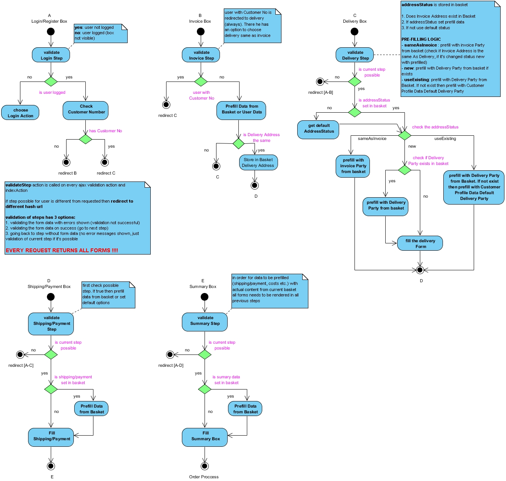

# General logic in checkout

For the general logic the [CheckoutController](../checkout_api/checkoutcontroller.md) and the [AjaxCheckoutController](../checkout_api/ajaxcheckoutcontroller.md) are responsible.

## One Page Checkout - steps

1. login
1. invoice
1. delivery
1. shippingPayment
1. summary

One Page Checkout enables the client to go through the process back and forth. All the steps are validated when ajax call is sent.

All the logic is moved into controllers which are responsible also for rendering.

## Checkout Activity Diagram - user cases in checkout process

