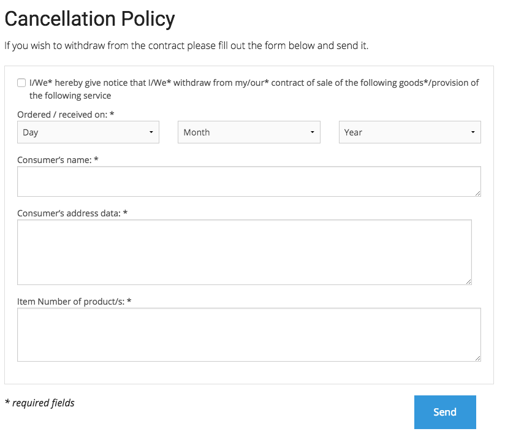

# RMA process

There is a simple RMA process in eZ Commerce. The goal is to inform user about the cancellation policies and give him the possible to return his goods - online as well.

The cancellation process validates the input and sends an email to the shop webmaster. 



## Links to the cancellation form in the footer

There is a link to the cancellation policies and online cancellation form displayed in the footer. The textmodules that are used to render the footer can be configured by siteaccess.

``` yaml
paramaters:
    siso_core.default.identifier_footer_block_address: footer_block_address
    siso_core.default.identifier_footer_block_company: footer_block_company
    siso_core.default.identifier_footer_block_service: footer_block_service
    siso_core.default.identifier_footer_block_ordering: footer_block_ordering
```

## Online cancellation form

There is an online cancellation form. After the user submitted the form, an email is send to the admin. Therefore the [SendCancellationEmailDataProcessor](SendCancellationEmailDataProcessor_23560538.html) is used.

Please see the concept for the [one-page forms](One-page-forms_23560744.html) as well.

``` html+twig
{{ path('silversolutions_service', {'formTypeResolver': 'cancellation'}) }}
```

``` yaml
parameters:
    #form configuration
    ses_forms.configs.cancellation:
        modelClass: Silversolutions\Bundle\EshopBundle\Form\Cancellation
        typeService: siso_core.cancellation_type
        template: SilversolutionsEshopBundle:Forms:cancellation.html.twig
        invalidMessage: error_message_register
        validMessage: common.success_cancellation
        dataProcessors:
            - siso_core.data_processor.send_cancellation_email
```

## Online RMA form

Furthermore there is also an online RMA form. After user submitted this form, an email is send to admin. There the [SendRmaEmailDataProcessor](SendRmaEmailDataProcessor_23560866.html) is used.

The email receiver has to generate a delivery note with a return number and sends it to the customer. The customer then can return his goods together with return number.

Please see the concept for the [one-page forms](One-page-forms_23560744.html) as well.

``` html+twig
{{ path('silversolutions_service', {'formTypeResolver': 'rma'}) }}
```

``` yaml
parameters:
    #form configuration
    ses_forms.configs.rma:
        modelClass: Silversolutions\Bundle\EshopBundle\Form\RMA
        typeService: siso_core.rma_type
        template: SilversolutionsEshopBundle:Forms:rma.html.twig
        invalidMessage: error_message_register
        validMessage: common.success_rma
        dataProcessors:
            - siso_core.data_processor.send_rma_email
```

## Checkout process

In the summary checkout process there is a checkox, where the user has to confirm that he accepts the cancellation policies. Therefore a textmodule is used. The textmodule can be configured by siteaccess.

``` yaml
paramaters:
    siso_core.default.identifier_data_protection_policy: label.accept_data_protection_and_cancellation_policies
```

The cancellation policies are rendered in the confirmation email as well.

This behavior can be generally switched off by siteaccess.

``` yaml
parameters:
    #true if the cancellation is allowed in the shop
    siso_core.default.cancellation_allowed: true 
```
