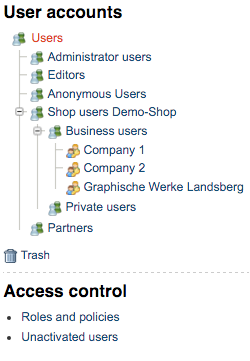

# Customers

## Introduction

Customers are stored as eZ Users in the CMS. eZ Commerce uses all features connected to users and roles such as

- Policies
- extendable User model
- User groups
- password management
- activation of accounts
- Session handling

In addition eZ Commerce supports multiple user accounts using the same email address (e.g. for a multishop setup).

### Users in the CMS

The shop uses an eZ user for shop customers. 

It enriches the eZ User ContentType with new fields which are required for the shop:

- firast name, last name
- salutation
- customer profile data
- customer number, contact number (will be used for Advanced only)
- budget per order and per month (will be used by advanced version/plugin customer center)

### User groups

For each shop a user group is used and private and business customers are stored in different sub user groups. If required shops can also share one common user group.



### ERP system as the master

The customers are directly connected to the ERP system as soon as they are having a customer number or/and a contact number. 

The customer number is usually the main reference to the ERP system and it is stored as a readonly field in the user record. 

The shop automatically gets the information from the ERP the first time the user information (customerprofile data) is requested.

The information will be stored in the session in order to reduce the calls to the ERP system.

The ERP will provide:

- the invoice adress
- the buyer address
- a list of delivery addresses
- contact infos if the user has a contact number
- further infos depending on the ERP system

### How to access customer data in a template

The template offers a global twig variable which contains the main information about the current user and also infos about addresses. It also contains infos about data from the ERP.

``` 
Current customer number: {{ ses.profile.sesUser.customerNumber }}
All delivery addresses:  
E-Mail address:          {{ ses.profile.sesUser.email }}
  
{# check, if user is logged in and blocked: #}

    Hello customer #{{ ses.profile.sesUser.customerNumber }}.
  
    
        Sorry, but you are blocked!
    

  
{# check, if user is logged in as anonymous user: #}

    <p>Anonymous user</p>

```

!!! note "Important note"

    Please do not use methods of the customerservice inside a constructor of a service. The reason is that the constructor is build at a very early stage of the process and the system may not have the information that a user is already logged in

!!! caution

    Please do **not** use the [customerservice](customers_api/customer_profile_data_components/customer_profile_data_services.md) in any place, that can not access the session. An example will be a CLI tool, or processes that are happing in background - like sending out the order if customer payed via payment service provider.

eZ Commerce is using the standard UBL to model customer data. The most important type is the Party which describes a Address. 

Foreach user these information will be stored. If a user has a customernumber this info will be updated from the ERP after the login: 

  - Buyer Party
  - Invoice Party
  - DeliveryParties - a list of Addresses using the Party format 

``` xml
<Party>
    <PartyIdentification>
        <ID>10000</ID>
    </PartyIdentification>
    <PartyName>
        <Name>Möbel-Meller KG</Name>
    </PartyName>
    <PostalAddress ses_unbounded="AddressLine" ses_tree="SesExtension">
        <StreetName>Tischlerstr. 4-10</StreetName>
        <AdditionalStreetName />
        <BuildingNumber>4-10</BuildingNumber>
        <CityName>Berlin</CityName>
        <PostalZone>12555</PostalZone>
        <CountrySubentity>Berlin</CountrySubentity>
        <CountrySubentityCode>BER</CountrySubentityCode>
        <AddressLine>
            <Line>Gartenhaus</Line>
        </AddressLine>
        <Country>
            <IdentificationCode>DE</IdentificationCode>
            <Name>Deutschland</Name>
        </Country>
        <Department>Development</Department>
        <SesExtension />
    </PostalAddress>
    <Contact>
       <ID>KT1001</ID>
       <Name>Mr Fred Churchill</Name>
       <Telephone>+44 127 2653214</Telephone>
       <Telefax>+44 127 2653215</Telefax>
       <ElectronicMail>fred@iytcorporation.gov.uk</ElectronicMail>
       <OtherCommunication></OtherCommunication>
       <Note></Note>
       <SesExtension>
           <LanguageCode></LanguageCode>
           <IsMain></IsMain>
       </SesExtension>
    </Contact>
    <Person ses_tree="SesExtension">
        <FirstName>Frank</FirstName>
        <FamilyName>Dege</FamilyName>
        <Title>Herr</Title>
        <MiddleName />
        <SesExtension />
    </Person>
    <SesExtension />
</Party>
```
