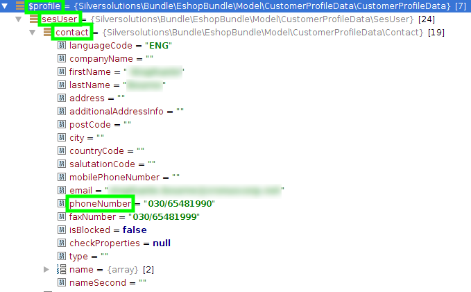

# Customer profile data services

## CustomerProfileDataServiceInterface

`\Silversolutions\Bundle\EshopBundle\Services\CustomerProfileData\CustomerProfileDataServiceInterface`

The general interface for any customer profile data service.

## AbstractCustomerProfileDataService

`\Silversolutions\Bundle\EshopBundle\Services\CustomerProfileData\AbstractCustomerProfileDataService`

Abstract customer profile data service implementation which provides helper methods for deriving services.

## EzErpCustomerProfileDataService

`\Silversolutions\Bundle\EshopBundle\Services\CustomerProfileData\EzErpCustomerProfileDataService`

Concrete customer profile data service implementation using ERP as source for customer and contact data. Also uses eZ platform as source for account data and target for fallback data.

## DeprecatedCustomerMappingService

`\Silversolutions\Bundle\EshopBundle\Services\CustomerProfileData\DeprecatedCustomerMappingService`

Concrete customer profile data service which implements the deprecated `AbstracCustomerService` to use with silver.eShop components, which depend on the deprecated model.

## Using customer profile data services in source code

!!! caution

    Please do **not** use the customerservice in any place, that can not access the session. An example will be a CLI tool, or processes that are happing in background - like sending out the order if customer payed via payment service provider.

To use a customer profile data service, e.g. the `EzErpCustomerProfileDataService`, you might inject the service into your method resp. using the Symfony DIC.

``` php
/** @var \Silversolutions\Bundle\EshopBundle\Services\CustomerProfileData\CustomerProfileDataServiceInterface $customerProfileDataService */
$customerProfileDataService = $container->get('ses.customer_profile_data.ez_erp');
 
/** @var \Silversolutions\Bundle\EshopBundle\Model\CustomerProfileData\CustomerProfileData $profile */
$profile = $customerProfileDataService->getCustomerProfileData();
 
$phoneNumberContact = $profile->sesUser->contact->phoneNumber;
```


