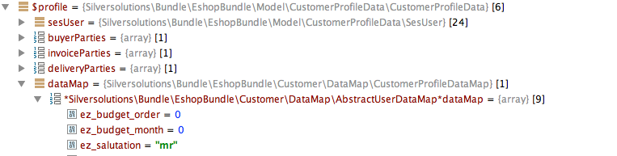

# Customers FAQ

## How to user menu is build?

You can configure the list of the bundles that will build the user menu:

``` 
parameters:
    siso_core.default.user_menu_bundles: ['SilversolutionsEshopBundle', 'SisoCustomerCenterBundle', 'SisoOrderHistoryBundle']
```

You can add your own bundle to this configuration and extend the user menu as long as:

- Your Bundle name follows the conventions: `[*One word company name*][*Bundle name*]Bundle` in camelCase spelling
- Example: CompanyCustomProjectBundle
- You need to create following template: `views/[*Bundle name*]/Components/user_menu.html.twig`
- Example: `views/CustomProject/Components/user_menu.html.twig`
- You can extend the user menu by custom code
- Example:

``` html+twig
<li class="first_item menu_header">
    {{ 'My own functions'|st_translate }}
</li>
<li>
    <a href="{{ path('my_custom_controller') }}">
        <i class="fa fa-tasks fa-fw"></i> {{ 'Your custom function'|st_translate }}
    </a>
</li>
```

## Where eZ data is stored?

By default the additional data of your eZ User class is stored in the dataMap of [CustomerProfileData](Customer-profile-data-services_23560906.html) with a prefix `ez_`.

These eZ types are supported:

- `eZ\Publish\Core\FieldType\TextLine\Value`
- `eZ\Publish\Core\FieldType\TextBlock\Value`
- `eZ\Publish\Core\FieldType\Float\Value`
- `eZ\Publish\Core\FieldType\Integer\Value`
- `eZ\Publish\Core\FieldType\Checkbox\Value`
- `eZ\Publish\Core\FieldType\Date\Value`
- `eZ\Publish\Core\FieldType\DateAndTime\Value`
- `Silversolutions\Bundle\DatatypesBundle\FieldType\SesSelection\Value`
- `EzSystems\EzPlatformMatrixFieldtype\FieldType\Value`

#### Default User class definition



In php:

`$customerProfileData->getDataMap()->getAttribute('ez_salutation')`
