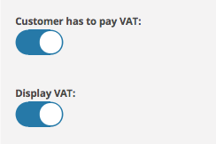
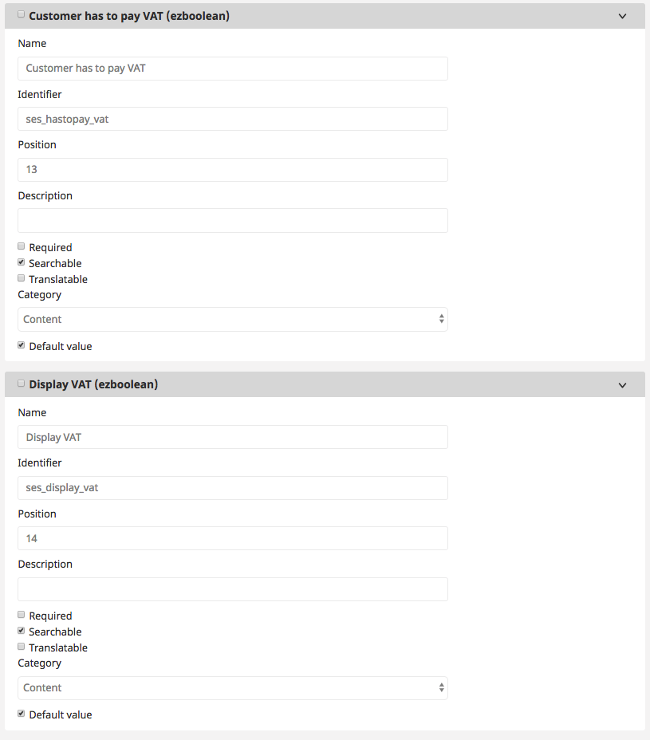

# VAT handling

The VAT handling for customers inside eZ Commerce is controlled by:

- The ERP (Advanced version only) system
- The settings from the user object 
- Default settings configured in a yaml file

The ERP system will have the highest priority. It means if it can provide the info about the VAT handling this setting will win. 

If the attributes are setup in the user object these settings will be used in case the ERP is not used (eZ Commerce) or the ERP does not provide this info.

As a last fall back the settings defined per siteaccess are used. 

## General infos about the settings

||Use case|What happens in the shop|
|--- |--- |--- |
|Customer has to pay VAT|set to false:</br>If for legal reasons the customer do not have to pay VAT (this is usually the case for some B2B cases).|If set to false the shop will not calculate VAT|
|Display Price inc VAT|set to false:</br>This should be set to false only if a customer does not have to pay VAT|If set to false the price in the shop will be without VAT|

## VAT settings from the ERP (Advanced version only)

The ERP can provide VAT settings per customer when a selectcustomer request is sent after a login.

There are 2 attributes which can be set by the ERP system:

- SesExtension-\>HasToPayVat 
- SesExtension-\>DisplayPriceInclVat

The default mapping is defined in the mapping xslt file. The default mapping file is located in `silver.e-shop/src/Silversolutions/Bundle/EshopBundle/Resources/mapping/wc3-nav/xsl/response.select_customer.xsl`

``` xml
<CustomerResponse>
  <SesExtension>
    <!-- Has to be adjusted depending on ERP -->
    <xsl:choose>
        <xsl:when test="VAT_Bus_Posting_Group = 'NATIONAL'">
            <HasToPayVat>1</HasToPayVat>
        </xsl:when>
        <xsl:otherwise>
            <HasToPayVat>0</HasToPayVat>
            <DisplayPriceInclVat>0</DisplayPriceInclVat>
        </xsl:otherwise>
    </xsl:choose>
  </SesExtension>
```

## VAT settings from the user object 

The VAT handling can be defined by user. 



**Please note to use the correct identifiers  and to check the checkox "Default value"\!**



## VAT settings from the configuration

```
ses.customer_profile_data.isPriceInclVat: true
ses.customer_profile_data.setHasToPayVat: true
```
