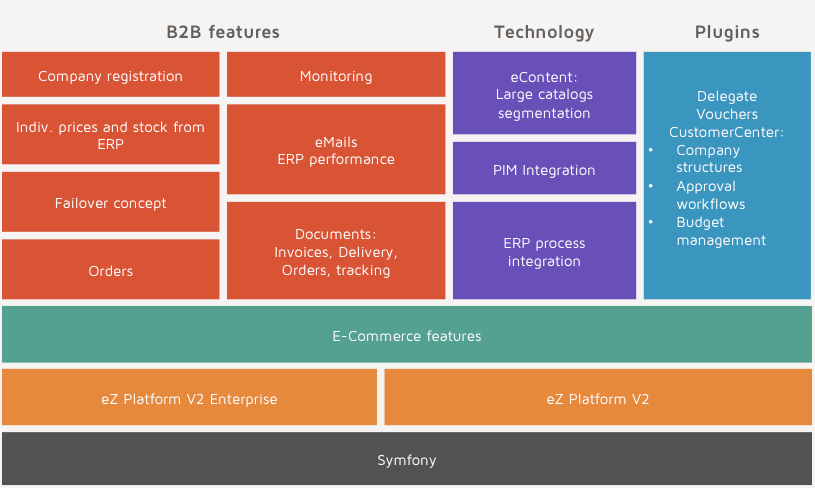

# Developer manual

## Used bundles

eZ Commerce uses a flexible concept and the implementation is divided in several bundles located in the vendor directory:

|Bundle|Description|
|--- |--- |
|EshopBundle|Core bundle of the shop|
|ComparisonBundle|Comparison feature|
|TranslationBundle|Contains translation features|
|ToolsBundle|Misc tools|
|PriceBundle|Price engine standard features|
|CheckoutBundle|Checkout for the shop (5 step solution)|
|QuickOrderBundle|Quickorder feature|
|SearchBundle|Search using SolrBundle|
|PaymentBundle|Core payment Bundle|
|PaypalPaymentBundle|PayPal implementation|
|TelecashPaymentBundle|Telecash implementation|
|OgonePaymentBundle|Ogone implementation|
|DatatypesBundle|Fieldtypes for the shop|
|EzStudioBundle|eZ Studio blocks an Controllers|
|LocalOrderManagementBundle|Contains feature for handling order locally|
|VariantTypeBundle|Used for variant handling|

## Components

