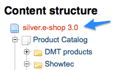
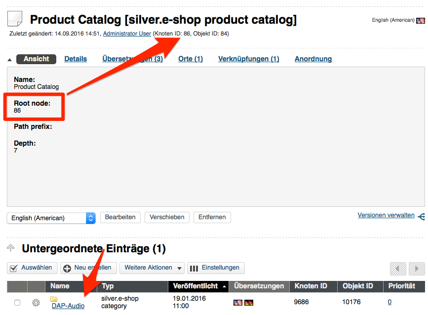
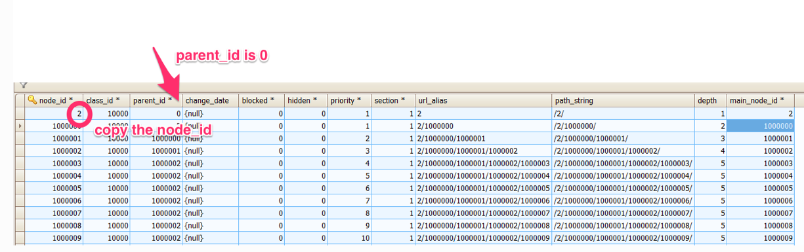

# Navigation

## Introduction

### Why does eZ Commerce offers a NavigationService?

eZ Commerce supports mixing of catalog elements (products) provided by a storage engine and content from CMS eZ Platform. As long as product would be stored in eZ Platform the menu could be build by eZ twig functions and controllers. 

Since eZ Commerce offers a flexible way to store products (DataProviders) a universal NavigationService ensures that the dataproviders are used to load the categories for the menu. 

### How to "inject" a product catalogue?

A product catalogue has to be setup in the backend using a object (product catalog) which introduces the products for the shop (here named as "Product Catalog"). The reason is that product may come from different sources (aka dataproviders). 

Example: 



## Features

eZ Commerce navigation supports different scenarios:

- navigation with one ore more catalog trees inside of an eZ Platform content tree.
- navigation without catalog
- navigation where the root element is product catalog
- navigation where the root element is product catalog, but display only part of a catalog (display only sub-elements that belongs to one category)
- Store any additional data in the navigation node, that you need
- Sorting the navigation nodes by priority
- Enable/disable fetching of nodes where the priority is 0
- Different depth for eZ content and catalog
- Highlighting of the active node in the navigation
- HTTP caching  

!!! caution "Limitation"

    The new navigation does not support product catalogs and categories with several locations. If you want to have e.g. the same categories on several places, you would need to copy the content. Products can be assigned to one or more categories.

## How does it work

### How the data is fetched?

Navigation is using eZ search in order to fetch the eZ content and a custom search service to fetch to catalog data directly from solr. Every dataprovider must ensure, that the data is indexed in the correct format. These data must be indexed at least.

``` 
document_type_id: [content/econtent]
type_id: [class id]
main_location_visible_b: [true/false]
section_id: [section id]
main_location_depth_i: [depth]
main_location_path_id: [path]
main_location_priority_i: [priority]
```

Additionally every data provider is able to extend the search query before the catalog data is fetched from solr. Read more in the [cookbook](navigation_cookbook.md) about it.

### Used fields for navigation

``` yaml
siso_core.default.navigation.catalog:
        #the class id has to be specified here
        types: ['38']
        sections: [1, 2]
        enable_priority_zero: true
        label_fields: ['ses_category_ses_name_value_s','name_s']
        additional_fields: ['ses_category_ses_code_value_s', 'ses_category_ses_name_value_s' ]
```

The name used for the navigation can be defined by configuration. The parameter "label\_fields" contains a list of attribute names (Solr names) which will be taken as name used in the menu. The first attribute which is available will be used. 

**Important**:

  - The eZ standard attribute `name_s` does **not** always contain the correct translation (issue of the eZ Indexer). 
  - When `name_s` is used in `label_fields` it might happen that the navigation/menu is not translated
  - Solution: configure the id of the attribute directly e.g. `ses_category_ses_name_value_s`

### Sorting

The navigation elements are sorted by location priority.

### Caching

The navigation is cached in 2 different ways:

- The top navigation is cached using http-cache and the strategy defined by "navigation".
- It is using one cache per siteaccess
- By default it is cached by user-hash for 10 hours  
- The left menu is cached in the same way. 

``` yaml
silver_eshop.default.http_cache:
       navigation:
            max_age: 36000
            vary: user-hash
```

When a content is modified which belongs to the navigation a contentmodficationhandler will be triggered. Please make sure that a cronjob is activated which refresh the cache if required:

`php bin/console silversolutions:cache:refresh --env=prod`

### How the catalog data is injected?

When the product catalog is accessible and the navigation is build, for a special ez content type **`ses_productcatalog`** the catalog elements are injected. The object of the type **`ses_productcatalog`** is the root node for the catalog. You can place as many product catalogs (on any level), as you wish. 

A new product catalog can be assigned to a content tree in eZ Platform using a special Content Type (`ses_productcatalog`).

If you are using eZ as dataprovider, you have to place your categories and products directly under your `ses_productcatalog` and then configure the root\_node id, so it points to itself.



If you are using econtent as dataprovider, you just have to configure the `root_node` it, so it matches the node id of the root element in the `sve_object` table.



Following fields are defined in the `ses_productcatalog` type:

|Attribute name|Attribute identifier|Description|
|--- |--- |--- |
|Name|name|Name of the product catalog for the Navigation|
|Root node|root_node|Root node of the product catalog in the storage engine|
|Depth|depth|The depth of the product catalog. The navigation will be build using this parameter. A depth of 1 means that there will be just one level starting at "Root node"|

## Before you start 

Please keep in mind that Navigation is really connected with a lot of different modules in our shop. Be sure to check these out:

- [Catalog Element](http://confluence.ng.silverproducts.de/)
- [Dataprovider](Catalog-data-providers---Products-from-different-sources_23560468.html)
