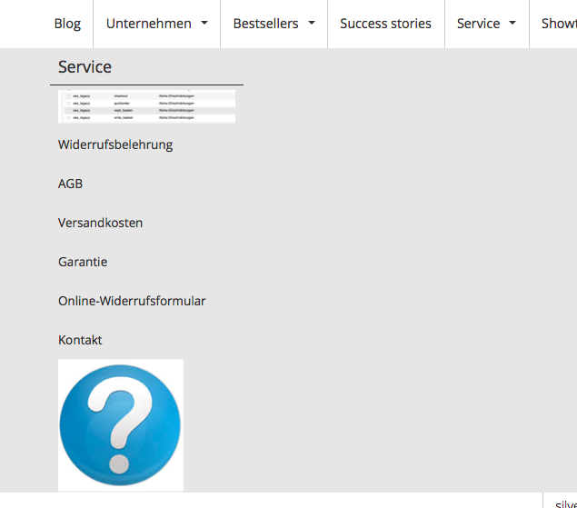
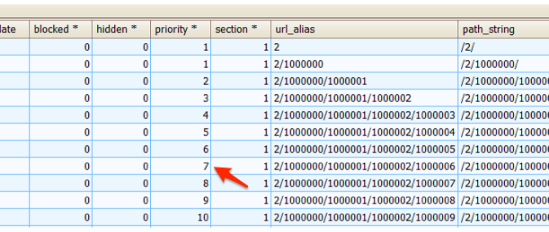
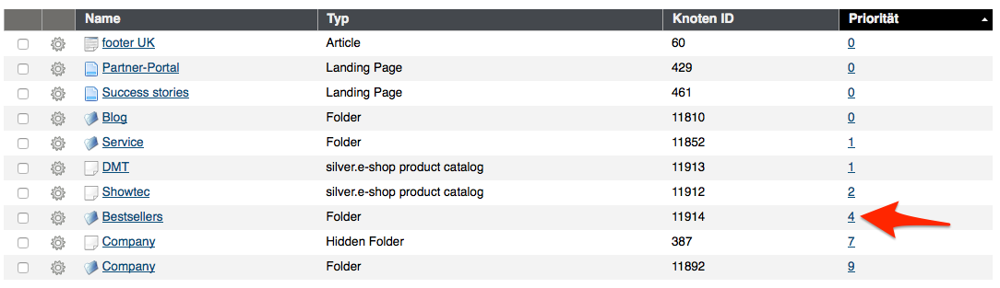
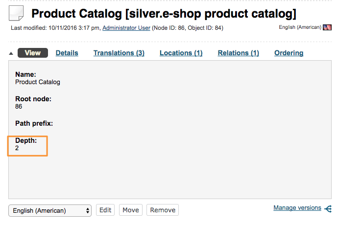

# Navigation FAQ

## I don't have any product catalog in my application. What do I have to do?

If you want to build navigation without product catalog, you need to change the configuration.

``` yaml
parameters:
    #set to false
    siso_core.default.product_catalog_enabled: false 

    siso_core.default.navigation.content:
        #remove "ses_productcatalog" from the list
        types: ["st_module", "folder", "article", "landing_page"] 
        ...
```

# I don't want to display content with priority 0. What do I have to do?

If you want to fetch only the content, where the priority is higher than 0, you need to change the configuration.

``` yaml
parameters:   
    siso_core.default.navigation.content:
        #set to false       
        enable_priority_zero: false

    siso_core.default.navigation.catalog:
        #set to false   
        enable_priority_zero: false
```

## I want to display a small image instead of the node label

This is possible if you have an image stored in your eZ content. Then you can additionally store the image in the navigation node and output it in the frontend.

``` yaml
parameters:   
    siso_core.default.navigation.content:
        ...
        additional_fields: ['name', 'short_description', 'show_children', 'image']
```

You need to adapt the template to render the image instead of the label. Example:

`Silversolutions/Bundle/EshopBundle/Resources/views/Navigation/knp_menu.html.twig`:

``` html+twig


  
    
  
    {{ item.label|raw }}
  


```



How can I influence sorting of the navigation elements?

The sort order can be configured.

``` yaml
parameters:
    ...
    siso_core.default.navigation_sort_order: 'asc'
```

For the sorting the priority is used. This is either the priority of the catalog elements (if you are using econtent), or the location priority for eZ.

#### Priority in the `sve_object` table



#### Location priority in eZ



## I would like to display 3 levels of categories in the mega menu. What do I have to do?

Please edit the Product catalog in the backend and change the settings for Depth. In prod mode you might have to clear the cache.


