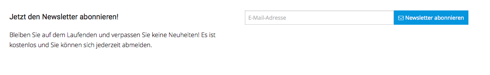

# Newsletter templates

### Templates list

|Path|Description|
|--- |--- |
|Silversolutions/Bundle/EshopBundle/Resources/views/Newsletter/newsletter_box.html.twig|Renders newsletter box. see Newsletter Box.|
|Silversolutions/Bundle/EshopBundle/Resources/views/Newsletter/newsletter_message.html.twig|Renders a simple page with success/error messages after user subscribed/unsubscribed to newsletter|
|Silversolutions/Bundle/EshopBundle/Resources/views/Emails/ConfirmationMail_SubscribeNewsletter.html.twig|HTML confirmation email that is send to the user in the DOI process|
|Silversolutions/Bundle/EshopBundle/Resources/views/Emails/ConfirmationMail_SubscribeNewsletter.txt.twig|Text confirmation email that is send to the user in the DOI process|

### Newsletter Box

The newsletter box can be rendered as an esi block and can be rendered in the Page Builder as well. The box is cached per user.

All paramaters from the block template are forwarded and accesible here, example:



## How to render a newsletter form

You can use a render statement to render the newlsetter form in a template

``` php
{{ render(
    controller(
        'SisoNewsletterBundle:Newsletter:renderNewsletterBox',
        {'params' : { 'display_hr' : true }}
    )
) }}
```
