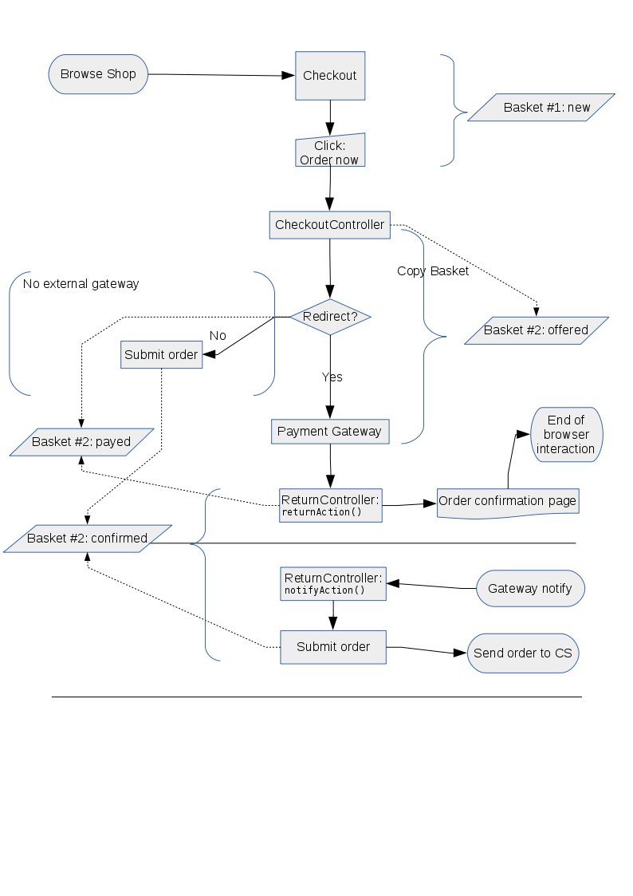

# Payment

The eZ Commerce ships with a payment bundle. This bundle depends on the [JMSPaymentCoreBundle](http://jmsyst.com/bundles/JMSPaymentCoreBundle). Thus, this third party bundle must be [installed manually](http://jmsyst.com/bundles/JMSPaymentCoreBundle/master/installation) if it wasn't already due to composer dependencies.

The eZ Commerce supports the following Payment providers:

|Payment provider|Details|Code used in Basket|
|--- |--- |--- |
|Paypal Express|See Paypal|`paypal_express_checkout`|
|Telecash|See Telecash|`telecash_connect`|
|Ogone|See Ogone|`ogone_gateway`|
|Invoice|Used for non electronic payments|`invoice`|

## Important configuration

```
jms_payment_core:
    encryption:
        provider: defuse_php_encryption
        secret: 'def0000033444be8556a1bd7e347a240d19d34a078112f3f18bbb74cb4caeff9f9df7e2f1c86f32826b6b262360791264a0aeb851bdb999f2b882038448966b3b1d40a79'
        enabled: true
```

!!! caution

    The secret has to be created by a command:

    `php vendor/defuse/php-encryption/bin/generate-defuse-key`

## Common Payment Workflow

The diagram shows the processes involved in a payment process.

When a user accepts the payment and the payment provider has acknowledged the data the

- user will be redirected to the shop and 
- in parallel the payment provider informs the shop calling a notify url of the shop ("Notify Shop"). This call is a direct call from the payment system and the shop 


