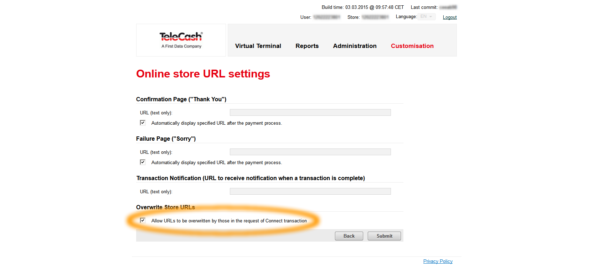
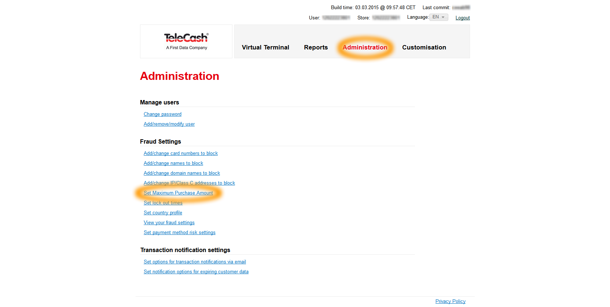
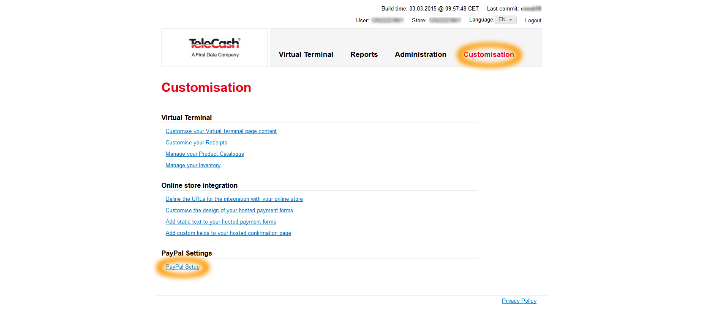
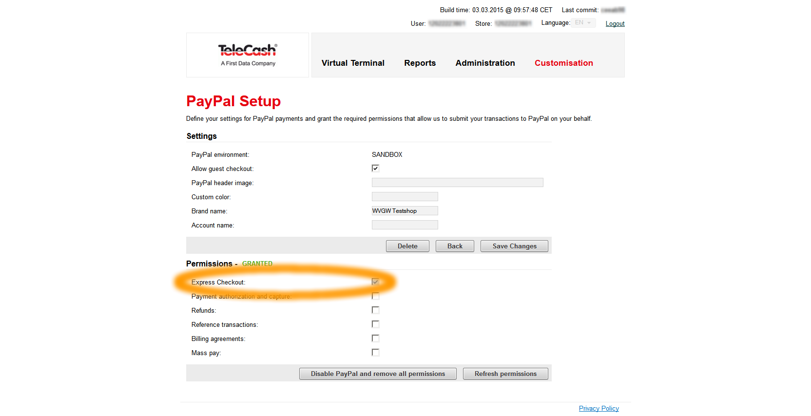

# Telecash

Telecash is a German Payment provider: http://www.telecash.de/ueber-uns/ueber-uns/

Telecash provides electronic payments using different payment options such as:

- Creditcards (VISA, American Express, MasterCard, Diners Club International, Discover, JCB, Union Pay inklusive 3D MasterCard Secure Code und Verified by Visa)
- SEPA Direct Debit
- Maestro  
- Giropay
- PayPal
- ClickandBuy
- Direktüberweisung and Sofortüberweisung
- iDEAL  

It depends on your contract and configuration which payment options will be offered in the payment process. For some payment options additional contracts are required. Please contact Telecash for more infos.

## Configuration

The TelecashPaymentBundle can be configured by some symfony parameters. The defaults are defined in `Siso/Bundle/TelecashPaymentBundle/Resources/config/parameters.yml`

|Parameter|Description|Default value|
|--- |--- |--- |
|siso_telecash_payment.paygate_url.test|This is the redirection URL, which is used in test mode. This value is not meant to be changed in a project and should rarely change, as it is part of theTelecash public API.|https://test.ipg-online.com/connect/gateway/processing|
|siso_telecash_payment.paygate_url.prod|This is the redirection URL, which is used in productive mode, accordingly to the test URL above.|https://www.ipg-online.com/connect/gateway/processing|
|siso_telecash_payment.application_mode|Switch for test and production mode. Possible values are the strings: test | prod. Depending on this value, either the test URL is used during the Payment process or the production URL.|test|
|siso_telecash_payment.parameter.mode|This defines the mode for the payment data collection at the paygate input page(s). Possible values are the strings: fullpay | payplus | payonly. Currently, only payonly is tested.|payonly|
|siso_telecash_payment.parameter.storename|This is one of the two account authentication credentials, that are provided by Telecash to the customer (shop owner). It has no default value and MUST be overridden in project settings.||
|siso_telecash_payment.parameter.secret|This is is the second account authentication credential. It MUST be overridden, as well.||
|siso_telecash_payment.parameter.timezone|Possible values are the strings: GMT | CET | EET|CET|
|siso_payment.telecash.test_code.success|This is injected into the plugin implementation and replaces in test mode the decimals digits of the amount to pay with this value. Since Telecash considers every transaction with a round amount as successful, this value would not cause any failed transactions. Normally this parameter doesn't need to be overridden.|00|
|siso_payment.telecash.test_code.test|This is the counterpart to the above setting. If this injected into the plugin service, all transactions will fail with an error code respective to this value. It could be overridden in order to change different error codes.|01|
|siso_payment.currency_mapping|This is a collection parameter. It contains a map which translates three letter currency codes into ISO 4217 numerical values. The labels in the mapping are currently not used, but may be used to display readable value later. Example for Euro currency: EUR: - Euro - 978||

## Account Administration

### URL Notification

In order to allow the shop to send the notification URL along with the redirection to the paygate, it is necessary to have an option actived. Since the notifycation URL is generated dynamically and contains the current order ID, it is required to be sent instead of configured statically in the paygate administration. You can find this option by the following steps:

1\. URL configuration

2\. Checkbox for URL override by request

### Amount Limit

For security reasons, it is possible to limit the amount of individual transactions. If you encounter problems of failed transactions because of the exceeded limit, you can change it in the following option:

### PayPal Integration

In order to processes PayPal payments over Telecash, you must grant your Telecash account the respective rights for this in your PayPal Account. Please note: Of course you will need to register a PayPal account, in advance. The following steps will redirect you to PayPal, ask for login and confirmation of the requested rights. Express checkout is at leaset needed for the silver.payment.

1\. PayPal

2\. Permissions

# Test data for test mode

https://www.telecash.de/fileadmin/user_upload/telecash/downloads/e-commerce/Customer_information_testtransactions_within_Internet_Payment_Gateway.pdf (English)

https://www.telecash.de/fileadmin/user_upload/telecash/downloads/e-commerce/Kundeninformation_Testzahlungen_im_Internet_Payment_Gateway.pdf (German)

## Credit card

Please use only the amounts from 1.00 to 999.00 EUR

Visa: 4921 8180 8989 8988, expiry 12/2020, Card Validation Code: any 3 digit number

MasterCard: 5404 1070 0002 0010, expiry 12/2020, Card Validation Code: any 3 digit number

## DirectDebit

To test payment system in the demo, any valid German IBAN can be used. A charge of the account will not take place in the test environment.

## Giropay

IBAN: DE46940594210000012345  
BIC: TESTDETT421

The IBAN can be entered optionally only on the online banking page of the relevant bank.

Loginname: sepatest1  
PIN+TAN: every number, 5 or 6 digits

## Sofortüberweisung

For German sender accounts enter 88888888 (8 times the number "8") in the payment wizard as the sort code for German sender accounts

Choose "Others" for Belgium and then 999 (3 times the number "9") and for all other countries 00000 (5 times the number "0") or select "Demo Bank".
