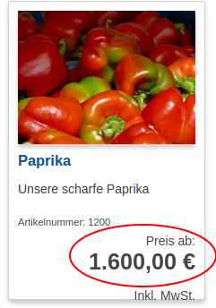

# Price engine templates

### Templates list

Default path:

    vendor/silversolutions/silver.e-shop/src/Silversolutions/Bundle/
    EshopBundle/Resources/views

#### Catalog/Subrequests/product.html.twig

Used on product detail page

Defines the parameters for price rendering and includes the `product_price.html.twig` template.

#### Catalog/Subrequests/product.html.twig

Used on product list page

Defines the parameters for price rendering and includes the `product_price.html.twig` template

##### How to set the parameters



Example: VariantProductNode

#### Catalog/Subrequests/product.html.twig

Common template to render the price, display a label about the price type (e.g. 'list price') and display the price source (e.g. ERP).

Includes PriceField.html.twig to render the price.

##### Accepted parameters

```
{# parameters, that will be passed to the
PriceField.html.twig  template to render the price #} 

'renderParams': renderParams
{# parameters, that will be used to design the label,
e.g. 'List price', 'Your price' #} 
{# you can decide if you want to display the
label and specify the css class #}
'labelParams': labelParams 

{# if set, the source will be displayed #}
'displaySource' : true
```

##### How to set the parameters

```

```

#### Fieldtypes/PriceField.html.twig

Renders the given price from catalog element, see [ses_render_price](rendering_for_prices.md).

##### Accepted parameters

`'params' : renderParams`

##### How to set the parameters

```

```

### Related custom Twig modifiers/functions/etc/:

|Twig filter|Description|Usage|
|--- |--- |--- |
|shipping|gets the list of shipping costs from the basket||
|basket_discounts|gets the list of discounts from the basket||
|basket_add_costs|gets the list of additional costs from the basket||
|basket_add_lines|gets the list of additional lines from the basket||


|Twig function|Description|Usage|
|--- |--- |--- |
|price_format|Formats a price value|{{ priceValue|price_format(currency, locale) }}|
|ses_render_price|Renders a PriceField from CatalogElement|{{ ses_render_price(catalogElement, minPrice,</br> {</br> 'outputPrice': {'cssClass': 'price price_med'}</br> }</br>) }}|
