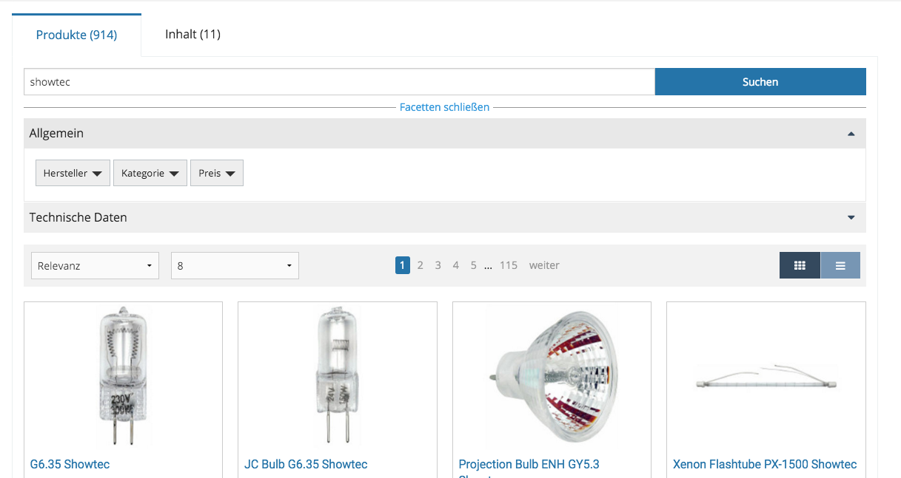
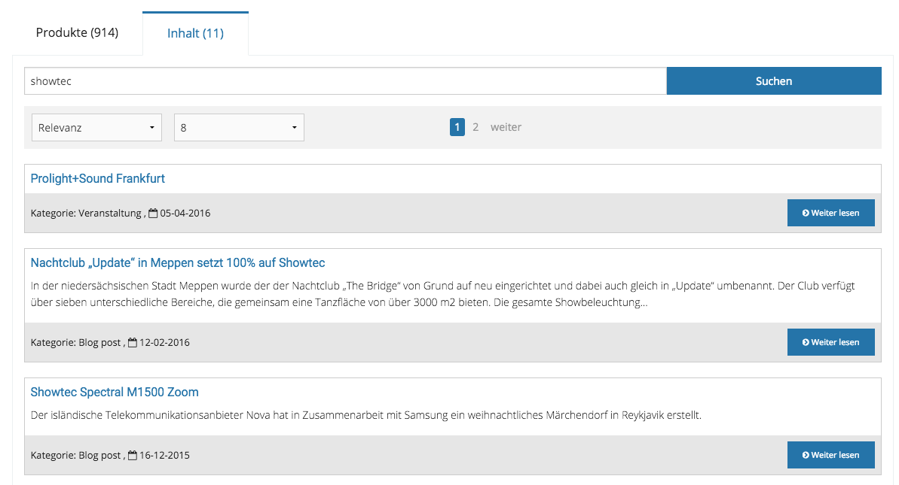
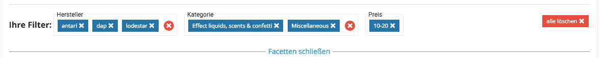
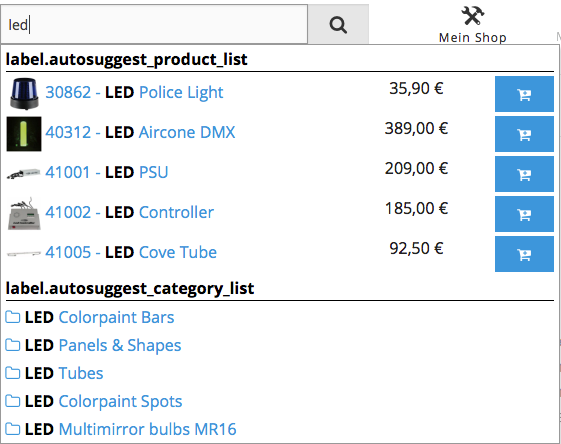

# Search

eZ Commerce comes with a very powerful search engine. The search engine is capable to provide one common search using product data and content. 

Product data and content is indexed automatically using the build in search engine based on Solr. 

The search displays the results in different groups. A group can consist products, videos, downloads, etc.



products in the search result



content in the search result

Facets can be grouped and the user can remove all facets of a group with one click: 



Features of the search:

- Groups displayed in tabs such as products and content can be configured.
- Facets are build dynamically as defined in configuration.
- User can use the back button to go back as URL's are unique.
- The search is using ajax to refresh the list.
- The data which is used for facets can be indexed in a project specific indexer plugin.
- You can use your back button of the browser without leaving the search
- A URL to a search result can be send via email to a friend
- Boosting can be defined in the configuration
- On the search result page it can be configured wether the facets shall be shown on top of the list or in the left column
- The products can be shown in a list or gallery view

The search bases on the new Solr implementation of the CMS eZ Platform (introduced in version 5.4.5). eZ Commerce extends the features of the search implementation with special features required for product search.

It also comes with an extension plugin system which allows to index custom fields by Contenttype. 

### Autosuggest

eZ Commerce provides a user friendly [autosuggest](search_features/search_autosuggest/search_autosuggest.md) feature:



### Important commands

Reindex eZ Content:

``` 
php -d memory_limit=-1 bin/console ezplatform:solr_create_index
```

## Before you start 

The installation of the search engine is described in the chapter [Installation](../../getting_started/installation.md)

## Definitions

Search phrase: it is a text input provided by the user to perform the search query.

Facet: A defined filter to narrow the search. Every facet group acts like an AND and every individual facet can be configured as Single, Multi Or or Multi And.

### Example

Given this scenario: 

Facet Category is a `Multi_Or` and has this options **Category A**, **Category B**.

Facet Colors is a `Multi_AND` and has this options **Color Red** and **Color Silver.** 

Facet Watt is defined Single and has this option: **1000**

Results elements = (Element has Category A **OR** Category B) **AND** (Element is Red **AND** Element is Silver) **AND** (Element has 1000 Watt)

`Multi_And` facets are good to handle elements with multiple features at the same time. Like an element that has 2 or more colors.
