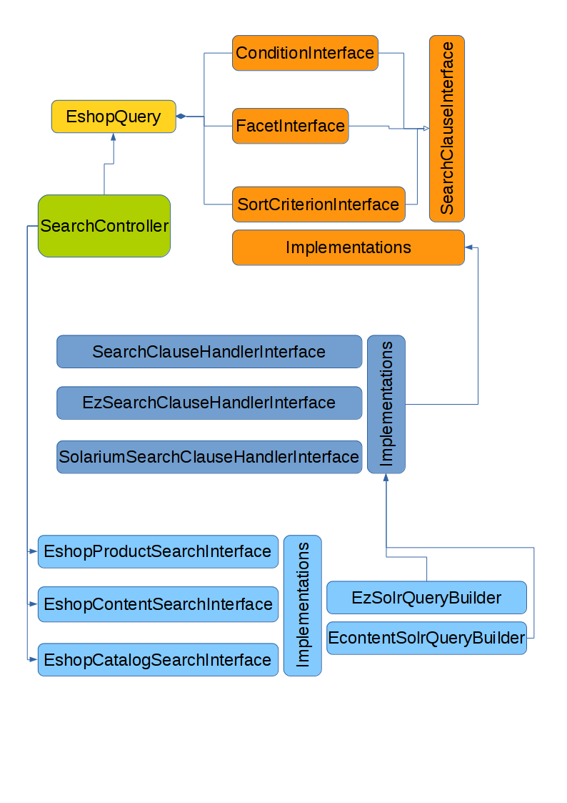

# Search API

## The Search Interface

### General class/interface architecture



### EshopSearchInterface

This interface represents the entry point for every search.

`\Siso\Bundle\SearchBundle\Api\EshopSearchInterface`

``` php
namespace Siso\Bundle\SearchBundle\Api;

/**
 * This interface specifies the main methods for the e-shop search.
 *
 * The general process flow for every search implementation would look like this:
 * 1. Generate instance of EshopQuery
 * 2. Define necessary parameters for the query:
 *   - Create the criteria of the search using implementations of ConditionInterface
 *   - Create instances of SortCriterionInterface
 *   - Get facets from FacetServiceInterface::buildFacets()
 *   - offset and limit
 * 3. Assign the defined parameters to the EshopQuery instance
 * 4. Create a SearchContext instance
 * 5. Pass the EshopQuery and the SearchContext to one of the methods of an instance
 *    of this interface
 */
interface EshopSearchInterface
{
    /**
     * Search for catalog products.
     *
     * This result of this method contains data which can be used to fetch the
     * respective ProductNode objects. Or, alternatively, the data could be
     * used directly (for example to display).
     *
     * @see \Siso\Bundle\SearchBundle\Api\Product\ProductResultLine
     *
     * @param EshopQuery $query
     * @param SearchContext $context
     * @return ProductSearchResult
     */
    public function searchProducts(EshopQuery $query, SearchContext $context);

    /**
     * Search for general content.
     *
     * The result of the method contains content data. The $resultObject
     * attribute of ContentResultLine can be any object. A calling instance
     * must check an expected type and process the returned object as needed.
     *
     * For example: the most common implementation is an eZ content search,
     * which returns ContentInfo objects.
     *
     * @see \Siso\Bundle\SearchBundle\Api\Content\ContentResultLine
     *
     * @param EshopQuery $query
     * @param SearchContext $context
     * @return ContentSearchResult
     */
    public function searchContent(EshopQuery $query, SearchContext $context);

    /**
     * Fetch information about the different search groups.
     *
     * Search groups are kind of a category for results and this method is
     * supposed to mainly provide the number of matches for each group.
     *
     * @param EshopQuery $query
     * @param SearchContext $context
     * @return mixed
     */
    public function fetchGroupData(EshopQuery $query, SearchContext $context);
}
```

### EshopQuery

This is the value object class for all search query parameters.

`\Siso\Bundle\SearchBundle\Api\EshopQuery`

``` php
namespace Siso\Bundle\SearchBundle\Api;

/**
 * This is a simple value object for search queries.
 *
 * It has only a the default constructor. That means the values must be
 * assigned by using the respective setter methods.
 *
 * Instances of this class are used in implementations of EshopSearchInterface.
 *
 * @see \Siso\Bundle\SearchBundle\Api\EshopSearchInterface
 */
class EshopQuery
{
    /**
     * @param int $offset
     */
    public function setOffset($offset)
    {
        $this->offset = $offset;
    }

    /**
     * @param int $limit
     */
    public function setLimit($limit)
    {
        $this->limit = $limit;
    }

    /**
     * @param ConditionInterface $condition
     */
    public function addCondition(ConditionInterface $condition)
    {
        $this->conditions[] = $condition;
    }

    /**
     * @param FacetInterface $facetCriterion
     */
    public function addFacet(FacetInterface $facetCriterion)
    {
        $this->facets[] = $facetCriterion;
    }

    /**
     * @param SortCriterionInterface[] $sortCriteria
     */
    public function setSortCriteria(array $sortCriteria)
    {
        $this->sortCriteria = $sortCriteria;
    }

    /**
     * @return int
     */
    public function getOffset()
    {
        return $this->offset;
    }

    /**
     * @return int
     */
    public function getLimit()
    {
        return $this->limit;
    }

    /**
     * @return ConditionInterface[]
     */
    public function getConditions()
    {
        return $this->conditions;
    }

    /**
     * @return FacetInterface[]
     */
    public function getFacets()
    {
        return $this->facets;
    }

    /**
     * @return SortCriterionInterface[]
     */
    public function getSortCriteria()
    {
        return $this->sortCriteria;
    }
}
```

### SearchContext

The current Controller implementation for the e-shop search uses a service call to instantiate the SearchContext: `\Siso\Bundle\SearchBundle\Service\SearchContextService`. It has the service ID: `siso_search.search_context_service.default`. In order to change the default implementation, this service must be overridden.

The search context defines context information for the query, which are not search clauses. For example data, related to the site access (which was addressed by the HTTP request). This information can be used by the respective search service implementation.

`\Siso\Bundle\SearchBundle\Api\SearchContext`:

``` php
namespace Siso\Bundle\SearchBundle\Api;

/** 
 * This class defines context information for every search request,
 * which are not necessarily filter values or similar.
 *
 * @property-read string[] $languages
 * @property-read bool|null $useAlwaysAvailable
 */
class SearchContext extends ValueObject
{
}
```

### SearchContextServiceInterface

Implementations of this interface are used by the standard search controller in order to get the instance of the SearchContext.

`\Siso\Bundle\SearchBundle\Api\SearchContextServiceInterface`:

``` 
namespace Siso\Bundle\SearchBundle\Api;

/**
 * Interface for all services, which are supposed to generate the context
 * instance for the EshopSearch interfaces.
 */
interface SearchContextServiceInterface
{
    /**
     * @return SearchContext
     */
    public function getContext();
}
```

### SearchClauseInterface

This marker interface has no methods. It's used for instanceof checks and type hinting for all sub-interfaces or -classes.

``` php
namespace Siso\Bundle\SearchBundle\Api;

/**
 * Base interface for all kinds search clauses like: filters, sorting etc.
 */
interface SearchClauseInterface
{
    // Marker interface
}
```

### ConditionInterface

This is also just a marker interface.

`\Siso\Bundle\SearchBundle\Api\ConditionInterface`:

``` php
namespace Siso\Bundle\SearchBundle\Api;

/**
 * Interface for all classes that define search conditions
 */
interface ConditionInterface extends SearchClauseInterface
{
    // Marker interface
}
```

### SortCriterionInterface

Basic interface for all sort criteria.

``` php
namespace Siso\Bundle\SearchBundle\Api;

/**
 * Basic interface for all sort criteria.
 * 
 * It defines basic constants and a method for handling the direction of
 * sorting.
 */
interface SortCriterionInterface extends SearchClauseInterface
{
    const ASC = 'asc';
    const DESC = 'desc';

    /**
     * Getter method for the direction value.
     * 
     * @return string   Either constant ASC or DESC
     */
    public function getDirection();
}
```

### FacetInterface

This is a simple setter getter interface for facets.

`\Siso\Bundle\SearchBundle\Api\FacetInterface`

``` php
namespace Siso\Bundle\SearchBundle\Api;

/**
 * Interface for all facet implementations.
 *
 * This interface is intended to be used by implementations of
 * EshopSearchInterface in order to provide:
 * 1. Information about the queried facet type and the facet criteria data
 * 2. Facet result data for the view layer, which will be added by the
 *    SearchService implementation from the response.
 * 3. The filter data of the selected facet.
 *
 * @see \Siso\Bundle\SearchBundle\Api\FacetOptionInterface
 */
interface FacetInterface extends SearchClauseInterface
{
    const FILTER_TYPE_SINGLE = 'single';
    const FILTER_TYPE_MULTI_AND = 'multi_and';
    const FILTER_TYPE_MULTI_OR = 'multi_or';

    /**
     * Returns a string that MUST be unique across all queried facets.
     *
     * @return string
     */
    public function getFacetIdentifier();

    /**
     * This is a key that identifies the text resource for a readable label.
     *
     * @return string
     */
    public function getLabelKey();

    /**
     * Returns all facets options which were returned by the search request.
     *
     * If $onlySelected is set and true, it will only return the options that
     * have been selected by the user before the request.
     *
     * @param bool $onlySelected
     * @return FacetOptionInterface[]
     */
    public function getFacetOptions($onlySelected = false);

    /**
     * Set the facet options from the search response.
     *
     * @param FacetOptionInterface[] $facetResults
     */
    public function setFacetOptions(array $facetResults);

    /**
     * MUST return of the FILTER_TYPE_* constant values.
     *
     * The filter type defines how the selected options filters are connected
     * logically together (AND, OR, etc.).
     *
     * @return string
     */
    public function getFilterType();

    /**
     * Indicates whether this facet has been chosen by the user.
     *
     * @return bool
     */
    public function isActive();

    /**
     * Indicates if multiple facet options could be chosen.
     *
     * @return bool
     */
    public function isMulti();
}
```

### FacetOptionInterface

This is a simple setter and getter interface for facet options.

`\Siso\Bundle\SearchBundle\Api\FacetOptionInterface`:

``` php
namespace Siso\Bundle\SearchBundle\Api;

/**
 * Interface for the selectable options of a facet.
 *
 * @see \Siso\Bundle\SearchBundle\Api\FacetInterface
 */
interface FacetOptionInterface
{
    /**
     * Returns the number of matching items for this facet option.
     *
     * @return int
     */
    public function getNumFound();

    /**
     * Returns a value which is unique for all options of this facet.
     *
     * @return string
     */
    public function getOptionIdentifier();

    /**
     * Returns the parameter name of this option, which is used to pass the
     * filter value(s). May be shared by options that belong to the same
     * filter.
     *
     * @return string
     */
    public function getOptionName();

    /**
     * Returns the respective filter value for this option.
     *
     * @return string
     */
    public function getOptionValue();

    /**
     * Returns the displayed label value for this option.
     *
     * @return string
     */
    public function getOptionLabel();

    /**
     * @experimental Maybe removed, if no practical usage is found.
     * @return ConditionInterface
     */
    public function getSearchCondition();

    /**
     * Indicates whether this option has been selected by the user.
     *
     * @return bool
     */
    public function isSelected();
}
```

### FacetServiceInterface

The handling of facets can be a complex process and easily messes up controller and template code very quickly. The purpose of this interface is to collect complex correlations of the request and response processes of facets in one class. It is RECOMMENDED to use only this interface for facet handling and create new implementations of it, if the current standard (`\Siso\Bundle\SearchBundle\Service\SimpleProductFieldFacetService`) is not sufficient.

`\Siso\Bundle\SearchBundle\Api\FacetServiceInterface`

``` php
namespace Siso\Bundle\SearchBundle\Api;

/**
 * Interface for services which provide all necessary processes regarding
 * facets.
 */
interface FacetServiceInterface
{
    /**
     * Instantiates all facets for the given search group and request
     * parameters.
     * 
     * $requestParameters MUST be a simple key-value-pair array.
     * 
     * @param array $requestParameters
     * @param string $searchGroupKey
     * @return FacetInterface[]
     */
    public function buildFacets(array $requestParameters, $searchGroupKey);

    /**
     * Instantiate and assign FacetOptionInterface objects to the given facet.
     * 
     * $resultMap MUST be a simple key-value-pair array. The key must the
     * respective facet option as string and the value the number of matching
     * documents: For example
     * array(
     *     'facet option 1' => 3,
     *     'facet option 2' => 24,
     * )
     * 
     * @param FacetInterface $facet
     * @param array $resultMap
     */
    public function setFacetOptions(FacetInterface $facet, array $resultMap);

    /**
     * Instantiate and facet groups and assign the given facets, respectively.
     * 
     * @param FacetInterface[] $facets
     * @param string $searchGroupKey
     * @return FacetGroup[]
     */
    public function buildFacetGroups(array $facets, $searchGroupKey);
}
```

### SearchClauseHandlerInterface

Basic search clause handler interface.

`\Siso\Bundle\SearchBundle\Api\SearchClauseHandlerInterface`

``` php
namespace Siso\Bundle\SearchBundle\Api;

/**
 * Basic interface for all services that are supposed to handle search clauses.
 *
 * Every implementation of the SearchClauseInterface must have a corresponding
 * implementation of this interface, which is able to convert the the search
 * clause in a query phrase that is understood by the targeted search engine
 * (or -Server, or -API)
 */
interface SearchClauseHandlerInterface
{
    /**
     * This methods indicates the respective e-shop search service, if this
     * implementation is able to handle the passed search clause.
     *
     * @param SearchClauseInterface $searchClause
     * @return bool
     */
    public function canHandle(SearchClauseInterface $searchClause);
}
```

### EzSearchClauseHandlerInterface

For specific implementations which use the eZ Platform Search API for queries.

`\Siso\Bundle\SearchBundle\Api\EzSearchClauseHandlerInterface`

``` php
use eZ\Publish\API\Repository\Values\Content\Query;

/**
 * Instances of this interface convert e-shop search clauses into eZ Publish
 * Search API clauses.
 */
interface EzSearchClauseHandlerInterface extends SearchClauseHandlerInterface
{
    /**
     * Convert the given $searchClause and assign it to the given eZ $query
     * 
     * @param SearchClauseInterface $searchClause
     * @param Query $query
     */
    public function handleSearchClause(SearchClauseInterface $searchClause, Query $query);
}
```

### SortServiceInterface

Interface that defines methods for setting the correct sort criteria for the search query.

It is RECOMMENDED to use only this interface for sorting and create new implementations of it, if the current standard (`\Siso\Bundle\SearchBundle\Service\DefaultSortService`) is not sufficient.

``` php
namespace Siso\Bundle\SearchBundle\Api;

/**
 * Interface for services which provide sorting criteria for the EshopQuery
 *
 * Interface SortServiceInterface
 */
interface SortServiceInterface
{
    const SORT_SETTINGS = 'sort';
    const SORT_FIELD = 'sort_field';
    const SORT_FIELD_RELEVANCE = 'score';
    const SORT_DIRECTION = 'sort_direction';

    /**
     * This function sets the Siso\Bundle\SearchBundle\Api\SortCriterionInterface sort criteria
     * into the $eshopQuery for the content search based on $params
     *
     * @param EshopQuery $eshopQuery
     * @param array $params
     * @return void
     *
     */
    public function setContentSorting(EshopQuery $eshopQuery, array $params);

    /**
     * This function sets the Siso\Bundle\SearchBundle\Api\SortCriterionInterface sort criteria
     * into the $eshopQuery for the product search based on $params
     *
     * @param EshopQuery $eshopQuery
     * @param array $params
     * @return void
     *
     */
    public function setProductSorting(EshopQuery $eshopQuery, array $params);

    /**
     * This function sets the Siso\Bundle\SearchBundle\Api\SortCriterionInterface sort criteria
     * into the $eshopQuery for the catalog search based on $params
     *
     * @param EshopQuery $eshopQuery
     * @param array $params
     * @return void
     *
     */
    public function setCatalogSorting(EshopQuery $eshopQuery, array $params);
} 
```
