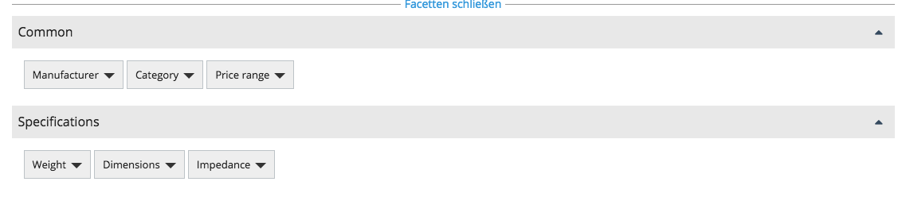
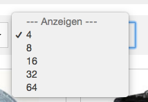

# Search configuration

## General search parameters

### siso_search.default.facet_position

``` yaml
parameters:
 # position of facet block in search. Possible values: left, center
 siso_search.default.facet_position: center
```

This is to specify if the facet block is on the center or to the left.



### siso_search.default.groups.product_list

``` yaml
siso_search.default.groups.product_list:
    product_list:
        types:
            - ses_product
        path: '/1/2/'
        section:
            - 1
        visibility: true
```

These parameters define the types that we search in the product listing section of the website. All filters from the search group section below are valid here, as well.

### siso_search.default.groups.search

``` yaml
siso_search.default.groups.search:
    product:
        types:
            - ses_product
        path: '/1/2/'
        section:
            - 1
        visibility: true
    content:
        types:
            - st_module
            - folder
            - article
            - landing_page
            - blog_post
            - event
        path: '/1/2/'
        section:
            - 1
        visibility: true
    files:
        types:
            - file
            - video
        path: '/1/43/'
        section:
            - 3
        visibility: true
```

These parameters define the tabs and the content of each tab for search section of the website.

In current example we have 3 tabs:

- Product
- Content
- Files

The label of the tabs are defined in the translation file. messages.de.php and messages.en.php using the key value as id.
In this example the key values are: product, content and files.

Inside each tab there are additional definitions:

- types: specify the content types that will be searched for (can be multiple)
- path: specify the ez path of the content.
- section: this additional parameter defines the possible sections of the content. In our configuration products and standard content are in section 1. Files are in section 3. The sections are defined inside ez backend. If multiple sections are defined, products or content must be assigned to either of them (OR operator).
- visibility: this parameters allow to search for content that is/isn't visible.

### siso_search.default.product_groups

``` yaml
siso_search.default.product_groups: ['product', 'product_list']
```

Defines the groups that will be used for the product search.

### siso_search.default.query.main_location_only

``` yaml
siso_search.default.query.main_location_only: true
```

Defines that search is returning main nodes only.

### siso_search.default.groups.search.preferred

``` yaml
siso_search.default.groups.search.preferred: product
```

Defines which group will be preferred for search as a default choice.

### siso_search.default.limits

``` yaml
siso_search.default.limits:
    left:
        3: 3
        6: 6
        12: 12
        24: 24
        48: 48
    center:
         4: 4
         8: 8
         16: 16
         32: 32
         64: 64
```

This parameter defines elements per page and will populate page size drop down.



### siso_search.default.preferred_limit

``` yaml
siso_search.default.preferred_limit:
    left: 6
    center: 8
```

Defines the default limit per design position for the search.

### siso_search.default.sort

``` yaml
siso_search.default.sort:
    product_list:
        - score
        - name|asc
        - name|desc
        - sku|asc
        - sku|desc
        - price|asc
        - price|desc
    product:
        - score
        - name|asc
        - name|desc
        - sku|asc
        - sku|desc
        - price|asc
        - price|desc
    content:
        - score
        - name|asc
        - name|desc
    files:
        - score
        - name|asc
        - name|desc
```

These parameters define the sorting options for each particular group.

###

``` yaml
siso_search.default.sort.preferred:
    product_list: score
    product: score
    content: score
    files: score
```

Defines default sorting per group.

Please note that score is a Solr field which is a numeric value that can affect the relevance of the elements. More info on Solr score can be found here: https://wiki.apache.org/solr/SolrRelevancyFAQ

### siso_search.default.field_boosts

``` yaml
# eZ Content
siso_search.default.field_boosts:
    product:
        ses_name: 50
        ses_sku: 100
        ses_intro: 20
        ses_short_description: 2
        ses_long_description: 1
        ses_manufacturer: 2
 
# Econtent
siso_search.default.field_boosts:
    product:
        text: 1
        ses_product_ses_sku_value_s: 100
        ses_product_ean_value_s: 100
        ses_product_ses_name_value_t: 50
        ses_product_sub_headline_value_t: 1
        ses_product_long_description_value_t: 20
        ses_product_ses_datamap_product_group_names_value_t: 1
        ses_product_ses_datamap_category_value_t: 2
```

Configuration for boosting

The boosting influences the calculation of the relevancy. Using boosting factors it can be "controlled" which fields are more important / more relevant for the search terms than other fields. A higher value will boost a hit, which means if the search engine find a search term a field boosted with a high factor the matching document will have a better relevancy. Please mind that the existence of search terms is crucial for the calculation of relevancy. The field boost has no influence on the order of results, if a search was queried without terms (e.g. a plane product list in the catalog).

By default the search engine uses a factor of 1. A boosting of values below 1 (e.g. 0.5) will reduce the relevance of this field.

Currently, the implementation of the field boosing API is not consistent. That means, that the way how it is configured differs for Econtent and eZ Content.

eZ Content:

The configured field name values are field identifiers of their respective ContentTypes (e.g. field ses_name of type ses_product ). Fields added by an indexer plugin can currently not be boosted.

Econtent:

The field name values are raw Solr field names. Thus, all indexed fields can be taken into consideration for boosting, but must also be adapted in the configuration always when they change in the index. Furthermore, you SHOULD specify the default search field 'text' here, as it would not be queried otherwise. Boosts in Econtent will activate the qf parameter, which overrides the default field (df parameter).

If you specify boosting fields in Econtent, the shop will only search in these fields!

### siso_search.default.simple_facet_definitions

``` yaml
siso_search.default.simple_facet_definitions:
    price_range:
        #possible values: single|multi_and|multi_or
        filter_type: 'single'
        #possible values: alpha|numeric|manual|range
        sort_type: 'range'
        #sort_type_order: 'XS|S|M|L|XL|XXL'
        index_field: 'ext_ses_price_range_ms'
        # ONLY VALID FOR THIS FACET
        index_range_boundries: 0|10|20|50|100
    manufacturer:
        filter_type: 'multi_or'
        sort_type: 'alpha'
        index_field: 'ses_product_ses_manufacturer_value_s'
    weight:
        filter_type: 'multi_or'
        sort_type: 'numeric'
        index_field: 'ext_ses_spec_weight_f'
    dimensions:
        filter_type: 'multi_or'
        sort_type: 'alpha'
        index_field: 'ext_ses_spec_dimensions_s'
    category:
        filter_type: 'multi_or'
        sort_type: 'alpha'
        index_field: 'location_parent_id_mid'
        # ONLY VALID FOR THIS FACET
        location_id_values: true
    impedance:
        filter_type: 'single'
        sort_type: 'numeric'
        index_field: 'ext_ses_spec_impedance_s'
    availability:
        filter_type: 'single'
        sort_type: 'alpha'
        index_field: 'ses_product_ses_stock_numeric_value_s'
    discontinued:
        filter_type: 'single'
        sort_type: 'alpha'
        index_field: 'ses_product_ses_discontinued_value_s'
```

This part defines the facet configuration.

Each facet can have the following configuration:

- key: it is used to identify each facet. (I.E.: price_range, manufacturer, etc).
- filer_type: The possible values are
- single|multi_and|multi_or.
    - Single: the user may select only one facet element.
    - Multi Or: the user may select multiple facet elements and each of them use OR as operator. (The results can match one facet OR the other)
    - Multi And: the user may select multiple facet elements and each of them use AND as operator. (The results should match all selected facets, for example if products have connectors and the results should have HDMI and USB-3)

!!! note
    
    Multi And has currently an interface issue. If a multiple selection of this kind of facet leads to an empty result page, the only possible way for the user to get back is to click the 'remove all facets' button. This can be inconvenient if a lot of facets exists and have already been chosen. Multi And facets are a rare requirement, though.

- sort_type: It defines how the facet box should be sorted. Some time is not enough to have only numeric or alphanumeric sorting.
- sort_type_order: For example for clothes size it is nice to have S | M | L | XL.
- index_field: name of corresponding field in solr
- index_range_boundries: currently is only available for Price Range facet. It defines the ranges of current values.

### siso_search.default.used_facets

``` yaml
siso_search.default.used_facets:
    product_list:
        common: ['manufacturer', 'category', 'price_range', 'availability', 'discontinued']
        specifications: ['weight', 'dimensions', 'impedance']
    product:
        common: ['manufacturer', 'category', 'price_range']
        specifications: ['weight', 'dimensions', 'impedance']
```

This section describes which facets will be displayed for each group.

### siso_search.default.search.auto_suggest_limit

``` yaml
siso_search.default.search.auto_suggest_limit: 10
siso_search.default.search.auto_suggest_fields:
    - ses_product_ses_sku_value_s
    - ses_product_ses_name_value_s
    - ses_variant_list_s
    - ses_variant_codes_ms
    - ses_variant_sku_ms
    - ses_variant_desc_ms
```

These are autosuggest parameters only for quick order. User input in quick order will search this defined Solr fields.

Also the limit can be specified here.

### siso_search.default.search_mapping_specification

``` yaml
#optional configuration for indexing the specification fields
siso_search.default.search_mapping_specification:
     manufacturer:
         alias: ['Manufacturer', 'Hersteller', 'Peak']
         type: string
     weight:
         alias: ['Weight', 'Netto-Gewicht']
         type: float
     dimensions:
         alias: ['Dimensions (LxWxH)', 'Maße (BxHxT)']
         type: string
```

This configuration is deprecated (MatrixFieldType does not exists anymore in eZ Platform)


These additional configuration allows some predefined rules for product specification matrix index.

alias

This is useful to specify additional words for a given specification matrix parameter. The indexer will index only the first element of the alias array.

type: it allows to specify a data type for the given specification matrix element. I.E. if float is set, the indexer will do a string to float conversion of the value.

separator: if this parameter is set, the indexer will create a Solr field with multiple elements using the specified separator to explode the string into an array.

I.E. for separator:

Specification Matrix Field Name: Dimensions
Specification Matrix Field Value: 220 x 110 x 150

If we specify 'x' as separator, the indexer will create a Solr field with multiple elements that will look like this: {220, 110, 150} 

### siso_search.default.category_cache

``` yaml
siso_search.default.category_cache:
    rootNodeId: 62
    maxProductCategoryDepth: 99
    productCategoryLimit: 999
    add_parent_category_name: true
    parent_category_name_separator: ' / '
```

As category names are currently not indexed, category names are stored in a cache called stash.

This parameter defines the following:

rootNodeId: It should be set with the node of e-shop product main category.

maxProductCategoryDepth: it defines how many levels of subcategories should be set in this cache.

productCategoryLimit: it defines the maximum category names that will be stores in this cache.

add_parent_category_name: If set to tru it will also index the parent category name.

parent_category_name_separator: this is string separator to concatenate parent category and current category.

### globals

``` yaml
globals:
    boxes_visibility_limit: 10
    items_visibility_limit: 5
    mega_visibility_limit: 50
```

|||
|---|---|
|boxes_visibility_limit|If more than limit the boxes are hidden by default and the toggler is enabled in order to show/hide more items|
|items_visibility_limit|If more than limit the search filter is visible inside a single facet box to help find faster what you need|
|mega_visibility_limit|If more than this limit we use mega dropdown with columns to make the user experience better.|

### siso_search.default.solr_special_characters

``` yaml
# Configuration to escape or remove Solr special characters from search query.
# Possible values: escape, remove or empty.
siso_search.default.solr_special_characters: escape
```

- `escape`: will escape every Solr special character from the user search query.
- `remove`: will remove every Solr special character from the user search query.
- `~`: will keep all Solr special characters.
 
These are the current Solr special characters:

+ - && || ! ( ) { } [ ] ^ " ~ * ? : \
Every character listed above has a special function and required syntax in Solr if they are not escaped.

Here are some examples:

`-` not operator, when preceding a word token. 
`+` operator, when preceding a word token implies an AND operator. The term after the + symbol definitely exists somewhere in the documents searched. 
`*` wildcard operator when followed by or preceded by a word token. Use wildcards to look for spelling variations and alternate word endings. 
`()` characters serve to group tokens with AND/OR operator. Search terms within parentheses are read first, then terms outside parentheses is read next. 
`"` operator surrounding word tokens will cause the word tokens to be treated as is and as a phrase.

### siso_search.default.query.main_location_only

``` yaml
siso_search.default.query.main_location_only: true
```

If true the search and autosuggest will only return one hit, if the product exists in several locations

### siso_search.default.use_filtered_images

``` yaml
#EcontentImageIndexerPlugin configuration
siso_search.default.use_filtered_images: true
siso_search.default.image_filter_resolution: thumb_small
```

The EcontentImageIndexerPlugin can make use of the imageConverter and therefore two additional parameters are available.

- `use_filtered_images` is used to configure if the imageConverter shall be used or not
- `image_filter_resolution` is used to specify in which way the images will be modified by the imageConverter

## Econtent search parameters

### silver_econtent.default.section_filter

``` yaml
parameters:
    silver_econtent.default.section_filter: enabled
    silver_econtent.default.catalog_filter_default_catalogcode:
        - ALL
        - NORMAL
```

These parameters are not only dedicated to search. But they are used in search result filtering, as well, if econtent is configured as data provider.

If $section_filter;silver_econtent$ is enabled, then the product/catalog search result list is restricted to elements which are assigned to catalog codes, provided by $catalog_filter_default_catalogcode;silver_econtent$.

## Econtent configure cores per siteaccess

### siso_search.default.core

``` yaml
parameters:
    siso_search.default.core: ~
```
    
Use default core (usually siso_econtent = econtent live core)

### siso_search.de_preview.core

``` yaml
parameters:
    siso_search.de_preview.core: siso_econtent_back
```
    
Use the back core. This might be useful if an import is using the tmp tables in econtent. The data will be indexed in the econtent_back core.

This settings allows to configure to use the back core for a preview siteaccess.

!!! note 

    There is one exception: the service searching for bestsellers will not use this setting and use the live core by default.
