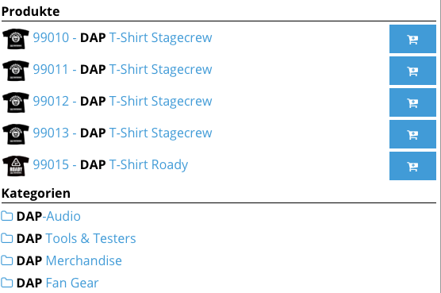
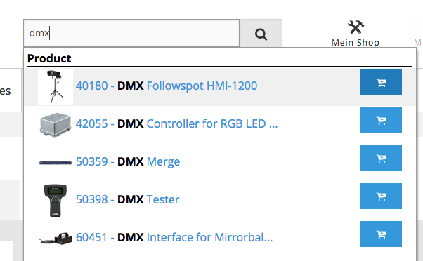
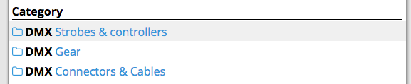
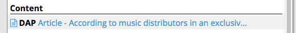
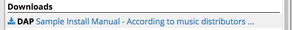
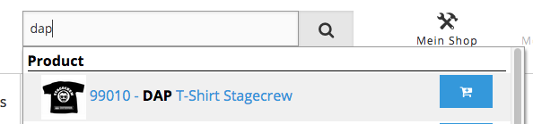

# Search autosuggest



The build in autosuggest function provides a user friendly way to preview products, categories, content or downloads which matches the given search criteria

## Introduction and functionality

As user types in main search field, different and configurable search results appear.

Autosuggest has 4 different independent modules:

And for each module the functionality is similar: 

1.  User types in search field.
2.  A Solr search is performed using the content of the search field directly to Solr using Solarium.
3.  Solr result is showed according to configuration..
4.  A different action is performed according to module type using a redirect controller that works after element is clicked:
    1.  A product click will redirect to product detail page.
    2.  A category click will redirect to category detail page.
    3.  A content click will redirect to Ez Content detail page.
    4.  A download click will start download of the current file.  

Note: It is very important to keep processing time as low as possible, since time is critical. That's why search is performed directly to Solr without any additional components from eZ Platform or from eZ Commerce.

### Module Product

This module is designed to display eZ Commerce products. Several fields can be showed according to configuration (see below: configuration).

Clicking on a product will redirect to the product detail page. Due to performance reasons the price is not displayed in this step. If a product has variants no addtobasket is offered. 

Also if Add to basket is set to true, an add to basket button will appear and the user will be able to add to basket directly from autosuggest window.

### Module Category

This module is designed to display eZ Commerce categories. Some fields can be showed according to configuration (see below: configuration).

Clicking on a category will redirect to the category detail page.

### Module Content

This module is designed to display Ez Content. Some Ez Fields can be showed according to configuration.

Clicking on an a content result will redirect to Ez detail page of the given content.

### Module Download

This module is designed to download files. A few field names can be showed according to configuration.

Clicking on this autosuggest result will start a download of the given element. We asume that downloads are meant to be downloaded and not to visit their content detail page.

### Configuration

!!! note 

    Please note that the parameter `siso_search.default.autosuggest_module_definitions` can't be defined multiple times. It would be overridden by the next definition. The module configurations are split only for overview purposes.

!!! tip

    The order of the module configurations represent the order of display in the suggestion box.

#### Product

``` yaml
siso_search.default.autosuggest_module_definitions:
    product_autosuggest:
        search_limit: 5
        use_prefix_search: false
        min_score: 1
        images_field:
            ez: main_image_url_s
            econtent: ses_product_ses_datamap_ext_main_image_url_value_s
        add_to_basket: true #add to cart
        type_id:
            - 2
        path: '/2/'
        section:
            - 1
        search_fields:
            - ses_product_ses_sku_value_s
            - ses_product_ses_name_value_s
        result_fields:
            - ses_product_ses_sku_value_s
            - ses_product_ses_name_value_s
        result_fields_separator: ' - '
        text_limit: 35
```

- search_limit: (int) Defines amount of elements to display.
- images_field: (string) defines images path for products depending on the dataprovider
- add_to_basket: (bool) defines if add to basket button is shown.
- types: (array) additional filter for element types.
- path: (string) additional filter for path.
- section: (array) additional filter for section.
- search_fields: (array) Solr search field names to perform the search.
- result_fields: (array) Solr result field names to be shown on results.
- result_fields_separator: (string) text to be used as a separator for result fields.
- text_limit: (int) limits the length of the resulting string.
- use_prefix_search: (boolean) if true a ngram fields can be defined in "
- min_score: is used in case use_prefix_search = false. Only if Solr score is higher than min_score product is returned
- search_fields", otherwise autosuggest uses a prefix for search (searchterm + `*`)

#### Category

``` yaml
siso_search.default.autosuggest_module_definitions:
category_autosuggest:
    search_limit: 5
    images: true
    types:
        - 38
    path: '/2/'
    section:
        - 1
    search_fields:
        - ses_category_ses_name_value_s
    result_fields:
        - ses_category_ses_name_value_s
    result_fields_separator: ' - '
    text_limit: 60
```

- search_limit: (int) Defines amount of elements to display.
- images: (bool) defines if category icon is shown.
- types: (array) additional filter for element types.
- path: (string) additional filter for path.
- section: (array) additional filter for section.
- search_fields: (array) Solr search field names to perform the search.
- result_fields: (array) Solr result field names to be shown on results.
- result_fields_separator: (string) text to be used as a separator for result fields.
- text_limit: (int) limits the length of the resulting string.

#### Content

``` yaml
siso_search.default.autosuggest_module_definitions:
content_autosuggest:
    search_limit: 5
    images: true
    section: 
        - 1
    search_fields:
        - article_title_value_s
        - article_intro_value_s
        - article_body_value_s
    result_fields:
        - article_title_value_s
        - article_intro_value_s
        - article_body_value_s
    result_fields_separator: ' - '
    text_limit: 60
```

- search_limit: (int) Defines amount of elements to display.
- images: (bool) defines if content icon is shown.
- section: (array) additional filter for section.
- search_fields: (array) Solr search field names to perform the search.
- result_fields: (array) Solr result field names to be shown on results.
- result_fields_separator: (string) text to be used as a separator for result fields.
- text_limit: (int) limits the length of the resulting string.

#### Download

```
siso_search.default.autosuggest_module_definitions:
download_autosuggest:
    search_limit: 5
    images: true
    search_fields:
        - file_name_value_s
        - file_description_value_s
    result_fields:
        - file_name_value_s
        - file_description_value_s
    mime_types:
        - application/pdf
    result_fields_separator: ' - '
    text_limit: 60
```

- search_limit: (int) Defines amount of elements to display.
- images: (bool) defines if download icon is shown.
- search_fields: (array) Solr search field names to perform the search.
- result_fields: (array) Solr result field names to be shown on results.
- mime_types: (array) Search only the mime types specified here.
- result_fields_separator: (string) text to be used as a separator for result fields.
- text_limit: (int) limits the length of the resulting string.

## Autosuggest Redirect Controller

This controller redirects to different pages according to passed type. It has been introduced in order to speed up linking to the detail pages without calling expensive methods in order to generate a route/url. 

This is controller that takes care of redirection.

```
class AutosuggestRedirectController extends BaseController
{
}
```

Currently we only have 3 redirection types

Each redirection type is a service defined in configuration.

Example:

`redirect_generator_id: siso_search.autosuggest_redirect_generator.product`

`SearchAutosuggestRedirectGeneratorProduct` type: `product_autosuggest`

Will fetch SKU  from $request object and will return a string containing the URL to redirect. The languages are injected into the service from the respective eZ site-access aware parameter.

``` php
/**
 * @param Request $request
 * @return string
 */
public function generateRedirectUrl(Request $request)
{
    $sku = $request->query->get('sku', '', false);
    $dataProvider = $this->catalogProvider->getDataProvider();
    $element = $dataProvider->fetchElementBySku(
        $sku,
        array(),
        $this->languages
    );
    $redirectUrl = $element->getSeoUrl();
 
    return $redirectUrl;
}
```

Category Type

`SearchAutosuggestRedirectGeneratorCategory`

In a similar to redirect generator for products, it will return the URL of the category.

``` php
$identifier = $request->query->get('identifier', '', false);
$dataProvider = $this->catalogProvider->getDataProvider();
$element = $dataProvider->fetchElementByIdentifier(
    $identifier,
    $this->languages
);
$redirectUrl = $element->getSeoUrl();
 
return $redirectUrl;
```

`SearchAutosuggestRedirectGeneratorDownload` type: `download_autosuggest`

This is a little bit more complex. It uses Ez API to fetch the media element by identifier and language. Then it creates a download link.

``` php
public function generateRedirectUrl(Request $request)
{
    $contentService = $this->repository->getContentService();
    $identifier = $request->query->get('identifier', '', false);
    /** @var \eZ\Publish\Core\Repository\Values\Content\Content $ezContent */
    $ezContent = $contentService->loadContent($identifier, $this->languages);
 
    //todo: find out if there is a simpler way to get download content URL.
    $downloadUrl =
        '/content/download/' .
        $ezContent->id . '/' .
        $ezContent->getField('file')->id . '/' .
        'version/' .
        $ezContent->versionInfo->contentInfo->currentVersionNo . '/' .
        'file/' .
        $ezContent->getFieldValue('file')->fileName;
 
    return $downloadUrl;
}
```

All redirect services implements the following interface:

`AutosuggestRedirectUrlGeneratorInterface`

## Cookbook

### How to add additional elements to autosuggest module

Any Solr field can be displayed in autosuggest results. So to add additional elements to display in any module is quite simple:

1. Identify the Solr field you would like to show

For this its convenient to access Solr http interface and search for the required field.

For example we would like to show a preview of PDF content in download module

Content of indexed files are stored in this Solr field:

`file_file_file_content_t`

2. Add Solr field to configuration

``` yaml
siso_search.default.autosuggest_module_definitions:
download_autosuggest:
    search_limit: 5
    images: true
    search_fields:
        - file_name_value_s
        - file_description_value_s
    result_fields:
        - file_name_value_s
        - file_description_value_s
+       - file_file_file_content_t
    mime_types:
        - application/pdf
    result_fields_separator: ' - '
    text_limit: 60
```

3. This will show the pdf content in each result line. But what if you would like to customise this result line?

Each template have the full result line to allow template customisation without service modification.

For example, template for download module is:

`Resources/views/Search/autosuggest/search_autosuggest_download_line.html.twig`

Array resultLine will have all information received from Solr, so it can be handy to display different fields any way you want.

#### Example: add a "new" label to certain products

It may also happen that you need to show some information which is not available directly in Solr and you have to process it. For this it is very easy to create an indexer plugin and have your information processed. 

Task: Display a flag with for new products

First we need to define what is a "new" product.

Let's say that a new product is a product that was published a month ago.

We could use this Solr field:

`"published_dt": "2016-01-19T09:59:24Z"`

to calculate if the product is new or not.

Create an indexer plugin to add a new boolean field set to true if current date - product published date <= 30 days.

Please refer to this documentation to build indexer plugin:

For Ez Data Provider: Search - Cookbook#Cookbook-Howtoimplementanindexerpluginforcustomfieldtypes

For Econtent Data Provider: How to implement a custom indexer plugin for econtent

Let's assume the new created field is ext_product_new_s

Now we just need to add this field to the result fields of Solr in product configuration.

``` yaml
product_autosuggest:
    search_limit: 10
    images_field: main_image_url_s
    display_cart_info: true #add to cart
    types:
        - 2
    path: '/2/'
    section: 1
    search_fields:
        - ses_product_ses_sku_value_s
        - ses_product_ses_name_value_s
    result_fields:
        - ses_product_ses_sku_value_s
        - ses_product_ses_name_value_s
+       - ext_product_new_s
    result_fields_separator: ' - '
    text_limit: 35
```

Now you need to modify the template to read that value:

Product template is:

`/Resources/views/Search/autosuggest/search_autosuggest_product_line.html.twig`

Please consider that even it is not being used, in every template you have array resultLine with all Solr information.

``` php
/* In a normal configuration resultLine array will look like this: */
array (size=5)
  'id' => string 'content9982gerde' (length=16)
  'ses_product_ses_name_value_s' => string 'DMX Followspot HMI-1200' (length=23)
  'ses_product_ses_sku_value_s' => string '40180' (length=5)
  'main_image_url_s' => string '/var/ezdemo_site/storage/images/4/4/1/1/531144-2-ger-DE/40180.jpg' (length=65)
  'meta_indexed_language_code_s' => string 'ger-DE' (length=6)
```

Additionally, if you change the configuration to support your new indexed field, that new field should be part of this array:

```
array (size=5)
  'id' => string 'content9982gerde' (length=16)
  'ses_product_ses_name_value_s' => string 'DMX Followspot HMI-1200' (length=23)
  'ses_product_ses_sku_value_s' => string '40180' (length=5)
  'main_image_url_s' => string '/var/ezdemo_site/storage/images/4/4/1/1/531144-2-ger-DE/40180.jpg' (length=65)
  'meta_indexed_language_code_s' => string 'ger-DE' (length=6)
+ 'ext_product_new_s' => bool true
```

The template modification might look like this:

```
<div class="row">
    <div class="small-8 large-8 columns">
        <a href="{{ ('/redirect_switcher?sku=' ~ sku ~ '&type=' ~ type)|st_siteaccess_path }}">
            
                
            
            {{ set_bold_text(searchQueryString, productText) }}
+           
+               <!-- DISPLAY FANCY ANIMATED GIF WITH NEW LABEL -->
+               
+               
        </a>
    </div>
        
<div class="small-4 large-4 columns">
<form action="/basket/add" method="post">
    <section class="js-add-to-basket-parent">
        <input type="hidden" name="ses_basket[{{ number }}][quantity]" value="1">
        <input type="hidden" name="ses_basket[{{ number }}][sku]" value="{{ sku }}">
        <input type="hidden" name="autosuggest" value="autosuggest">
        <button class="button tiny js-add-to-basket" style="float:right;" data-sku="{{ sku }}" type="submit" name="add_to_basket">
            <i class="fa fa-cart-plus fa-lg fa-fw"></i>
        </button>
    </section>
</form>
</div>
```

### How to override autosuggest services

Autosuggest services are very simple. There are four available services:

```
vendor/silversolutions/silver.e-shop/src/Siso/Bundle/SearchBundle/Service/SearchAutosuggestAllService.php
vendor/silversolutions/silver.e-shop/src/Siso/Bundle/SearchBundle/Service/SearchAutosuggestCategoryService.php
vendor/silversolutions/silver.e-shop/src/Siso/Bundle/SearchBundle/Service/SearchAutosuggestContentService.php
vendor/silversolutions/silver.e-shop/src/Siso/Bundle/SearchBundle/Service/SearchAutosuggestDownloadService.php
```

Their structure is very simple:

Search logic is build in method

`searchProducts`

Output is generated both at

```
getDisplayText
generateHtml
```

Template is rendered in

`generateHtml`

Also please consider that each autosuggest service implements this interface:

`SearchAutosuggestInterface`

``` php
<?php
class SearchAutosuggestProductService
{
 
    /**
     * Main method to fetch products from Solr.
     *
     * @param $searchQueryString
     * @return array
     */
    public function fetchElements($searchQueryString);
 
    /**
     * This method performs the Solr search with the specified configuration and returns an array with the results
     *
     * @param $searchQueryString
     * @return array
     */
    protected function searchProducts($searchQueryString);
 
    /**
     * This method generates the text to be displayed according to current configuration.
     *
     * @param $resultLine
     * @return string
     */
    protected function getDisplayText($resultLine);
 
    /**
     * This method returns the rendered template for one result element.
     *
     * @param $resultLine
     * @param $number
     * @param $searchQueryString
     * @return string
     */
    protected function generateHtml($resultLine, $number, $searchQueryString);
}
```

And service definition is found in configuration

``` 
Example:
search_service_id: siso_search.autosuggest_service.product
```

In order to create a new autosuggest service, you just need to implement the interface and define the service id in autosuggest configuration.

## Frontend:

### What you should know about template files and autosuggest

Each autosuggest section has its own template. Currently we have 4 templates located in the following directory:

`vendor/silversolutions/silver.e-shop/src/Silversolutions/Bundle/EshopBundle/Resources/views/Search/autosuggest`

|Description|Template file|
|--- |--- |
|Product template</br>This is the most complex template, since it needs to render image, text, price and add to basket button|search_autosuggest_product_line.html.twig|
|Category template</br>This template renders an Icon (optional) and text.|search_autosuggest_category_line.html.twig|
|Content template</br>This template renders an Icon (optional) and text.|search_autosuggest_content_line.html.twig|
|Download template</br>
This template renders an Icon (optional) and text.|search_autosuggest_download_line.html.twig|

Autosuggest Product Template File

In this template we are showing the following:

image (if it set)

Autosuggest text (usually SKU - Product Name)

Add to basket button.

To make autosuggest work it is very important to have add to basket button with class: `js-add-to-basket` This will allow ajax to perform the add product to basket.

Please note that the object link is generated as a link, and is not using the link functionality of autosuggest js module.

The link goes to autosuggest redirect controller, which will redirect according to type parameter.



`search_autosuggest_product_line.html.twig`

``` html+twig
<div class="row collapse autocomplete-suggestion-product">
  
  
    
  
  
    
  
  <div class="small-{{ columns }} columns u-padding-right-1x u-line-height-normal">
    <a href="{{ ('/redirect_switcher?sku='~sku~'&type='~type)|st_siteaccess_path }}">
      
        
      
      {{ set_bold_text(searchQueryString, productText) }}
    </a>
  </div>
  <div class="small-2 columns text-center">
    
      {{ price|price_format }}
    
  </div>
  
    <div class="small-2 columns">
      <form action="/basket/add" method="post">
        <section class="js-add-to-basket-parent">
          <input type="hidden" name="ses_basket[{{ number }}][quantity]" value="1">
          <input type="hidden" name="ses_basket[{{ number }}][sku]" value="{{ sku }}">
          <input type="hidden" name="autosuggest" value="autosuggest">
          <input class="js-autosuggest-product-name" type="hidden" value="{{ productText }}">
          <button class="button tiny right js-add-to-basket" data-sku="{{ sku }}" type="submit" name="add_to_basket">
            <i class="fa fa-cart-plus fa-lg fa-fw"></i>
          </button>
        </section>
      </form>
    </div>
  
</div>
```

Autosuggest Category Template File

This template only displays an icon for category and autosuggest text.



`search_autosuggest_category_line.html.twig`

```html+twig
<a href="{{ ('/redirect_switcher?identifier='~identifier~'&type='~type)|st_siteaccess_path }}">

    <i class="fa fa-folder-o" aria-hidden="true"></i>

{{ set_bold_text(searchQueryString, categoryText) }}
</a>
```

Autosuggest Content Template File

This template only displays an icon for content and autosuggest text.



`search_autosuggest_content_line.html.twig`

``` html+twig
<a href="{{ path( "ez_urlalias", {"locationId": id}) }}">
    
        <i class="fa fa-file-text-o" aria-hidden="true"></i>
    
{{ set_bold_text(searchQueryString, contentText) }}
</a>
```

Autosuggest Download Template File

This template only displays an icon for download and autosuggest text. The download link is generated in autosuggest redirect controller.



`search_autosuggest_download_line.html.twig`

``` html+twig
<a href="/redirect_switcher?identifier={{ id }}&language={{ language }}&type={{ type }}">

    <i class="fa fa-download" aria-hidden="true"></i>

{{ set_bold_text(searchQueryString, downloadText) }}
</a>
```

Twig Function to mark as `<strong>` user search terms

This small function is used to insert `<strong>` tag for user search terms in autosuggest search result.

I.E.:

If user searchs for DMX, then all DMX occurrences will have `<strong>` tag.

In the following example, the word dap is highlighted using stron tab.



```
new \Twig_SimpleFunction('set_bold_text',                   array($this, 'setBoldText'),
    array(
        'is_safe' => array('html')
    )),
```

``` php
/**
 * Returns html with added <strong> tag(s) to needle occurences in haystack.
 * Supports multiple words.
 *
 * @param $needle
 * @param $haystack
 * @return mixed
 */
public function setBoldText($needle, $haystack)
{
    // return $haystack if there are strings given, nothing to do
    if (strlen($haystack) < 1 || strlen($needle) < 1) {
 
        return $haystack;
    }
 
    preg_match_all("/$needle+/i", $haystack, $matches);
    if (is_array($matches[0]) && count($matches[0]) >= 1) {
        foreach ($matches[0] as $match) {
            $haystack = str_replace($match, '<strong>'.$match.'</strong>', $haystack);
        }
    }
 
    return $haystack;
}
```

!!! note "Very Important"

    In all templates we have access to resultLine array, which has all information returned by Solr. You can use this information to adapt the template without overriding the services.

!!! note "Very important"

    Autosuggest needs to be generated as fast as possible, so we never have to add additional logic with heavy processing in template or anywhere else. Example: We need to avoid using image transformation functions. If there is the need to have an image of a given size or features it is strongly recommended to do it at index time using an indexer plugin and then use the processed image.

### Advanced Javascript Functionality

The following JS tool is used for autosuggest:

https://github.com/devbridge/jQuery-Autocomplete

However to support add to basket we had to do some modifications:

Since we need to keep the autosuggest window opened when user adds to basket suggestions are working as a link and not using onSelect() function from JS Module.

Also a new function was created to hide autosuggest window on any click.

!!! note "Important"

    After user clicks on an autosuggest search result bu default search input field is populated with autosuggest result data. This functionality can be turned on and off using parameter:
    
`preserveInput: true`

In autocomplete

File: Resources/public/js/app.js

``` js
$('.js-autocomplete').autocomplete({
  noCache: true,
  minChars: 2,
  serviceUrl: function () {
    if ($('body').attr('data-siteaccess') == '/') {
      return '/search_autosuggest';
    }
    else {
      return $('body').attr('data-siteaccess') + '/search_autosuggest';
    }
  },
  paramName: 'search_terms',
  triggerSelectOnValidInput: false,
  width: Foundation.utils.is_large_up() ? 560 : '',
  groupBy: 'category',
  maxHeight: 750,
  preserveInput: true, // Enables or disables search input field to be populated with autosuggest result field.
  formatResult: function (suggestion, currValue) {
    return suggestion.data.html;
  }
});
 
// close autocomplete when user clicks out from the autocomplete window
$('body').on('click', function() {
  if ($('.autocomplete-suggestions').is(':visible')) {
    $('.autocomplete-suggestions').hide();
  }
});
```

Then basket hoplite should had to be modified to leave autosuggest window open if the user clicked add to basket. This was configured in the following file:

`Resources/public/js/phalanx/hoplite/basket/basket.js`

`vendor/silversolutions/silver.e-shop/src/Silversolutions/Bundle/EshopBundle/Resources/public/js/phalanx/hoplite/basket/basket.js:102`

``` php
// if the click comes from autosuggest dropdown
if ($(this).parents('.autocomplete-suggestions').length) {
  // populate product name in the search field
  // we need to do it this way because autocomplete stays open (see below)
  // because it stays open when we click on a second selection it's not working
  var productName = $(this).parents('.js-add-to-basket-parent').find('.js-autosuggest-product-name').val();
  $('.js-autocomplete').val(productName);
 
  // make sure it stays open
  if (Foundation.utils.is_large_up()) {
    $('.autocomplete-suggestions').css('display', 'block');
  }
}
```
