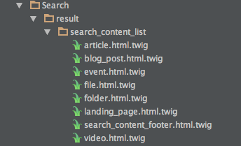

# Search templates

Configuration for facets

``` yaml
globals:
    # defines limit for maximum number of boxes that are displayed. If in this case more than 10 facets boxes are found there will be a "More" button"
    boxes_visibility_limit: 10 
 
    # defines limit for maximum number of items shown in the one box.
    items_visibility_limit: 5 
 
    # defines limit from which mega box with facets will be displayed. 
    mega_visibility_limit: 50  
```

Templates list:

```
Search/search_results.html.twig
Search/search_facets.html.twig
Search/search_query.html.twig
Search/search_groups.html.twig
Search/search.html.twig
Search/search_filters.html.twig
Search/result/search_content_list/folder.html.twig
Search/result/search_content_list/video.html.twig
Search/result/search_content_list/event.html.twig
Search/result/search_content_list/search_content_footer.html.twig
Search/result/search_content_list/landing_page.html.twig
Search/result/search_content_list/article.html.twig
Search/result/search_content_list/file.html.twig
Search/result/search_content_list/blog_post.html.twig
```

## Line templates for content and products

For each content type a line template for search has to be offered. The line templates are responsible for displaying one product or one content item. 

### Products

For each product the template "Catalog/listProductNode.html.twig" is used for displaying the content for a product. Te template has access to the catalogElement containing all the data including price information. 

### Content items

For each content type a template has to be provided. It shall be stored in the folders "Search/result/search_content_list" 



In addition the template has to be defined in the configuration for the eZ templating system:

``` yaml
search_content_list:
    siso_search_folder_item:
        template: SilversolutionsEshopBundle:Search/result/search_content_list:folder.html.twig
        match:
            Identifier\ContentType: [folder]
    siso_search_article_item:
        template: SilversolutionsEshopBundle:Search/result/search_content_list:article.html.twig
        match:
            Identifier\ContentType: [article]
    siso_search_landing_page_item:
        template: SilversolutionsEshopBundle:Search/result/search_content_list:landing_page.html.twig
        match:
            Identifier\ContentType: [landing_page]
    siso_search_blog_post_item:
         template: SilversolutionsEshopBundle:Search/result/search_content_list:blog_post.html.twig
         match:
             Identifier\ContentType: [blog_post]
    siso_search_event_item:
         template: SilversolutionsEshopBundle:Search/result/search_content_list:event.html.twig
         match:
             Identifier\ContentType: [event]
    siso_search_file_item:
         template: SilversolutionsEshopBundle:Search/result/search_content_list:file.html.twig
         match:
             Identifier\ContentType: [file]
    siso_search_video_item:
         template: SilversolutionsEshopBundle:Search/result/search_content_list:video.html.twig
         match:
             Identifier\ContentType: [video]
```

The template itself has access to the content object.

Example for the blog post template (`Search/result/search_content_list/blog_post.html.twig)``:

``` html+twig

  
    <figure class="left c-card__image--inline u-no-float-on-small">
      {{ ez_render_field(content, 'image') }}
      
        <figcaption>
          {{ ez_render_field( content, 'caption' ) }}
        </figcaption>
      
    </figure>
  
  <h3 class="c-card__title">
    <a href="{{ path(location) }}" title="{{ ez_field_value( content, 'title' ) }}">
      {{ ez_field_value( content, 'title' ) }}
    </a>
  </h3>
  
    <p class="c-card__description u-no-padding-top">
      {{ ez_render_field( content, 'blog_post_intro' )|truncate(maxchars) }}
    </p>
  
  

```

## How to

### Hide (remove) more / download link

In order to hide or remove the link make sure to pass false value to the uri parameter. We use this technique to hide download button for a video content type but it can be used for every type of content. In order to make it work you need to make some changes to a specific content type template like we do in the video template.

`vendor/silversolutions/silver.e-shop/src/Silversolutions/Bundle/EshopBundle/Resources/views/Search/result/search_content_list/video.html.twig`:

``` html+twig


  
  

  

  

  

  <h3 class="c-card__title">
    <a href="{{ path(location) }}" title="{{ ez_field_value( content, 'name' ) }}">
      {{ ez_field_value( content, 'name' ) }}
    </a>
  </h3>

  <div class="flex-video">
    <video controls>
      <source src="{{ uri }}" type="{{ mimeType }}">
      {{ 'common.video_not_supported'|st_translate }}
    </video>

  


```

When including `search_content_footer.html.twig` make sure to pass false to the uri parameter
