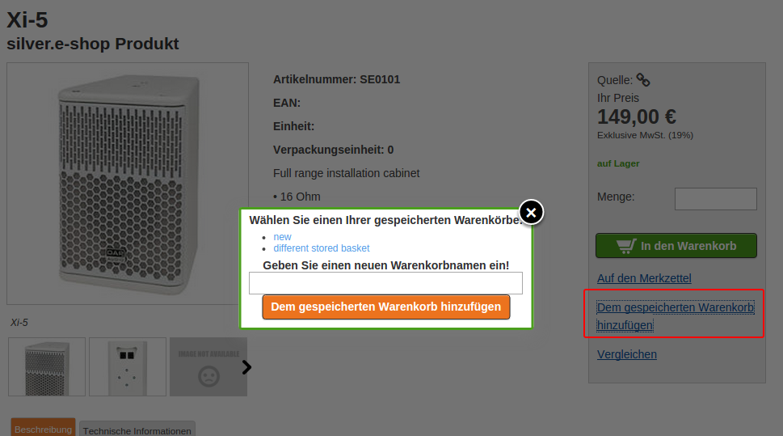
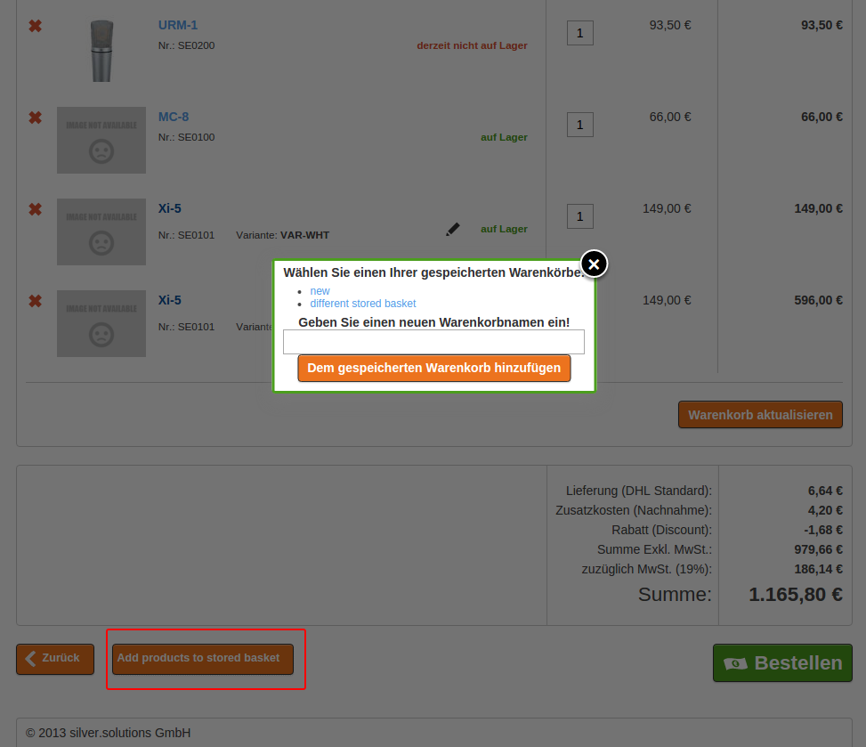
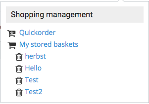
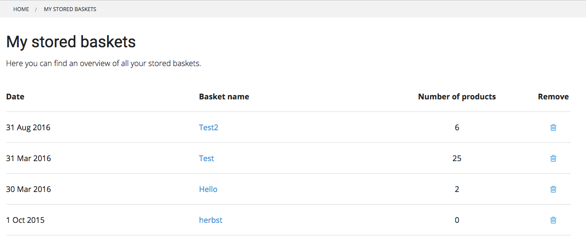
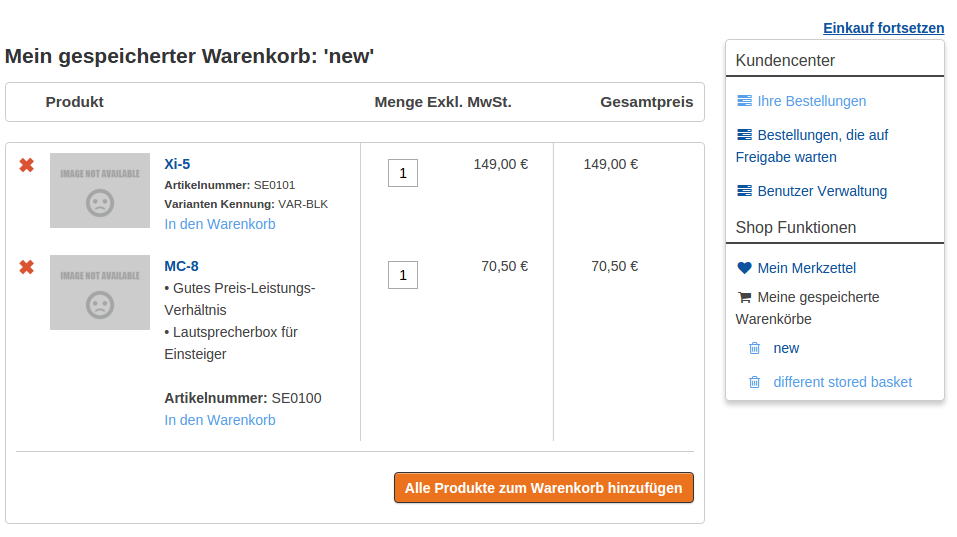

# Stored Baskets

### Who is able to use stored basket

!!! note

    Stored basket is available only for logged users. There can be many stored baskets per 1 user.

Every stored basket have a name, that has to be provided by user. 

User can store the whole basket under a name for later purposes and new stored basket will be created.

### How to add products to stored basket 

There are 2 ways to add products to stored basket:

- User can **add** an item into a stored basket from product detail page. See below:  

- User can add all items from the basket into stored basket (user must choose stored basket from a list or provide new one).  

There are 2 options user can take within the popup:

- **save as new stored basket** - if the user doesn't have any *stored baskets* yet, a pop-up-window is shown, with similar text: '*You don't have any stored baskets yet. Please enter a name for your stored basket*'. Here an input field can be displayed where the user must enter the basket name.
- **choose existing stored basket** - if the user has some *stored baskets* already, a list (pop-up-window) is shown, where the user can choose which *stored basket* he wants to add item into. Also he has possibility to enter a new basket name.    

If the product is a **variant** user needs to choose all options to be able to add product.

!!! tip

    For stored baskets the price and quantity for product is stored.

### Where to find stored basket links

User can find the list of *stored baskets* in his profile page. He can click on one of the stored baskets and see the details. 

#### List of stored baskets

User can find a list of all his stored baskets in the shop functions.

On the list page he has an overview, can choose or delete one of the stored baskets.

#### Stored basket detail page

!!! note
    
    The prices in the stored basket are updated immediately after user entered the stored basket page.

In the overview there are some information about product:

- name
- sku
- short description
- image
- variant information
- price and availability
- the stored quantity - possible to change for add to basket functionality

#### Adding products to basket

There are 2 ways to add items to basket:

- add 1 product into basket 
- add all products into basket

##### Quantity field

When adding into basket the user can define how many items of product will he want to add to basket. If there is no quantity field the minimum order quantity will be taken.

Products will stay in the stored basket as long as user does not remove them.

#### Remove products from stored basket

User can remove products in 2 ways:

- delete an item from *stored basket*
- delete the whole stored basket (trash icon in the right user menu section)

#### Product not available

If the product is not in catalog anymore, user will see a proper message in the overview page.
