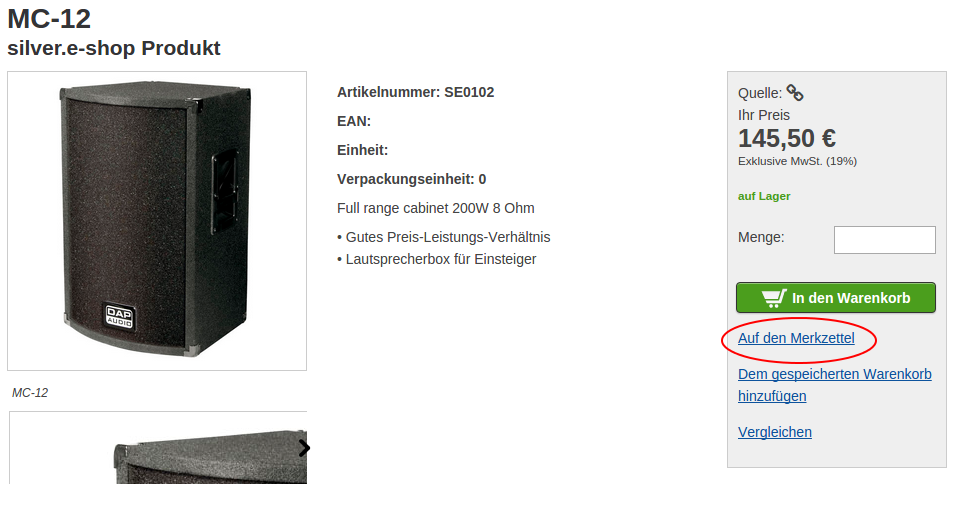
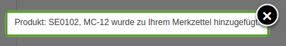
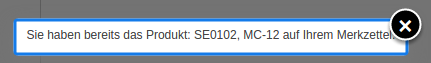
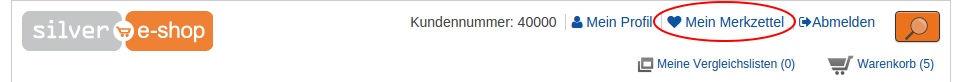
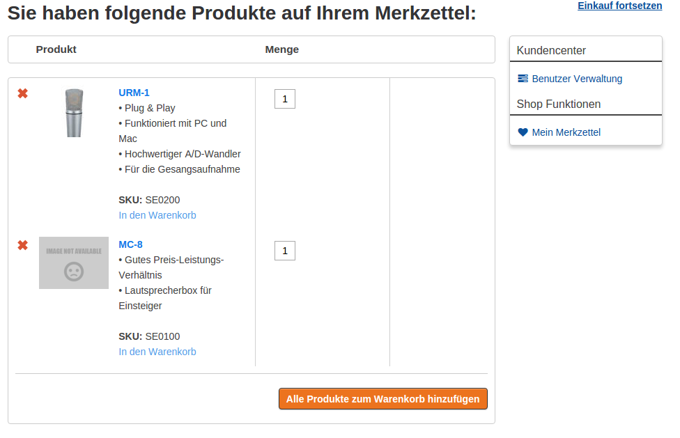

# Wishlist

### Who is able to use wishlist

!!! note

    Wishlist is available only for logged users. There is 1 wishlist per 1 user.

There is no possibility to have more than one wishlist. If a client wants to store some products in different list, he can use stored basket functionality.

### How to add product to wishlist

Add to wishlist link is placed in product detail page in the right column. See below:

For products that are **variants** user need to choose actual variant to be able to store it. Add to wishlist will be not visible, until options are selected. See below: 

### Messages that are shown when adding to wishlist

After successful adding to wishlist a message is displayed. 

Items can be stored only once. Notice is displayed:

When adding product:

- no prices are stored
- no quantity is stored

### Where to find wishlist links

Wishlist can be found in the header of the website and in the profile page in right user menu. See below (Mein Merkzettel):

**Header**

**Profile**

### Wishlist overview page

In the overview there are some information about product:

- name
- sku
- short description
- image
- variant information

#### Adding products to cart

There are 2 ways to add items to cart:

- add 1 product into cart 
- add all products into cart

##### Quantity field

When adding into basket the user can define how many items of product will he want to add to cart. If there is no quantity field the minimum order quantity will be taken.

!!! tip

    Products will stay in the wishlist as long as user does not remove them.

#### Remove products from wishlist

User can remove products from wishlist one by one. They will not be visible anymore in wishlist.

#### Product not available

If the product is not in catalog anymore, user will see a proper message in the overview page.
