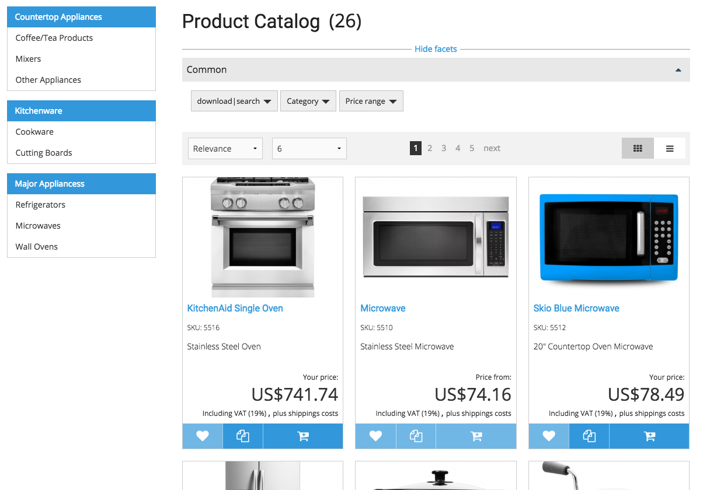
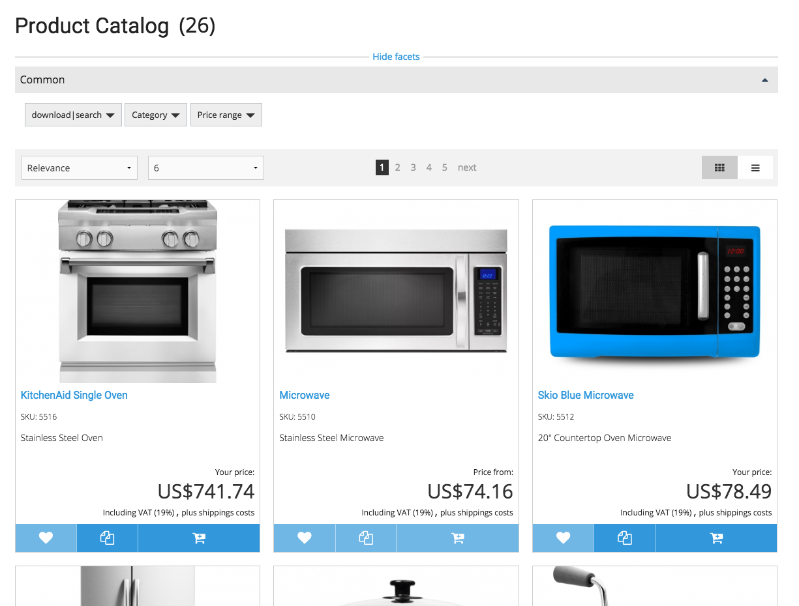

# How to: Change catalog layout

Please make sure before you start to install the [boilerplate](extending_the_frontend.md) first

## Introduction

In this guide we want to change the catalog layout in an easy way.

Before:



After:



We want to hide the Side Navigation and make the Product Catalog full width.

Lets start with finding the right Template in the vendor section:

Please copy the template `vendor/silversolutions/silver.e-shop/src/Silversolutions/Bundle/EshopBundle/Resources/views/Catalog/catalog.html.twig` to `app/Resources/Views/Catalog/catalog.html.twig`

You have to create the folder Catalog before you can copy the template

Delete the content thats inside the block `second_nav`

``` html+twig

            <div class="large-3 columns show-for-large-up u-padding-right-3x hide-for-print">
                
                
                    {# @notice - this will display the whole catalog and the current catalog element will be marked as active #}
                    
                
            

```

Change it to:

``` html+twig

           

```

!!! note

    If you don't see any changes please remove the cache\!
