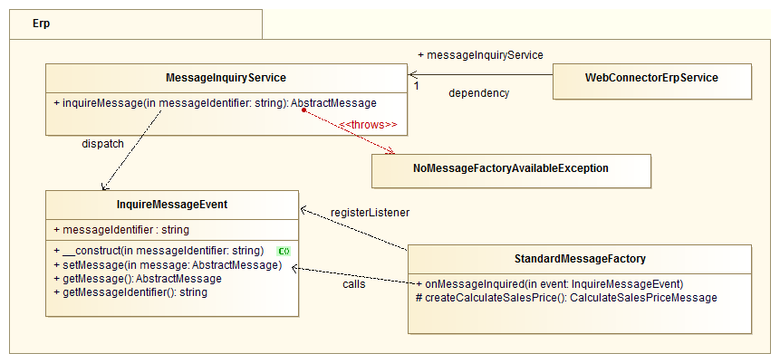

# ERP Message Instantiation

This article will describe the instantiation of the erp messages.

An erp message is a message-containing class which derived from the abstract class *AbstractMessage*. This messages are entities used system wide to store data in a defined structured way within the eZ Commerce (Advanced version only).

## Concept

The message instantiation uses the mechanics of the symfony2 EventDispatcher system. http://symfony.com/doc/current/components/event_dispatcher/introduction.html

When a new message object is required, in the respective code position a specific service is inquired to deliver a message object of specific type (e.g. `calculate_sales_order`). The eZ Commerce ( Advanced version only) will then dispatch a custom message-inquiry-event within that service, containing the wanted message type and a reference to an AbstractMessage object. Specific listeners, which are capable to create messages, can register/subscribe to that event and check if they are responsible for that type of message. In symfony2 new listeners can be easily registered to events as services via (yaml-)configuration. This enables a flexible way to add new "custom" messages and their "factories" per module *and* the possibility to overwrite the instantiation of certain messages (by simply overriding the service definition).

The workflow of the message instantiation:

- e.g. a factory in the Erp-package want do create a new message. Thus it calls a inquireMessage() method of its MessageInquiryService dependency.
- the new event will be created with the respective message type attribute (e.g. `calculate_sales_order`) and a null reference to its AbstractMessage attribute.
- the event will be dispatched via EventDispatcher
- an implemented listener is called with the event object
- the listener checks if it's responsible to the message type, and:
    - if responsible, creates the message, appends the message object to the event object and stops further event propagation via $eventstopPropagation();
    - if not responsible, does nothing
- when the event is done, the MessageInquiryService will check if the message was created, and:
    - if created, returns the message object
    - if not created, will throw an exception

## How to implement a listener / creator

Static naming of events

``` php
namespace Silversolutions\...;

final class ErpMessageEvents
{
    /**
     * The silver_eshop.request_create_message event is thrown each time a message
     * should be created.
     *
     * The event listener receives an
     * Silversolutions\...\Event\RequestCreateMessageEvent instance.
     *
     * @var string
     */
    const STORE_ORDER = 'silver_eshop.request_create_message';
 
    // Other events 
}
```

Event object

``` php
namespace Silversolutions\...\Event\RequestCreateMessageEvent;

use Symfony\Component\EventDispatcher\Event;
use Silversolutions\...\Event;
use Silversolutions\...\AbstractMessage;
use Silversolutions\...\...; // Implemented Message

class RequestCreateMessageEvent extends Event
{
    /** @var string */
    protected $messageType;
 
    /** @var AbstractMessage */
    protected $messageObject;

    public function __construct($messageType)
    {
        $this->messageType = $messageType;
    }

    public function getMessageType()
    {
        return $this->messageType;
    }

    public function setMessageObject(AbstractMessage $messageObject)
    {
        $this->messageObject = $messageObject;
    }

    public function getMessageObject()
    {
        return $this->messageObject;
    }
}
```

Listener, implementation via service, see

<http://symfony.com/doc/master/cookbook/service_container/event_listener.html>

## Model


