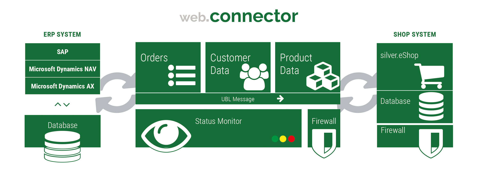

# How does the shop communicate with the ERP

## General

The shop is able to use different transports in order to connect to the ERP systems or other third parties. eZ Commerce (Advanced version only) supports different transport protocols such as

- Webservices/SOAP
- REST

The transport layer can be extended in project if there is a need for an additional protocol or way to access the ERP/CRM...

One way to connect to an SAP or Microsoft Dynamics NAV system is to use the Web.Connector (separately licensed product) which already comes with prepared interfaces to the stated ERP systems.  There are other options besides using the Web.Connector:

- if the ERP offers a Webservice/REST interface it would be an option to connect eZ Commerce Advanced directly with the ERP
- An enterprise service bus (ESB) would be an option as well

The following picture describes how the shop communicates with the ERP system using the Web.Connector: 



Since every ERP system uses its own standard how data is formatted and named eZ Commerce Advanced uses a standard format to describe data such as customer or orders. The standard used is **UBL** ([Universal Business Language](https://www.oasis-open.org/committees/tc_home.php?wg_abbrev=ubl)) an universal standard describing business processes. 

## What happens when a request is sent to an ERP-System

| Step | Who                        | What                                                                                               |
| ---- | -------------------------- | -------------------------------------------------------------------------------------------------- |
| 1    | Shop          | Requests data using a request object                                                               |
| 2    | Shop          | A mapping might map the UBL request to a specific request for the ERP (optional step) |
| 3    | Web.Connector              | The Web.Connector receives the request and maps the request into an ERP request                    |
| 4    | Web.Connector | Sends the ERP request to the ERP                                                                   |
| 5    | ERP                        | The ERP processes the requests and sends an answer                                                 |
| 6    | Web.Connector | Gets answer from ERP and maps it to an answer for the shop                                         |
| 7    | Shop                       | Receives the request and maps it to UBL (optional step)                                            |
| 8    | Shop                       | Application gets a proper UBL response object                                                      |

!!! note "Specification for requests and responses"

    The shop uses a specification which describes how the request to the ERP (our Web.Connector) and the answer from the ERP will look like. 

    The specification is written in XML and located in resources/specifications/xml. It includes always two files: a request and a response specification. 

    It it used to [generate PHP objects](erp_communication/erp_components\erp_component_messages/erp_message_class_generator.md) which can be used to define a request or get the response back from the ERP.

An example - get customer data

The request is initiated by the shop:

Step: URL-Request

Who: Shop

Details:

Sets request using the generated ERP-Classes for select customer.

Customer now will be set in

BuyerCustomerParty/Party/PartyIdentification/ID

Mapping:

Used specification:

`@EshopBundle/Resources/specifications/xml/request.selectCustomer.xml`

``` xml
<?xml version="1.0" encoding="UTF-8"?>
<BuyerCustomerParty>
    <Party ses_unbounded="PartyIdentification">
        <PartyIdentification>
            <ID>10000</ID>
        </PartyIdentification>
    </Party>
</BuyerCustomerParty>
```

Step: Maps request

Who: Shop

Details:

Request is mapped to `<PARTY><PARTY_ID>0100000</PARTY_ID></PARTY>`

Mapping:

Used mapping

`app/Resources/xsl/request.selectcustomer.xsl`

``` xml
<?xml version="1.0" encoding="UTF-8"?>
<xsl:stylesheet version="1.0" xmlns:xsl="http://www.w3.org/1999/XSL/Transform">
    <xsl:template match="/BuyerCustomerParty">
             <PARTY>
                 <PARTY_ID>
                     <xsl:value-of select="Party/PartyIdentification/ID" />
                 </PARTY_ID>
             </PARTY>
    </xsl:template>
</xsl:stylesheet>
```

Step: Receives request

Who: Web.Connector

Details:

Converts the request in the language of the ERP, e.g. `<Params><Read><No>0100000</No></Read></Params>`

Mapping:

Used mapping:

`mapping/nav_ws/xsl/request.selectcustomer.xsl`

``` xml
<xsl:stylesheet version="1.0"
    xmlns:xsl="http://www.w3.org/1999/XSL/Transform">
    <xsl:param name="WEBSITE" />
    <xsl:template match="/">
        <Params>
            <Read>
                <No><xsl:value-of select="PARTY/PARTY_ID" /></No>
            </Read>
        </Params>
    </xsl:template>
</xsl:stylesheet>
```

Step: Processes request

Who: ERP-System

Details:

Gets the request and will send a result back

The answer will be mapped one or more time depending on the configuration:

Step: receives customer data from ERP

Who: Web-Connector

Details:

Data from ERP:

??? note

    ``` xml
    <RawResponse>
     <Key>28;EgA...</Key>
      <No>0100000</No>
      <Blocked>_blank_</Blocked>
      <Name>Demo customer</Name>
      <Name_2>- Office  -</Name_2>
      <Address>Demo street</Address>
      <Post_Code>12555</Post_Code>
      <City>Berlin</City>
      <Country_Region_Code>DE</Country_Region_Code>
      <Fax_No>0301212</Fax_No>
      <Phone_No>03012121</Phone_No>
      <E_Mail>info@test.de</E_Mail>
      <Contact>- -</Contact>
      <Customer_Posting_Group>SAMMEL</Customer_Posting_Group>
      <Gen_Bus_Posting_Group>NATIONAL</Gen_Bus_Posting_Group>
      <VAT_Bus_Posting_Group>NATIONAL</VAT_Bus_Posting_Group>
        
      <Kontakt_EMail>info@test.de</Kontakt_EMail>
      <Kontakt_Ansprechpartner>- -</Kontakt_Ansprechpartner>
      <PaymentMethodCode>EINZUG</PaymentMethodCode>
      <Ship_to_Address>
        <Cust_Ship_to_Address_WS>
          <Key>44;3gAAAAJ7BzAAMQAwADAAMAAwADAAAAACe/9MADAAMQ==9;1326112700;</Key>
          <Customer_No>0100000</Customer_No>
          <Code>L01</Code>
          <Name>Demo customer</Name>
          <Name_2>Max Mueller</Name_2>
          <Address>Molkereistr. 1a</Address>
          <City>Berlin</City>
          <Post_Code>12555</Post_Code>
          <Blocked/>
        </Cust_Ship_to_Address_WS>
         
      </Ship_to_Address>
    </RawResponse>
    ```

Step: Maps data back

Who: Web-Connector

Details: Maps data for shop using a 1:1 conversion

Mapping:

Using a mapping file `mapping/nav_ws/xsl/response.selectcustomer.xsl`

In this case the answer will not be mapped and mapping is done in the shop

``` xml
<xsl:stylesheet version="1.0"
    xmlns:xsl="http://www.w3.org/1999/XSL/Transform">
    <xsl:param name="WEBSITE" />
    <xsl:template match="/SoapResponse/ReadResult">
        <RawResponse>
            <xsl:copy-of select="*" />
        </RawResponse>
    </xsl:template>
</xsl:stylesheet>
```

Step: Receivers response and maps it to UBL

Who: Shop

Details:

Converts the answer into UBL using a mapping and the shop will convert the response to an UBL object as defined in the specification (`@EshopBundle/Resources/specifications/xml/response.selectCustomer.xml`)

Mapping:

Converts the answer into UBL using a mapping and the shop will convert the response to an UBL object as defined in the specification (@EshopBundle/Resources/specifications/xml/response.selectCustomer.xml)

??? note "Mapping (app/Resources/xsl/response.selectcustomer.xsl)"

    ``` xml
    <?xml version="1.0" encoding="UTF-8"?>
    <xsl:stylesheet version="1.0" xmlns:xsl="http://www.w3.org/1999/XSL/Transform">
        <xsl:template match="/RawResponse">
            <OrderResponse singleElementArrays="OrderLine">
                    <BuyerCustomerParty>
                        <Party>
                            <PartyIdentification>
                                <ID>
                                    <xsl:value-of select="No" />
                                </ID>
                            </PartyIdentification>
                            <PartyName>
                                <Name>
                                    <xsl:value-of select="Name" />
                                </Name>
                            </PartyName>
                            <PartyName>
                                <Name>
                                    <xsl:value-of select="Name_2" />
                                </Name>
                            </PartyName>
                            <PostalAddress>
                                <StreetName> <xsl:value-of select="Address" /></StreetName>
                                <BuildingName></BuildingName>
                                <BuildingNumber></BuildingNumber>
                                <CityName><xsl:value-of select="City" /></CityName>
                                <PostalZone><xsl:value-of select="Post_Code" /></PostalZone>
                                <CountrySubentity></CountrySubentity>
                                <AddressLine>
     
                                </AddressLine>
                                <Country>
                                    <IdentificationCode>DE</IdentificationCode>
                                </Country>
                            </PostalAddress>
                            <Contact>
                                <Name><xsl:value-of select="Kontakt_Ansprechpartner" /></Name>
                                <Telephone></Telephone>
                                <Telefax></Telefax>
                                <ElectronicMail><xsl:value-of select="Kontakt_EMail" /></ElectronicMail>
                            </Contact>
                            <SesExtension>
                                <CustomerPostingGroup>
                                    <xsl:value-of select="Customer_Posting_Group" />
                                </CustomerPostingGroup>
                                <Gliederungskennzeichen>
                                    <xsl:value-of select="Gliederungskennzeichen" />
                                </Gliederungskennzeichen>
                            </SesExtension>
                        </Party>
                    </BuyerCustomerParty>
                    <SellerSupplierParty>
                    </SellerSupplierParty>
                <AccountingCustomerParty>
                    <Party singleElementArrays="PartyIdentification PartyName">
                        <PartyIdentification>
                            <ID><xsl:value-of select="CUSTOMER/NUMBER" /></ID>
                        </PartyIdentification>
                        <PartyName>
                            <Name>
                                <xsl:value-of select="CUSTOMER/NAME" />
                            </Name>
                        </PartyName>
                        <PostalAddress singleElementArrays="AddressLine">
                        </PostalAddress>
                    </Party>
                </AccountingCustomerParty>
                <OriginatorCustomerParty>
                </OriginatorCustomerParty>
                <DeliveryParties singleElementArrays="Party">
                    <xsl:variable name="CustomerNumber" select="CUSTOMER/NUMBER"></xsl:variable>
                    <xsl:variable name="CustomerName" select="CUSTOMER/NAME"></xsl:variable>
                    <xsl:for-each select="CUSTOMER/SHIP_TO_ADDRESS">
                        <Party singleElementArrays="PartyIdentification PartyName">
                            <PartyIdentification>
                                <ID>
                                    <xsl:value-of select="SHIP_CODE" />
                                </ID>
                            </PartyIdentification>
                            <PartyName>
                                <Name>
                                    <xsl:value-of select="$CustomerName" />
                                </Name>
                            </PartyName>
                            <PostalAddress singleElementArrays="AddressLine">
                            </PostalAddress>
                        </Party>
                    </xsl:for-each>
                </DeliveryParties>
                <SesExtension>
                    <CustomerPostingGroup>
                        <xsl:value-of select="CUSTOMER/CUSTOMER_POSTING_GROUP" />
                    </CustomerPostingGroup>
                </SesExtension>
                <OrderLine>
                </OrderLine>
            </OrderResponse>
        </xsl:template>
    </xsl:stylesheet>
    ```

Specification:

``` xml
<OrderResponse singleElementArrays="OrderLine">
  <BuyerCustomerParty>
    <Party>
      <PartyIdentification>
        <ID>0838020</ID>
      </PartyIdentification>
      <PartyName>
        <Name>Demo customer</Name>
      </PartyName>
      <PartyName>
        <Name>Max Meier</Name>
      </PartyName>
      <PostalAddress>
        <StreetName>Demo street 12</StreetName>
        <BuildingName/>
        <BuildingNumber/>
        <CityName>Berlin/CityName>
        <PostalZone>12555</PostalZone>
        <CountrySubentity/>
        <AddressLine/>
        <Country>
          <IdentificationCode>DE</IdentificationCode>
        </Country>
      </PostalAddress>
      <Contact>
        <Name>- -</Name>
        <Telephone/>
        <Telefax/>
        <ElectronicMail>info@test.de</ElectronicMail>
      </Contact>
      <SesExtension>
        <CustomerPostingGroup>SAMMEL</CustomerPostingGroup>
        
      </SesExtension>
    </Party>
  </BuyerCustomerParty>
  <SellerSupplierParty/>
  <AccountingCustomerParty>
    <Party singleElementArrays="PartyIdentification PartyName">
      <PartyIdentification>
        <ID/>
      </PartyIdentification>
      <PartyName>
        <Name/>
      </PartyName>
      <PostalAddress singleElementArrays="AddressLine"/>
    </Party>
  </AccountingCustomerParty>
  <OriginatorCustomerParty/>
  <DeliveryParties singleElementArrays="Party"/>
  <SesExtension>
    <CustomerPostingGroup/>
  </SesExtension>
  <OrderLine/>
</OrderResponse>
```

## Web.Connector setup - a short introduction

In eZ Commerce Advanced some config parameters have to be setup:

The URL to the Web.Connector:

webconnector_url: `https://<ip: port>/webconnector/webconnector_opentrans.php5`

and the configuration for each message:

``` yaml
silver_erp.config.messages:
       .........
        select_customer:
            message_class: "Silversolutions\\Bundle\\EshopBundle\\Message\\SelectCustomerMessage"
            response_document_class: "\\Silversolutions\\Bundle\\EshopBundle\\Entities\\Messages\\Document\\CustomerResponse"
            webservice_operation: "SV_OPENTRANS_SELECT_CUSTOMERINFO"
            mapping_identifier: "selectcustomer"
```

If a mapping_identifier is defined eZ Commerce will use a mapping (XSLT based). 

On the Web.Connector PC for each message a configuration describes which mapping shall be performed: 

``` php
     $cfg->setSetting('WebserviceHandler_Config', 'MethodSettings', array(
        ........
        'SV_OPENTRANS_SELECT_CUSTOMERINFO' => array(
            'remote_reference'      => 'customer',
            'method'                => 'Read',
            'mapping'               => 'selectCustomer',
            'mapping_parameters'    => array(
                'WEBSITE' => 'HOME',
            ),
        ),
```

## Example for developers

``` php
 $erpService = $this->getContainer()->get('silver_erp.facade');
 
 $customerNo = "1000";
 $selectCustomerResponse = $erpService->selectCustomer($customerNo);
```

The answer will be an object as defined in `@EshopBundle/Resources/specifications/xml/response.selectCustomer.xml`:

``` xml
Silversolutions\Bundle\EshopBundle\Entities\Messages\Document\CustomerResponse Object
(
    [BuyerCustomerParty] => Silversolutions\Bundle\EshopBundle\Entities\Messages\Document\CustomerResponseBuyerCustomerParty Object
        (
            [Party] => Silversolutions\Bundle\EshopBundle\Entities\Messages\Document\Party Object
                (
                    [PartyIdentification] => Array
                        (
                            [0] => Silversolutions\Bundle\EshopBundle\Entities\Messages\Document\PartyPartyIdentification Object
                                (
                                    [ID] => Silversolutions\Bundle\EshopBundle\Entities\Messages\Document\StringObject Object
                                        (
                                            [value] => 0100000
                                        )
                                )
                        )
                    [PartyName] => Array
                        (
                            [0] => Silversolutions\Bundle\EshopBundle\Entities\Messages\Document\PartyPartyName Object
                                (
                                    [Name] => Silversolutions\Bundle\EshopBundle\Entities\Messages\Document\StringObject Object
                                        (
                                            [value] => Demo customer
                                        )
                                )
                            [1] => Silversolutions\Bundle\EshopBundle\Entities\Messages\Document\PartyPartyName Object
                                (
                                    [Name] => Silversolutions\Bundle\EshopBundle\Entities\Messages\Document\StringObject Object
                                        (
                                            [value] => - Office -
                                        )
                                )
                        )
                    [PostalAddress] => Silversolutions\Bundle\EshopBundle\Entities\Messages\Document\PartyPostalAddress Object
                        (
                            [StreetName] => Silversolutions\Bundle\EshopBundle\Entities\Messages\Document\StringObject Object
                                (
                                    [value] => Demo street 12
                                )
                            [AdditionalStreetName] => Silversolutions\Bundle\EshopBundle\Entities\Messages\Document\StringObject Object
                                (
                                    [value] =>
                                )
                            [BuildingNumber] => Silversolutions\Bundle\EshopBundle\Entities\Messages\Document\StringObject Object
                                (
                                    [value] =>
                                )
                            [CityName] => Silversolutions\Bundle\EshopBundle\Entities\Messages\Document\StringObject Object
                                (
                                    [value] => Berlin
                                )
                            [PostalZone] => Silversolutions\Bundle\EshopBundle\Entities\Messages\Document\StringObject Object
                                (
                                    [value] => 12555
                                )
....
```
