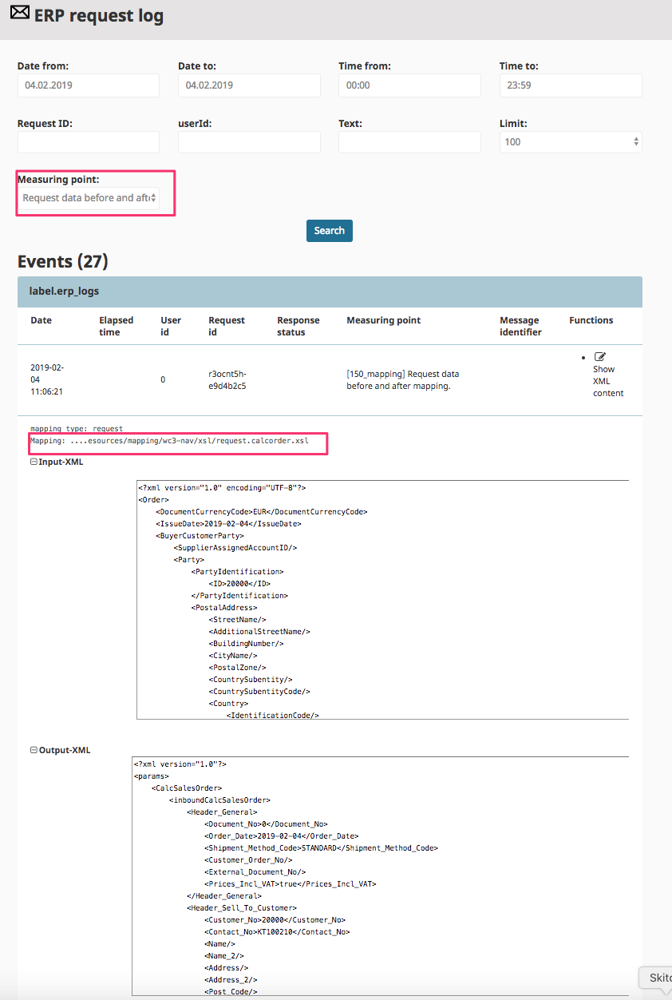

# Integrate ERP systems

eZ Commerce is build to communicate with ERP systems. It uses the data and logic already provided by the ERP system. 

This ensures that the

- shop is always up to date
- the complex logic and processes already implemented in the ERP will be reused 
- the customer will see his individual prices and the availability from the ERP
- seemless processes: orders will be transferred 

## How to start

!!! note

    The introduction [How does the shop communicate with the ERP](how_does_the_shop_communicate_with_the_erp.md) will explain how the shop communicates with the ERP system. It also describes how to adapt the communication for your needs.

### How to configure the ERP integration

If you are using a prepared connector (Connector) you will find further information about the configuration here: [Web connector configuration](erp_communication/erp_configuration/web_connector_configuration.md).

In case a REST based ERP system is used see: [Curl Configuration](erp_communication/erp_configuration/curl_configuration.md)

In case your ERP supports Web-Services directly: [Configuration for Webservice based ERPs](erp_communication/erp_configuration/configuration_for_webservice_based_erps.md)

### How to adapt the mapping

eZ Commerce is using a standard "language" (UBL) to model the business data. The ERP systems normally are using vendor specific structures and attribute names. A xslt based mapping feature allows to adapt the mapping between these formats. See [Adapt the mappings for ERP functions](erp_communication/erp_configuration\adapt_the_mappings_for_erp_functions/adapt_the_mappings_for_erp_functions.md) for more details.

### Howto monitor the ERP connection

The Admin user interface provides a monitoring service which allows to check all messages exchanged between ERP and eZ Commerce. 

After selecting a date range and a measuring point (recommended ones: "Request data before and after mapping" and "Response data before and after mapping" ) you will get more details about the request send to the ERP system and the mapping which has applied. 

- mapping: displays the xslt file used for mapping
- the input XML and the XML converted by the xslt transformation  

!!! tip

    You can copy the input xml and copy the content to PHP-storm. This allows to test and adapt the mapping using the stated xslt file without testing it using the shop.

### How to use the ERP api for special requirements

Besides the standard processes eZ Commerce offers an API to call ERP functions in your application. Check [ERP communication](erp_communication/erp_communication.md) for more details.

## Supported ERP systems

eZ Commerce offers prepared interfaces to:

- Microsoft Dynamics NAV
- Microsoft Dynamics AX
- SAP

For the listed ERP systems connectors are available.

Since eZ Commerce offers an open interface using standards (REST, Webservices and a standard XML Format UBL) it is possible to adapt other ERP systems as well.

Requirements towards an ERP system: The ERP system has to be open (means offers e.g. a REST or Web-Service interface) and offers the functions as listed in "Supported processes with ERP integration".

## Supported processes with ERP integration

This chapter will describe which data is exchanged between eZ Commerce Advanced and the ERP system. It depends on the project specific configuration which data will be exchanged since in complex systems other systems might provide data as well (such as a PIM system).

|Data/Process|What is exchanged|When|
|--- |--- |--- |
|Customer data|Data about the customer such as Invoice and buy address list of delivery addresses status customer group creditlimit contact data|The data for a customer will be fetched from the ERP when the user logs in and has a customer number|
|Product data|Products and product groups|During the import. The import will be initiated e.g. every night or even more often. This data is usually provided using an export (XML,CSV,Json)|
|Prices|List price and volume prices Individual prices|List prices will be exchanged during the product import Individual prices will be fetched from the ERP when a customer is logged in and has a customer number. In that case the shop requests prices in realtime from the ERP. It can be defined by project in which cases prices are requested from the ERP (.e.g product detail page, basket and checkout)|
|Orders|Address data, Delivery address, products and customer number|When the customer has ordered the order will be send immediately to the ERP system. If a electronic payment is involved the order will be placed when the payment provider has acknowledged the payment transaction.|
|Documents|Invoices, orders, delivery notes, credit memos|The addon order history requests such documents in real time from the ERP. This ensures that the customer will see all documents even if an order has been placed by phone or fax.|

## Further information

The documentation provides more information about this topic:

- [How to create a new ERP message (example: ItemTransfer)](erp_communication/guides/how_to_create_a_new_erp_message/how_to_create_a_new_erp_message.md)
- About UBL and how to add new fields: [Usage of UBL](erp_communication/guides/usage_of_ubl.md)
- [Web-Connector Configuration](erp_communication/erp_configuration/web_connector_configuration.md)
