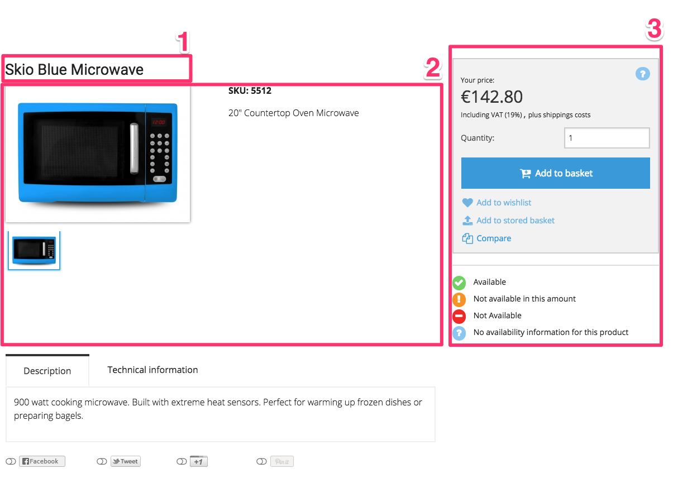

# Change product template

The product is rendered using a set of templates:

Main template: `vendor/silversolutions/silver.e-shop/src/Silversolutions/Bundle/EshopBundle/Resources/views/Catalog/product.html.twig`

The product page is using 3 important sub templates:

|No (see Screenshot)|Path|
|--- |--- |
|1|Catalog/parts:productTitle.html.twig|
|2|Catalog:parts/productDetail.html.twig|
|3|Catalog:parts/productBasket.html.twig|
